# Ecclesia — Church Operating System
## Product Requirements Document (PRD)

**Document Status:** Version 1.0 — LOCKED (8 of 10 open questions fully resolved; OQ-04 and OQ-10 carry provisional placeholder values pending one live pastoral-calibration session — see §24 and the companion *Open Questions Resolution Workshop*)
**Classification:** Internal — Engineering, Product, Design, Leadership
**Owner:** Product Management
**Primary Reference Deployment:** River of Life Cathedral, Tikrom, Kumasi, Ghana (a Council Church of the United Denominations Originating from the Lighthouse Group of Churches — UDOLGC)

| Field | Value |
|---|---|
| Document version | 1.0 |
| Last updated | 2026-07-31 |
| Intended audience | Engineering leadership, staff/principal engineers, design, QA, data/analytics, implementation/onboarding teams, executive sponsors |
| Companion documents | *Ecclesia Technical Blueprint (PTB v2.0)*, *Ecclesia PRD Open Questions Resolution Workshop* |
| Change control | Any modification to a ratified chapter requires a version bump and a recorded rationale in the changelog (Section 0.1) |

### 0.1 Changelog

| Version | Date | Change | Author |
|---|---|---|---|
| 0.1 | 2026-07-31 | Initial draft of Chapter 1 (Executive Summary → Scope) | Product Management |
| 0.2–0.7 | 2026-07-31 | Chapters 2–7 drafted (Stakeholders/Personas through Risks/Assumptions/Release/Roadmap/Open Questions/Glossary) | Product Management |
| 1.0 | 2026-07-31 | Open Questions Resolution Workshop completed; 8 of 10 decisions finalized and applied throughout (household/guardian link, configurable Poimen gate, Resident Pastor succession runbook, follow-up SLA defaults, Bacenta co-leadership deferred, pledge reminder behavior, data residency deferred, visitor self-service deferred). OQ-04 (silent-drift thresholds) and OQ-10 (Church Pulse weighting) ship with labeled provisional values pending one live calibration session with Bishop Francis and the Assistant Pastors. Document locked as v1.0. | Product Management |

---

## 1. Executive Summary

Ecclesia is a Church Operating System: a single, coherent software platform on which a church runs its entire ministry — the care of people, the organization of ministry teams, the rhythm of gatherings, the stewardship of money, and the leadership decisions that tie all of it together. It is being built with River of Life Cathedral (Tikrom, Kumasi, Ghana), a Council Church within UDOLGC, as the reference deployment, but it is designed from day one to generalize across denominations, governance models, languages, and national contexts.

The category Ecclesia enters — "Church Management Software" (ChMS) — is mature but shallow. Incumbent products (Planning Center, ChurchTrac, Breeze, Elvanto, ChurchSuite, and various regionally dominant tools) are, almost without exception, **records systems**: they store people, log attendance, track giving, and generate reports. They answer "what happened?" competently. They almost never answer "what should a leader do next?" — and they rarely model the actual unit of pastoral care that most growing, cell-based, or bacenta-style churches operate on: the small group as the primary discipleship and shepherding structure, not merely a tag on a person record.

This is the gap Ecclesia is built to close. Every domain in the product — People, Pastoral Care, Ministry, Gatherings, Stewardship, and Insights — exists in service of one outcome: **reducing the administrative load on leaders so that more of their time and attention is spent on people, not paperwork.** This is not a mission-statement flourish; it is a design constraint that will be tested against every feature in this document. If a proposed feature increases the number of manual steps a Shepherd or Pastor must take to know that a member needs care, it fails the test regardless of how well it manages data.

Ecclesia is organized around six core domains, each with clear ownership boundaries and explicit contracts with the others:

| Domain | Answers the question | Primary actors |
|---|---|---|
| People | Who is in our church, and what is their journey? | Everyone (as subject); Admins, Pastors, Shepherds (as operators) |
| Pastoral Care | Who is caring for whom, and is anyone falling through the cracks? | Shepherds, Assistant Pastors, Resident Pastor |
| Ministry | Who is serving, where, and how well-resourced is each team? | Ministry Leaders, Workers |
| Gatherings | What events happen, who attends, and what does that tell us? | Everyone; recorded by Ushers/Leaders |
| Stewardship | What resources have been entrusted to us, and how are they stewarded? | Treasurers, Bacenta Leaders, Finance Team, Leadership (approvals) |
| Insights | What do all of the above domains, taken together, tell leadership about the health of the church? | Resident Pastor, Assistant Pastors, Council |

Two architectural ideas recur throughout this document and should be treated as first-class design principles rather than implementation details:

1. **Everything Is A Gathering.** Sunday services, Wednesday service, Friday prayer, Bacenta meetings, Basonta meetings, conferences, camps, conventions, and (future) online gatherings are not six or seven unrelated features — they are instances of one generalized `Gathering` abstraction with type-specific configuration. This is what allows attendance, capacity, recurrence, and reporting logic to be built once and reused everywhere, and it is what allows the platform to absorb new gathering types in the future (a youth camp, a marriage retreat, a citywide crusade) without new subsystems.

2. **Church Pulse as an engagement model, not an attendance count.** Historically, ChMS products conflate "engagement" with "attendance," which produces a badly distorted picture: a member who attends Sunday every week but has no Bacenta, serves nowhere, and has never been followed up with looks identical to a fully engaged member in an attendance-only view. Church Pulse is Ecclesia's composite model for engagement, deliberately built from multiple weighted signals (attendance, Bacenta participation, serving, follow-up responsiveness, leadership engagement, visitor retention) so that pastoral concern surfaces *before* a member disappears, not after.

This PRD is written to enterprise standards because the ambition behind Ecclesia is enterprise-scale: not one church, but a platform capable of serving a single congregation of 40 people and a multi-branch Council of a thousand churches with the same core model, differentiated by configuration rather than by forked code paths.

---

## 2. Vision

> **To become the world's most comprehensive Church Operating System.**

Unpacking what "comprehensive" and "Operating System" mean here, precisely, matters — both are doing real work in this sentence and neither is decorative.

**"Operating System"** is a deliberate analogy, not a marketing term. An operating system does three things: it provides a small set of core abstractions (processes, files, permissions) that every application is built on top of; it mediates access to shared resources so applications don't have to reinvent scheduling, memory management, or security; and it remains stable and predictable while an unbounded number of applications are built or run on top of it. Ecclesia is architected the same way. People, Gatherings, and Bacentas/Basontas are the core abstractions. Pastoral Care, Ministry, Stewardship, and Insights are applications that run on top of those abstractions and share them rather than duplicating them. A future capability — say, a small-group curriculum tool, a benevolence-fund workflow, or a multi-site campus model — should be buildable as a new application on the existing core, not a rearchitecture.

**"Comprehensive"** means Ecclesia's ambition is not to be the best at one thing (e.g., giving, or check-in) but to be the system a church's entire operational and pastoral life runs through — while remaining honest that comprehensiveness is a multi-year journey, not a v1 claim. Chapter 1 scopes what is in the first release; the roadmap (a later chapter) scopes the path to comprehensiveness.

The vision is denomination-agnostic in its abstractions (a "Bacenta" is, structurally, a small group; a "Basonta" is, structurally, a ministry team) but denomination-aware in its terminology and defaults, because forcing River of Life's leaders to think in generic small-group software vocabulary instead of their own — Bacenta, Basonta, Poimen, Council — would violate the "Ministry First" principle before the product ever gets to a feature screen.

---

## 3. Mission

> **To help churches care for people, strengthen ministry, and steward resources faithfully through intelligent technology.**

The mission statement contains three verbs, and each maps directly onto a cluster of domains, which is the mechanism by which this document stays traceable from mission down to feature:

| Mission verb | Domains it governs | What "success" looks like in behavior |
|---|---|---|
| Care for people | People, Pastoral Care | A Shepherd is proactively alerted to a member who has missed three consecutive Bacenta meetings, before that member decides to stop coming altogether |
| Strengthen ministry | Ministry, Gatherings | A Ministry Leader can see, at a glance, that the Media team is short-staffed for the upcoming Convention and can recruit from a pool of trained, available workers |
| Steward resources faithfully | Stewardship | A Treasurer can reconcile a week's offerings from all Bacentas against bank deposits, with a full audit trail, in minutes rather than hours — and no pastor ever needs to touch cash to make that happen |

"Faithfully" is not filler. It is a direct, load-bearing requirement: stewardship features must produce an auditable, tamper-evident trail (who recorded what, when, and who verified it) because the discovery findings are explicit that finance integrity in this domain rests on separation of duties (Bacenta leaders record; Treasurers count and verify; Pastors do not touch cash). The product must encode that separation as an access-control and workflow rule, not merely as an organizational convention that the software is indifferent to.

"Intelligent technology" is intentionally modest phrasing. It does not promise AI for its own sake. It promises that the system should notice things a busy human leader would otherwise miss — a quiet member, an under-resourced ministry, a Bacenta whose attendance is trending down — and surface them as decisions to be made, not just data to be queried.

---

## 4. Problem Statement

### 4.1 The category is mature, but the primary job is unaddressed

Church Management Systems have existed for decades and the market is not empty. Yet the discovery process behind Ecclesia surfaced a consistent, structural gap: existing systems are optimized to be **system-of-record** tools (they store people, events, and transactions reliably) rather than **system-of-care** tools (they help a leader act on what the data implies). This is not a UI complaint that better dashboards would fix. It is a modeling gap: most incumbent systems do not have a first-class concept of a small group as a pastoral care unit with accountability semantics (someone is responsible for someone), because most incumbent systems were designed around Western congregational or attendee-list models where small groups are optional and loosely coupled to membership.

River of Life Cathedral's structure — and the wider UDOLGC Council model it belongs to — makes the Bacenta the mandatory, non-optional unit through which pastoral care, discipleship, evangelism, and even offering collection flow. A member without a Bacenta is not an edge case to be handled gracefully; it is close to a data-integrity violation, because "every member belongs to one Bacenta" is a foundational business rule. No mainstream ChMS treats small-group membership with that level of structural seriousness, which means churches operating this model today either bend a generic tool into an uncomfortable shape, or run parallel systems (a spreadsheet for Bacentas, a separate app for giving, a paper register for follow-up) that never talk to each other and therefore never produce a single, trustworthy picture of a member's engagement.

### 4.2 The specific failures this creates, in practice

| Failure mode | Root cause | Consequence |
|---|---|---|
| Members disengage silently | Attendance is tracked per-service, not per-Bacenta, so a member attending Sunday but never attending Bacenta looks "fine" in every existing report | Pastoral concerns are discovered late, often only when the member has already stopped attending altogether |
| Follow-up on visitors is inconsistent | Visitor capture is manual (paper cards), follow-up assignment is informal (verbal handoff), and there is no enforced workflow state | Visitors fall through the cracks between "attended once" and "assigned to a Bacenta"; conversion-to-member rates are not measurable, only anecdotal |
| Offering handling has weak auditability | Cash flows through multiple hands (Bacenta collection → Bacenta leader recording → church-level counting) with no digital chain of custody | Reconciliation is manual and slow; discrepancies are hard to trace to a specific handoff point; trust in reporting depends on individual diligence rather than system enforcement |
| Leadership lacks a real engagement signal | Attendance counts are treated as a proxy for engagement | Leaders cannot distinguish a thriving, well-shepherded congregation from one that is quietly hollowing out beneath a stable Sunday headcount |
| Growth breaks the tools | Spreadsheets and generic ChMS configurations do not scale past a certain number of Bacentas/branches without manual, error-prone process | A Council overseeing multiple branches cannot get a consolidated, trustworthy view without significant manual reconciliation work across branches |
| Leadership development is untracked | Poimen (leadership training) has no system of record tied to the leadership pipeline (Member → Worker → Shepherd → Pastor) | Appointment decisions are made without a clear, shared view of who has been trained and is ready |

### 4.3 Why this matters beyond River of Life

River of Life Cathedral is the reference deployment, not the only intended customer. The Bacenta/Basonta/cell-based structure it exemplifies is common across a large family of church movements globally (cell churches, house-church networks, and various Pentecostal and neo-charismatic denominations with UDOLGC-like Council structures), and it is precisely this segment that mainstream ChMS vendors — built primarily for North American congregational or multi-campus attractional-church models — under-serve. This is Ecclesia's wedge: build the small-group-first, care-first model properly for this segment, on an architecture general enough to also serve congregational-model churches later, rather than starting from a generic model and bolting small groups on as an afterthought.

### 4.4 The cost of inaction, stated plainly

If Ecclesia does not solve this, the status quo persists: pastoral care remains reactive rather than proactive, finance integrity depends on individual trustworthiness rather than systemic accountability, and church leadership makes strategic decisions (where to plant a new Bacenta, who to appoint as a Shepherd, which ministry needs investment) from incomplete or stale information. The cost is measured not in software-industry terms (churn, ARR) but in the currency the mission itself names: people who needed care and did not receive it in time.

---

## 5. Product Philosophy

Ecclesia's guiding philosophical claim is stated in the discovery material and is treated here as an axiom the whole product must satisfy, not a slogan to reference occasionally:

> Traditional systems manage records. Ecclesia manages ministry.

This distinction has concrete, testable implications for how the product must be designed, and it is worth making those implications explicit so that "manages ministry, not records" does not remain an abstraction that engineering cannot act on.

**5.1 A record is a fact. Ministry is a relationship, and relationships have state.** A traditional ChMS is satisfied once it has stored "Member X attended Sunday Service on 2026-07-26." Ecclesia is not satisfied until it can answer: is Member X's Bacenta relationship healthy? Has Member X's Shepherd checked in on them recently? Is Member X drifting from Sunday-only attendance toward full disengagement? This means nearly every entity in the system needs an explicit lifecycle/state machine (Chapter on Domain Model and Business Rules will formalize these), not just a timestamped log of events.

**5.2 The system's default posture is proactive, not query-driven.** A records system waits to be asked a question ("show me attendance for Bacenta 12 last month"). A ministry system asks the leader a question first ("Bacenta 12's attendance has dropped three weeks running — do you want to reach out?"). This has direct implications for the Insights domain: it cannot be a pure reporting/BI layer bolted onto the other five domains. It must be able to generate proactive, actionable prompts (not just dashboards) from cross-domain signals, which in turn means the domains must emit events (see "Everything Is A Gathering" and the forthcoming Event Storming Atlas) that Insights can subscribe to, rather than Insights running nightly batch queries against static tables.

**5.3 People before data.** Where a modeling decision must trade off data-model elegance against a leader's actual mental model of their church, the leader's mental model wins. This is why Bacenta and Basonta are named as such throughout the product rather than being normalized into a generic "Group" entity in the UI (even though, at the data layer, they may share a common underlying schema — see Section 12, Domain Model Overview, in a later chapter). Precision of language is a pastoral-care requirement, not a cosmetic one: a Shepherd should never have to translate the software's vocabulary into their own before they can use it.

**5.4 Configurable by design, not configurable by accident.** Because Ecclesia must serve River of Life today and a much broader set of churches and Council structures tomorrow, every domain must separate the invariant core model (a member belongs to exactly one Bacenta; a Gathering has attendance) from the configurable layer (what a Bacenta is called, what gathering types exist, what the leadership hierarchy's role names are). This is elaborated as a Product Principle below and will recur as a concrete requirement throughout the functional specification.

**5.5 Stewardship with accountability is a first-class citizen, not a compliance afterthought.** Finance workflows in Ecclesia are designed around separation of duties as a structural constraint enforced by the permission system, not a policy written in a handbook that the software is blind to. Section 19 (Permissions) and the Stewardship functional domain chapter will formalize this, but it is stated here because it is philosophy, not just implementation: a system that lets a Pastor role record cash offerings has, by definition, failed this product's philosophy regardless of how good its reporting is.

**5.6 Built to grow means the data model must survive organizational change, not just user-count growth.** "Scale" for Ecclesia is not only "more members, more traffic." It is also: a Bacenta splits into two as it grows; a Basonta merges with another; a branch becomes independent; a Council restructures its oversight model. The domain model must treat these as anticipated state transitions with defined rules, not exceptional data-migration events each time they occur.

---

## 6. Product Principles

These principles are the operating constitution for every subsequent decision in this PRD and in the engineering work that follows it. Each has a formal definition, the design implication it creates, and — critically — the anti-pattern it exists to prevent, because a principle that cannot be violated is not actionable; naming the failure mode it guards against is what makes it enforceable in design review.

| Principle | Definition | Design implication | Anti-pattern it prevents |
|---|---|---|---|
| **Ministry First** | Every feature must be justifiable in terms of its effect on pastoral care, discipleship, or ministry effectiveness — not merely operational convenience | Feature proposals in this PRD and beyond must state which ministry outcome they serve (see Section 12, User Stories, in a later chapter, which will require a "ministry rationale" field per epic) | Building features because they are easy to build or common in competitor products, with no stated ministry outcome |
| **People Before Data** | The system's language, structure, and defaults must match how church leaders actually think about their church, even when a more "elegant" generic data model is available | Domain-specific naming (Bacenta, Basonta, Poimen) is preserved in UI and API surface, with genericization pushed to the data layer only | Forcing users to learn the software's abstractions instead of the software learning the church's vocabulary |
| **Relationships Matter** | The unit of value in the system is a relationship (Shepherd-to-member, Pastor-to-Shepherd, Treasurer-to-Bacenta) not an isolated record | Every core entity must be able to answer "who is responsible for this" and "who is this connected to," not just "what are this entity's attributes" | Modeling People as a flat directory / CRM-style contact list disconnected from care structures |
| **Configurable by Design** | The invariant core (rules that must always hold, e.g., one Bacenta per member) is separated from the configurable layer (labels, gathering types, role names, workflows) from the outset | Every domain's schema must distinguish hard business rules (enforced in code) from tenant-level configuration (stored as data) | Hard-coding River of Life's specific terminology or org structure into logic that other churches or future restructurings cannot adapt |
| **Stewardship with Accountability** | Financial and leadership processes must be structured so that trust is produced by the system's design (separation of duties, audit trails), not solely by the integrity of individuals | Permission model enforces who may record vs. verify vs. approve; every financial transaction has an immutable audit trail | Allowing any single role to record, verify, and approve the same transaction end-to-end |
| **Built to Grow** | The platform must support organizational change (splits, merges, new branches, denominational restructuring) as first-class, modeled transitions | Domain model includes explicit lifecycle events for structural change, not just for individual member/records | Treating structural change as a one-off data migration project each time it happens |

---

## 7. Product Goals

Goals are organized by time horizon, because an enterprise-grade product cannot be honest about "goals" without being honest about sequencing. Each goal states the outcome, not the feature, since features are the "how" and belong in later chapters (Functional Requirements, User Stories, Workflows).

### 7.1 Horizon 1 — Foundation (Release 1, single-church deployment at River of Life)

| Goal | Outcome statement | Primary domains involved |
|---|---|---|
| G1.1 | Every member has exactly one authoritative Bacenta assignment, visible to their Shepherd and Pastor, with no manual reconciliation required | People, Pastoral Care |
| G1.2 | Every Gathering (Sunday services, Wednesday service, Friday prayer, Bacenta meetings, Basonta meetings) records attendance through one unified mechanism | Gatherings |
| G1.3 | A visitor can be captured digitally at first contact and tracked through a defined follow-up workflow until Bacenta assignment | People, Pastoral Care, Gatherings |
| G1.4 | Weekly offerings collected at the Bacenta level are recorded, verified, and reconciled digitally, with Pastors never handling cash and every transaction traceable to who recorded and who verified it | Stewardship |
| G1.5 | Leaders can see a Church Pulse score for the congregation, each Bacenta, and (where meaningful) each member, built from the composite engagement signals defined in this document | Insights, Pastoral Care |
| G1.6 | Leadership can identify, without manual cross-referencing, a member who attends Sunday consistently but is disengaged from their Bacenta (the "silent drift" pastoral concern named explicitly in discovery) | Insights, Pastoral Care |

### 7.2 Horizon 2 — Depth (post-Release-1, still single-church or small-Council scope)

| Goal | Outcome statement |
|---|---|
| G2.1 | Mobile Money giving is simple enough that members prefer it to cash, with reconciliation as strong as the cash workflow |
| G2.2 | Poimen (leadership training) has a tracked curriculum and progression record tied directly to the leadership pipeline (Member → Worker → Shepherd → Pastor), so appointment decisions are evidence-based |
| G2.3 | Ministry teams (Basontas) can see their own staffing adequacy ahead of major gatherings (e.g., Convention) and recruit against a visible gap |
| G2.4 | Project-based giving (pledges and donations toward a named project, e.g., a building fund) is supported with progress tracking distinct from recurring tithes/offering |

### 7.3 Horizon 3 — Scale (multi-branch Council deployment)

| Goal | Outcome statement |
|---|---|
| G3.1 | A Council can view consolidated People, Pastoral Care, Ministry, Gatherings, and Stewardship data across all its branch churches without manual aggregation |
| G3.2 | A branch can be onboarded onto Ecclesia and reach full operational parity (Bacentas, Basontas, gatherings, stewardship) within a bounded, defined onboarding timeline |
| G3.3 | Online Gatherings are a fully supported gathering type with attendance, engagement, and follow-up semantics equivalent to in-person gatherings |
| G3.4 | The platform supports organizational restructuring events (Bacenta split/merge, branch independence) as modeled workflows rather than manual data surgery |

### 7.4 Explicit non-goals (stated to prevent scope creep from being discovered the hard way, mid-build)

- Ecclesia's Horizon 1–2 goals do not include being a general-purpose donor-CRM or fundraising platform for parachurch organizations; Stewardship is scoped to the church's own giving, offerings, and project funding, not third-party grant management.
- Ecclesia's Horizon 1 goals do not include being a full accounting/general-ledger system (accounts payable, payroll, tax filing); expense approval and receipt retention are in scope, full GL/accounting is explicitly deferred (see Section 9, Scope).
- Ecclesia is not, at any horizon currently scoped, a livestreaming or video-hosting platform; Online Gatherings (G3.3) track attendance and engagement metadata, and may integrate with third-party streaming tools, but do not replace them.

---

## 8. Success Metrics

Success metrics are organized around one North Star metric and a set of supporting metrics per domain. The North Star is chosen deliberately to resist the single biggest measurement failure named in the Problem Statement: mistaking attendance for engagement.

### 8.1 North Star Metric

**Church Pulse Score (congregation-level, trailing 4-week average).**

Church Pulse is a composite, weighted score (0–100) computed from six signal categories: attendance consistency, Bacenta participation, serving activity, follow-up responsiveness, leadership engagement, and visitor retention. The precise weighting formula, signal definitions, and score bands (e.g., what constitutes "at risk") are specified in the Insights functional domain chapter, because a scoring algorithm is a functional requirement, not an executive-summary detail — but it is named as the North Star here because it is the single number this entire product should move, and because a system that improved raw attendance while Church Pulse stayed flat or fell would have failed its own mission statement.

Why this, and not attendance, is the North Star: attendance is a lagging, partial indicator that the Problem Statement (Section 4) shows can mask disengagement. Church Pulse is designed so that a member drifting away is detectable through the leading signals (declining Bacenta participation, unresponsiveness to follow-up) before the lagging signal (they stop attending Sunday) confirms it.

### 8.2 Supporting metrics by domain

| Domain | Metric | Definition | Why it matters |
|---|---|---|---|
| People | Visitor-to-Member conversion rate | % of first-time guests who reach "Member" status within a defined window (default: aligned to the Six Weeks Participation stage) | Directly measures whether the follow-up and Bacenta-assignment workflow is functioning, not just whether visitors are being logged |
| People | Bacenta assignment completeness | % of active members with exactly one current Bacenta assignment | A direct proxy for the enforcement of the "every member belongs to one Bacenta" business rule; should trend to ~100% and any deviation is itself a data-quality alert |
| Pastoral Care | Follow-up SLA adherence | % of assigned follow-ups completed within the defined follow-up window | Measures whether pastoral care is timely, not just eventually done |
| Pastoral Care | Silent-drift detection rate | Number of members flagged as "Sunday-only, Bacenta-disengaged" per month, and the % subsequently re-engaged within 60 days | Directly operationalizes the pastoral concern named explicitly in discovery |
| Ministry | Basonta staffing adequacy | Ratio of active, available workers to the staffing target for each Basonta, per major gathering | Measures whether Ministry has visibility into its own resourcing gaps ahead of time, not after a Convention is understaffed |
| Gatherings | Attendance capture completeness | % of scheduled Gatherings with attendance recorded within a defined window after the gathering ends | A data-quality metric; Insights and Church Pulse are only as good as the attendance data feeding them |
| Stewardship | Reconciliation cycle time | Time from offering collection to bank deposit being confirmed and reconciled against recorded offerings | Directly measures whether the "money is banked weekly, reports prepared weekly" operating rhythm is actually achievable on the platform, not just theoretically supported |
| Stewardship | Mobile Money adoption rate | % of total giving value received via Mobile Money vs. cash | Directly measures progress against the explicit goal of making Mobile Money giving simple (G2.1) |
| Insights | Leadership action rate on Insights prompts | % of proactive Insights prompts (e.g., "Bacenta 12 attendance dropped") that a leader acts on (dismissed with action vs. ignored) | Measures whether Insights is genuinely changing leader behavior, which is the entire justification for the domain existing |

### 8.3 Measurement discipline

Every metric above must have, before Release 1 ships, an owner (which domain's engineering team is responsible for the underlying event/data), a computation cadence (real-time, daily, weekly), and a displayed location in the product (this will be formalized in the Insights functional domain chapter). A metric with no owner or no display surface is not a success metric; it is an aspiration, and this document distinguishes between the two deliberately.

---

## 9. Scope

### 9.1 Scope framing: horizons, not "MVP vs. everything else"

Because this PRD explicitly rejects an "MVP-only" framing, scope here is expressed as what is in Release 1 (mapped to Horizon 1 goals, Section 7.1) versus what is deliberately sequenced later — not as a binary in/out list. Everything listed as "later" is still specified, in principle, by this PRD's ambitions; it is sequenced, not rejected.

### 9.2 In scope — Release 1

| Area | In scope |
|---|---|
| People | Member profiles, member lifecycle stage (Visitor → First-Time Guest → Follow-up → Assigned to Bacenta → Six Weeks Participation → Member → Worker → Shepherd → Pastor), one-Bacenta-per-member enforcement |
| Pastoral Care | Bacenta structure and membership, Shepherd assignment, follow-up workflow for visitors and disengaged members, silent-drift detection |
| Ministry | Basonta structure and membership (many-per-member), worker assignment, basic staffing visibility |
| Gatherings | Unified Gathering model covering Sunday First/Second Service, Wednesday Service, Friday Prayer Meeting, Bacenta Meetings, Basonta Meetings; attendance recording per church and per Bacenta; digital visitor capture |
| Stewardship | Offering/Tithe/Special Offering recording at Bacenta level, Treasurer verification workflow, cash and Mobile Money as giving channels, weekly reconciliation and reporting, expense approval with receipt retention |
| Insights | Church Pulse scoring (congregation and Bacenta level), silent-drift alerts, basic leadership dashboards |
| Leadership/Roles | Resident Pastor, Assistant Pastors, Bacenta Leaders (Shepherds), Members, Finance Team (Treasurers) as first-class roles with distinct permissions |

### 9.3 Sequenced for later (Horizon 2–3, per Section 7)

| Area | Deferred capability | Target horizon |
|---|---|---|
| Ministry | Poimen leadership training curriculum and progression tracking | Horizon 2 |
| Stewardship | Project-based pledges/donations with progress tracking | Horizon 2 |
| Stewardship | Simplified/streamlined Mobile Money giving flows (beyond basic recording) | Horizon 2 |
| Gatherings | Online Gatherings as a full gathering type | Horizon 3 |
| Organization | Multi-branch Council consolidation and cross-branch reporting | Horizon 3 |
| Organization | Modeled organizational restructuring workflows (Bacenta split/merge, branch independence) | Horizon 3 |
| Insights | Member-level (not just congregation/Bacenta-level) Church Pulse scoring | Horizon 2–3, pending privacy/permissions design |

### 9.4 Explicitly out of scope (all horizons currently planned)

| Excluded area | Rationale |
|---|---|
| Full general-ledger accounting (payroll, tax filing, chart-of-accounts-level bookkeeping) | Distinct problem domain with mature, regulated incumbent solutions; Ecclesia integrates with, rather than replaces, dedicated accounting systems (to be addressed in the Integrations chapter) |
| Livestreaming/video hosting infrastructure | Distinct technical domain; Online Gatherings will integrate with third-party streaming providers rather than build one |
| Denomination-wide (cross-Council) governance or church-planting management beyond a single Council's branches | Out of scope until Horizon 3 goals for Council-level consolidation are validated in production with at least one real Council |
| Generic parachurch donor/fundraising CRM functionality | Would dilute the product's focus on a single church/Council's own congregation and stewardship, per the explicit non-goals in Section 7.4 |

### 9.5 Scope boundary risk

The single greatest scope risk this document flags for engineering leadership is the temptation to genericize too early. Because "Configurable by Design" (Section 6) is a stated principle, there will be pressure to build a fully generic small-group/event/finance platform from day one "since we'll need it eventually anyway." This PRD's position, consistent with "Built to Grow" properly understood, is that the invariant core (Section 6 table) should be designed for generality now, but configurable surface area (new gathering types beyond the Release 1 list, new role hierarchies beyond River of Life's, new financial instruments beyond tithe/offering/special offering/pledges) should be added when a second real deployment or a Horizon 2/3 goal actually requires it — not spent speculatively in Release 1 at the cost of shipping the Horizon 1 goals in Section 7.1.

---

## 10. Stakeholders

Stakeholders are grouped into three tiers: **Ministry stakeholders** (the people whose work the product exists to serve, per the mission statement), **Organizational/Governance stakeholders** (those accountable for the church or Council as an institution), and **Delivery stakeholders** (those who build, operate, and fund the platform itself). Separating these tiers matters because a common failure mode in enterprise software is collapsing "who the product is for" and "who is paying for and building it" into one undifferentiated stakeholder list, which quietly biases requirements toward whoever is in the room during design reviews (typically Delivery stakeholders) at the expense of whoever the mission is actually about (Ministry stakeholders). Every requirement in later chapters should be traceable to a named stakeholder in this section.

### 10.1 Ministry stakeholders

| Stakeholder | Role in the church | Primary relationship to Ecclesia | Core concern |
|---|---|---|---|
| Resident Pastor | Final authority over the local church; appoints leaders; sets vision | Consumer of Insights and cross-domain reporting; approver of appointments and major expenses | "Do I have a true, current picture of the whole church, and can I trust it enough to act on it?" |
| Assistant Pastors | Delegated pastoral oversight, often over a cluster of Bacentas or a functional area | Operator across Pastoral Care, Ministry, and Gatherings; escalation point for Shepherds | "Am I being alerted to the right things at the right time, without being buried in noise?" |
| Bacenta Leaders (Shepherds) | Direct pastoral care of an assigned group of members; the primary point of relational contact | Heaviest day-to-day operator: attendance, follow-up, offering recording, member status | "Does this system make it easier for me to know and care for my people, or is it one more form to fill in?" |
| Basonta (Ministry Team) Leaders | Lead a serving team (Choir, Media, Ushers, Technical, etc.) | Operator within Ministry domain: rostering, staffing visibility, worker management | "Can I see who is available and trained before I'm short-staffed on the day?" |
| Finance Team (Treasurers) | Count, verify, and record offerings; prepare financial reports; manage banking | Heaviest operator within Stewardship: verification workflows, reconciliation, reporting | "Can I prove, to anyone who asks, exactly where every cedi came from and where it went?" |
| Members | The congregation; subjects of care, and (for many) also servants and givers | End users of member-facing surfaces: attendance, giving, profile, communications | "Does the church actually know me, or am I a name in a database?" |
| Workers / Shepherds-in-training | Members progressing along the leadership pipeline (Worker → Shepherd) | Subjects and, increasingly, operators as they take on responsibility | "Is my growth and training being recognized and tracked toward appointment?" |
| Visitors / First-Time Guests | Not yet part of the congregation; the entry point of the Member Journey | Subjects only, typically via a digital visitor form | "Did anyone notice I came, and will anyone follow up with me?" |

### 10.2 Organizational / Governance stakeholders

| Stakeholder | Role | Primary relationship to Ecclesia | Core concern |
|---|---|---|---|
| UDOLGC Council leadership | Oversight body for River of Life Cathedral and other Council-affiliated branches | Horizon 3 consumer: consolidated cross-branch reporting | "Can the Council see and support its branches without imposing manual reporting burden on them?" |
| Church Administration / Office Staff | Day-to-day administrative operations at the branch | Configuration, data entry support, and report generation on behalf of pastors and treasurers | "Can I keep the system's records accurate without it becoming a full-time data-entry job?" |
| Future branch Resident Pastors (Horizon 3) | Leaders of additional branches onboarded after River of Life | Same relationship as the reference Resident Pastor, replicated per branch | "Will onboarding respect our own church's structure, or force us into River of Life's exact configuration?" |

### 10.3 Delivery stakeholders

| Stakeholder | Role | Primary relationship to Ecclesia | Core concern |
|---|---|---|---|
| Product Management | Owns this PRD and the roadmap; arbitrates scope | Author/maintainer of requirements; final arbiter of "Ministry First" tradeoffs | "Are we building the right thing, sequenced correctly, without scope creep?" |
| Engineering (Platform/Backend, Mobile, Web, Data) | Designs and builds the system | Primary consumer of this document as an implementation-ready specification | "Is the domain model precise enough that I can design a schema and API without guessing?" |
| Design/UX | Designs the interaction layer for each persona | Consumer of Personas (Section 11) and Workflows (later chapter) | "Do I understand each persona's context (literacy, device, time pressure) well enough to design for them, not for myself?" |
| QA / Data Integrity | Verifies the system enforces stated business rules | Consumer of Business Rules (later chapter) as a test-case source | "Is every rule in this document testable, or are some of them unfalsifiable aspirations?" |
| Implementation / Onboarding team | Deploys Ecclesia to new branches/Councils | Consumer of Scope (Section 9) and future onboarding-workflow chapter | "Is the configuration layer actually sufficient to onboard a new branch without custom engineering work?" |
| Executive Sponsors / Investors (if applicable) | Fund and govern the product's development | Consumer of Success Metrics (Section 8) and Roadmap (later chapter) | "Is this becoming the comprehensive Church Operating System the vision promises, on a credible timeline?" |

### 10.4 RACI across core domains

The table below assigns Responsible / Accountable / Consulted / Informed at the domain level. This is a governance tool, not a permissions specification — the formal, enforceable access-control model is defined later in Section 19 (Permissions) and its own chapter. A stakeholder being "Accountable" here does not by itself grant them a system permission; it states who, organizationally, answers for that domain's outcomes.

| Domain | Responsible | Accountable | Consulted | Informed |
|---|---|---|---|---|
| People | Bacenta Leaders (Shepherds) | Assistant Pastors | Church Administration | Resident Pastor |
| Pastoral Care | Bacenta Leaders (Shepherds) | Assistant Pastors | Resident Pastor | Council (Horizon 3) |
| Ministry | Basonta Leaders | Assistant Pastors | Resident Pastor | — |
| Gatherings | Ushers / Bacenta & Basonta Leaders | Assistant Pastors | Church Administration | Resident Pastor |
| Stewardship | Finance Team (Treasurers) | Resident Pastor | Assistant Pastors | Council (Horizon 3) |
| Insights | Product/Engineering (build); Resident Pastor (act) | Resident Pastor | Assistant Pastors, Council | All roles (per their permitted view) |

### 10.5 Stakeholder conflicts to design around

Naming likely tensions between stakeholders now, before feature design begins, is cheaper than discovering them mid-build:

| Tension | Nature of the conflict | Resolution principle |
|---|---|---|
| Shepherd workload vs. data completeness | The system's value (silent-drift detection, Church Pulse) depends on Shepherds consistently recording attendance and follow-up outcomes, but Shepherds are volunteers with limited time | Data entry must be minimized to the point of near-friction-free (see Non-Functional Requirements, later chapter); the system must justify the effort by immediately returning value to the Shepherd (e.g., a pre-filled member list, not a blank form) |
| Pastoral privacy vs. leadership visibility | Assistant Pastors and the Resident Pastor need visibility into pastoral concerns, but member-level detail (e.g., why someone is disengaged) may be sensitive | Permission model (Section 19) must define what detail level each role sees; Church Pulse at member level is explicitly flagged in Section 9.3 as pending privacy/permissions design before release |
| Treasurer independence vs. Pastor oversight | Separation of duties (Section 6) requires Pastors not to touch cash or bypass verification, but Pastors remain ultimately accountable for church finances | The system must give Pastors full visibility and approval authority over expenses and reports without granting them the ability to record or alter raw offering entries |
| Council standardization vs. branch autonomy (Horizon 3) | A Council wants consistent, comparable data across branches; a branch wants its own configuration (Section 6, "Configurable by Design") | The invariant core (Section 6) must be what the Council compares across branches; the configurable layer is where branch-specific identity is preserved |

---

## 11. Personas

Personas in this document are grounded in the discovery findings' leadership hierarchy and member journey, not invented archetypes. Each persona includes a profile snapshot, goals, current pain points (contrasted explicitly against the Problem Statement in Section 4), jobs-to-be-done, what success looks like in the product, and a representative scenario. Fictional names are used for narrative clarity; they are illustrative composites, not real individuals at River of Life Cathedral.

### 11.1 Persona summary table

| Persona | Represents | Primary domains | Tech context |
|---|---|---|---|
| Pastor Emmanuel — Resident Pastor | Final church authority | Insights, Pastoral Care, Stewardship (oversight) | Smartphone-first, moderate literacy, limited time per session |
| Pastor Grace — Assistant Pastor | Delegated oversight of a cluster of Bacentas | Pastoral Care, Ministry, Gatherings | Smartphone and occasional laptop, daily active use |
| Shepherd Kwabena — Bacenta Leader | Direct pastoral care of ~10-25 members | People, Pastoral Care, Gatherings, Stewardship (recording) | Smartphone-only, variable connectivity, brief high-frequency sessions |
| Leader Abena — Basonta (Ministry) Leader | Leads the Media/Technical team | Ministry, Gatherings | Smartphone, tech-comfortable, event-driven usage spikes |
| Treasurer Kofi — Finance Team | Counts, verifies, records offerings; prepares reports | Stewardship | Desktop/laptop preferred for reconciliation, smartphone for verification on the go |
| Member Ama — Engaged Member/Worker | Attends, serves, gives, progressing toward Shepherd | People, Gatherings, Stewardship (giving) | Smartphone-only, giving via Mobile Money |
| Visitor Yaw — First-Time Guest | Just attended for the first time | People (subject only) | Smartphone, likely no prior relationship with the church |
| Admin Efua — Church Administrator / System Configurator | Configures the platform, supports data quality | All domains (configuration layer) | Laptop, highest technical proficiency among ministry stakeholders |
| Overseer Apostle Boateng — Council Overseer (Horizon 3) | Oversees multiple branch churches | Insights (cross-branch), Stewardship (cross-branch) | Laptop/tablet, low-frequency, high-stakes review sessions |

### 11.2 Pastor Emmanuel — Resident Pastor

**Profile.** Final decision-maker for River of Life Cathedral. Appoints Assistant Pastors and Shepherds. Ultimately accountable for the church's finances and pastoral health, though (per the Stewardship business rules) does not personally handle cash. Time is the scarcest resource; his product usage windows are short and often between other responsibilities.

**Goals.** Know, at a glance, whether the church is healthy — not just whether Sunday attendance is up. Make appointment decisions (Worker → Shepherd → Pastor) based on real evidence of readiness, not just tenure or visibility. Trust that stewardship of the church's finances is sound without needing to personally audit every transaction.

**Pain points today (mapped to Section 4 problem statement).** Attendance numbers give false comfort — a stable Sunday headcount can hide a hollowing-out at the Bacenta level (Section 4.2, "Members disengage silently"). Appointment decisions rely on Assistant Pastors' and Shepherds' verbal recommendations, with no consolidated view of Poimen training completion. Financial reports arrive weekly as a summary; if a discrepancy exists, tracing it back to a specific Bacenta or handoff point is slow.

**Jobs-to-be-done.** "When I open the app on a Sunday evening, I want to see one number that tells me the true health of the church, so that I know whether to celebrate or intervene." "When I'm considering appointing someone as a Shepherd, I want to see their attendance, serving, and training history in one place, so that my decision is evidence-based." "When I review the weekly financial report, I want confidence that it reflects what actually happened, without having personally touched the money."

**Success looks like.** Church Pulse (Section 8.1) is the first thing Pastor Emmanuel checks, and he trusts it enough to act on a declining trend before it becomes a crisis. Appointment recommendations surface Poimen completion and engagement history automatically rather than requiring him to ask around.

**Representative scenario.** After Sunday Second Service, Pastor Emmanuel opens Ecclesia and sees a notification: "Bacenta 12's Church Pulse has dropped 15 points over 3 weeks — attendance stable, but Bacenta participation down 40%." He forwards this to the relevant Assistant Pastor with one tap, rather than discovering the issue months later when members have already drifted away — the exact failure mode named in Section 4.2.

### 11.3 Pastor Grace — Assistant Pastor

**Profile.** Oversees a cluster of Bacentas on behalf of the Resident Pastor. The primary escalation point when a Shepherd flags a concern beyond their capacity to address. Balances direct ministry involvement with an administrative/oversight function.

**Goals.** Know which of her Bacentas need attention this week, not just this quarter. Support Shepherds without micromanaging them. Identify Shepherd candidates from among Workers in her cluster.

**Pain points today.** Oversight is currently reactive — she hears about a problem when a Shepherd mentions it in conversation, not from a system that surfaces it. There is no easy way to compare Bacentas against each other to see which need the most support this week.

**Jobs-to-be-done.** "When I start my week, I want a ranked list of the Bacentas under my care that most need my attention, so that I spend my limited time where it matters most." "When a Shepherd needs to escalate a pastoral concern, I want a clear, low-friction way for them to reach me through the system."

**Success looks like.** A weekly cluster-level view, ranked by Church Pulse trend, replaces informal check-ins as the primary way she decides where to spend her oversight time.

### 11.4 Shepherd Kwabena — Bacenta Leader

**Profile.** A volunteer, not paid staff, caring for roughly 10-25 members as their Bacenta Leader. This is the single heaviest-touch persona in the system: he is expected to know his people, record attendance at Bacenta meetings, follow up on absentees, and collect and record offerings — all while holding a full-time job elsewhere. He is the persona for whom "Ministry First" and "reduce administrative load" (Section 1) are most directly tested.

**Goals.** Actually know his people — who's struggling, who's growing, who's missing. Spend Bacenta meeting time shepherding, not administering. Avoid being the reason an offering doesn't reconcile.

**Pain points today.** Attendance and follow-up are tracked on paper or from memory; when he's asked "who hasn't come in three weeks," he has to reconstruct it manually. Recording offerings after a Bacenta meeting, when he is tired and the meeting ran long, is exactly the kind of task most likely to be skipped or done sloppily if the tool is not fast.

**Jobs-to-be-done.** "When I take attendance at Bacenta, I want it to take under a minute, so that it doesn't eat into fellowship time." "When someone misses three meetings in a row, I want the system to tell me, so that I don't have to keep a mental tally of 25 people." "When I record an offering after the meeting, I want it simple enough to do immediately, from my phone, so it never gets forgotten or done from memory later."

**Success looks like.** Attendance capture for a Bacenta meeting of ~20 people takes under 60 seconds on a phone. The system proactively tells him who is drifting rather than requiring him to notice unaided — this is the literal mechanism by which G1.6 (Section 7.1) gets delivered to the person actually positioned to act on it.

**Representative scenario.** Kwabena is functionally the pastoral front line for the "silent drift" pastoral concern named explicitly in the discovery findings: a member attending Sunday but not Bacenta. He needs the system to flag this to him specifically, because he is the one relationally positioned to reach out — Insights surfacing this only to the Resident Pastor, three layers removed from the relationship, would defeat the purpose.

### 11.5 Leader Abena — Basonta (Ministry Team) Leader

**Profile.** Leads a serving team such as Media or Technical. Manages a roster of Workers who may also belong to a Bacenta and serve on other teams simultaneously (the "member may belong to multiple Basontas" rule, Section 6).

**Goals.** Have enough trained, available people for every service and especially for major events (Convention, Camp). Know who on her team is overcommitted (serving on too many teams) versus underutilized.

**Pain points today.** Staffing is coordinated informally (a WhatsApp group, verbal check-ins); discovering a gap happens the week of the event, not weeks ahead of it.

**Jobs-to-be-done.** "When a major gathering is coming up, I want to see my staffing gap ahead of time, so I have time to recruit rather than scramble." "When I need a new worker, I want to see who's available and not already overcommitted across other Basontas."

**Success looks like.** Staffing adequacy (Section 8.2 metric) is visible to her directly, ahead of the event, not inferred after the fact — this operationalizes G2.3 (Section 7.2) for the persona who actually owns that outcome.

### 11.6 Treasurer Kofi — Finance Team

**Profile.** Member of the Finance Team responsible for counting, verifying, and recording offerings, and preparing weekly financial reports. Operates under the explicit business rule that Pastors do not handle cash, which makes the Finance Team the sole custodian of the church's cash-handling integrity.

**Goals.** Be able to prove, for any given week, exactly what was collected, by which Bacenta, verified by whom, and reconciled against what was banked. Prepare the weekly report without a manual, error-prone spreadsheet exercise.

**Pain points today.** Reconciling offerings recorded by many different Bacenta Leaders against the total counted and banked is a manual, additive process today; a discrepancy requires re-checking each Bacenta's submission individually with no system-enforced audit trail (Section 4.2, "Offering handling has weak auditability").

**Jobs-to-be-done.** "When a Bacenta Leader submits an offering record, I want to verify it against the physical count with a clear accept/flag action, so discrepancies are caught immediately, not at month-end." "When I prepare the weekly financial report, I want the numbers to already be reconciled and traceable, so the report is an export, not a reconstruction."

**Success looks like.** Reconciliation cycle time (Section 8.2 metric) shrinks from a manual, hours-long weekly task to a same-day, largely system-assisted verification step. Every transaction the report is built from has a visible chain of custody: who recorded, who verified, when banked.

### 11.7 Member Ama — Engaged Member / Worker

**Profile.** An active member who attends, serves on a Basonta, gives regularly via Mobile Money, and is being considered for Poimen training. Represents the "healthy" end of the member journey (Section: Member Journey in discovery) as it stands today, while still being a persona whose ongoing engagement the system must help sustain, not just measure.

**Goals.** Feel known by her Bacenta and church, not just counted. Give conveniently without the friction of manual reporting to anyone. See a path toward growing into more responsibility.

**Pain points today.** Giving via Mobile Money today does not clearly connect back to "the church knows I gave" in a way that feels acknowledged; there's no visible record she can check herself.

**Jobs-to-be-done.** "When I give via Mobile Money, I want it to be as simple as sending money to a friend, and I want a record I can see myself." "When I'm ready to take on more responsibility, I want that path (Worker → Shepherd) to be visible, not just informal."

**Success looks like.** This persona is the direct beneficiary of G2.1 (Mobile Money simplicity, Section 7.2) and, longer-term, of a visible Poimen/leadership-pipeline record (G2.2).

### 11.8 Visitor Yaw — First-Time Guest

**Profile.** Attended a service for the first time, invited by a friend or drawn in independently. Has no prior relationship with the church and no account in the system yet. This persona exists in the product for one purpose: to be captured and followed up with, without falling through the cracks — the single most named risk in Section 4.2.

**Goals (as a person, not "user goals" in the product sense).** Feel welcomed. Decide, over the following weeks, whether this is a church he wants to belong to.

**Pain points in the current process.** Visitor capture today is a paper card (per discovery: "visitors are currently recorded manually"), which depends entirely on someone remembering to collect it, someone else remembering to transcribe it, and a third person remembering to follow up — three manual handoffs, any one of which can silently fail.

**Jobs-to-be-done (on behalf of the church, since Yaw is a subject, not an operator).** "When Yaw fills out a digital visitor form, the church wants his information captured with zero risk of loss, and a follow-up assigned automatically within a defined window."

**Success looks like.** Visitor-to-Member conversion rate (Section 8.2) rises because every visitor enters a tracked, enforced workflow (Visitor → First-Time Guest → Follow-up → Assigned to Bacenta) rather than depending on informal diligence.

### 11.9 Admin Efua — Church Administrator / System Configurator

**Profile.** Not named explicitly in the discovery findings as a leadership role, but implied by the "Configurable by Design" principle (Section 6) and the practical reality that someone must maintain data quality, configure gathering types, and support less technical users. The most technically proficient ministry-side persona.

**Goals.** Keep the system's configuration (gathering types, role labels, Basonta list) matched to how the church actually operates, without needing engineering support for routine changes. Support Shepherds and Treasurers who are less comfortable with technology.

**Pain points today.** No equivalent role exists today because no comparable system exists; this persona's pain point is anticipatory — namely, the risk that Ecclesia ships with configuration options that in practice require a developer to change, which would violate Section 6's "Configurable by Design" principle in practice even if not in intent.

**Jobs-to-be-done.** "When the church adds a new Basonta or renames a role, I want to make that change myself, in the product, without filing a support ticket."

**Success looks like.** This persona is the practical, human test of whether "Configurable by Design" (Section 6) was actually achieved: if Efua cannot make a routine configuration change without engineering help, that principle has failed in practice regardless of the architecture diagram.

### 11.10 Overseer Apostle Boateng — Council Overseer (Horizon 3)

**Profile.** Oversees River of Life Cathedral and other branches as part of the UDOLGC Council structure. Not a Release 1 persona (Council-level consolidation is a Horizon 3 goal, Section 7.3), but included here because designing the invariant core (Section 6) correctly in Release 1 depends on knowing this persona's eventual needs now, per the "Built to Grow" principle.

**Goals.** See a consolidated, trustworthy view of People, Pastoral Care, Ministry, Gatherings, and Stewardship across all branches, without imposing extra manual reporting work on individual branches.

**Pain points anticipated.** Without a shared core data model across branches (Section 6, "Configurable by Design"), consolidation would require manual reconciliation of differently-structured branch data — precisely the failure this document commits, in Section 9.5, to designing against from Release 1 onward.

**Jobs-to-be-done.** "When I review the Council's health, I want branch-level data to roll up automatically, because it was captured on a common model, not because someone compiled it by hand."

**Success looks like.** G3.1 (Section 7.3): consolidated cross-branch visibility with no manual aggregation step.

---

*End of Chapter 2.*

---

## 12. Domain Model Overview

This section defines the core entities, relationships, and lifecycle state machines that every functional requirement in Section 13 is built on. It exists to satisfy a specific engineering need: before a schema can be designed or an API contract written, the invariant core referred to throughout Chapter 1 (Section 6, "Configurable by Design") must be named precisely. Everything in this section is normative — later chapters (Business Rules, Functional Domains, Permissions) elaborate on it but must not contradict it.

### 12.1 Modeling notation

Diagrams in this document use Mermaid syntax (`classDiagram`, `erDiagram`, `stateDiagram-v2`), rendered by any Mermaid-compatible viewer (GitHub, GitLab, Notion, most modern documentation tooling) and readable as structured pseudocode where it is not. State machines are normative: a transition not shown is, by default, disallowed and must be explicitly rejected by the system, not silently permitted.

### 12.2 Core abstractions

| Abstraction | Definition | Why it exists as a distinct core entity |
|---|---|---|
| **Person** | Any individual known to the system, regardless of current relationship to the church (visitor, member, leader, staff) | A single identity must persist across the entire member journey (Section 12.5) so that a visitor's history is not lost when they become a member — losing that continuity was identified in Section 4.2 as part of the "visitors fall through the cracks" failure mode |
| **Group** | A generalized collection of Persons with a defined purpose-type and membership cardinality rule | Bacenta and Basonta are structurally the same kind of thing (a named group with a leader and members) differing only in purpose and cardinality rule — modeling them as one abstraction with a type discriminator is what makes "Configurable by Design" (Section 6) actually true at the data layer, rather than merely asserted |
| **Gathering** | A generalized, schedulable event with attendance semantics, per the "Everything Is A Gathering" concept (Chapter 1, Section 1) | Prevents six-plus near-duplicate event subsystems (Sunday Service, Wednesday Service, Bacenta Meeting, etc.) from being built and maintained independently, and is what allows a new gathering type (e.g., a Camp) to be added as configuration, not new code |
| **Attendance Record** | A join entity linking one Person to one Gathering with a status (present, absent, excused) and metadata (recorded by, recorded at) | Attendance must be queryable both per-church and per-Bacenta (an explicit discovery requirement) — a single Attendance Record entity, scoped by the Gathering's own Group association, satisfies both without duplicating data |
| **Role Assignment** | A join entity linking a Person to a named Role (Member, Worker, Shepherd, Basonta Leader, Assistant Pastor, Resident Pastor, Treasurer) with an effective date range and a scope (which Group or Branch the role applies to) | Separates *who someone is becoming* (lifecycle stage, Section 12.5) from *what responsibility they currently hold* (role) — see the Design Note in 12.5 explaining why this separation is necessary and was not explicit in the original discovery framing |
| **Financial Transaction** | A generalized stewardship entity covering offerings, tithes, special offerings, pledges, donations, and expenses, each following a typed state machine (Section 12.7) | A single auditable transaction model, rather than separate ad hoc tables per giving type, is what makes the "Stewardship with Accountability" principle (Section 6) enforceable as one consistent set of rules rather than six inconsistent ones |
| **Engagement Signal** | A timestamped, typed fact emitted by any domain (attendance taken, follow-up completed, offering recorded, worker rostered) that Insights consumes | This is the mechanism, named in Chapter 1 Section 5.2, by which Insights becomes event-driven and proactive rather than a nightly batch query — Church Pulse (Section 12.8) is computed *from* a stream of Engagement Signals, not from direct queries against every other domain's tables |
| **Branch** | A single local church (e.g., River of Life Cathedral) within a Council | Present in the Release 1 model as a single-row concept (one Branch) specifically so that Horizon 3 multi-branch support (Section 7.3) is a matter of adding rows, not restructuring the schema — this is the concrete mechanism behind the "Built to Grow" principle |
| **Council** | The overseeing body for one or more Branches (e.g., UDOLGC) | Modeled from Release 1 as the parent of Branch, even though Horizon 3 features (cross-branch consolidation) are deferred, for the same forward-compatibility reason as Branch |

### 12.3 Entity relationship overview

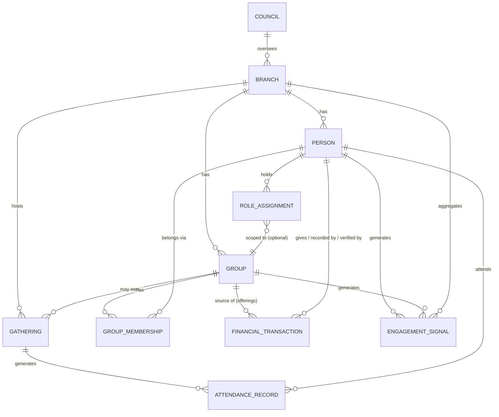

**Design note — why `GROUP_MEMBERSHIP` is its own entity rather than a foreign key on `PERSON`.** A naive model would put a single `bacenta_id` field directly on `Person`. This fails on two counts: it cannot represent the many-to-many Basonta relationship using the same mechanism as the one-to-one Bacenta relationship (forcing two different modeling patterns for what Section 12.2 argues should be one `Group` abstraction), and it destroys history — when a member is reassigned from one Bacenta to another, a foreign-key overwrite loses the fact that they were ever in the first one. `GROUP_MEMBERSHIP` as a distinct, timestamped, soft-closeable entity (with a `started_at`/`ended_at` pair) preserves that history and is the only way Section 13's reassignment-audit requirement (FR-PC-02) can be satisfied.

### 12.4 The Gathering type hierarchy ("Everything Is A Gathering")

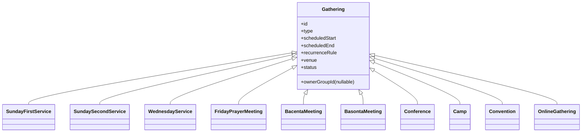

**Implementation note.** This hierarchy should be realized as one `Gathering` table with a `type` discriminator column and a `config` JSON/structured column for type-specific fields (e.g., `OnlineGathering.streamUrl`, `BacentaMeeting.ownerGroupId` is mandatory while `SundayFirstService.ownerGroupId` is null since it belongs to the whole Branch) — not as ten separate tables. `ownerGroupId` is what makes per-Bacenta attendance (an explicit discovery requirement) a query filter on the unified `AttendanceRecord` table rather than a separate reporting subsystem.

**Edge case this hierarchy must handle explicitly:** a gathering that is both a scheduled recurring instance and a one-off (e.g., a Bacenta's regular weekly meeting is cancelled one week in favor of attending a citywide Convention instead). The model must support a recurring `Gathering` series generating individual dated instances, any one of which can be individually cancelled or reassigned without breaking the series definition — this is called out explicitly because it is the kind of scheduling edge case that, if unhandled, produces silently wrong attendance-completeness metrics (Section 8.2).

### 12.5 Member lifecycle state machine

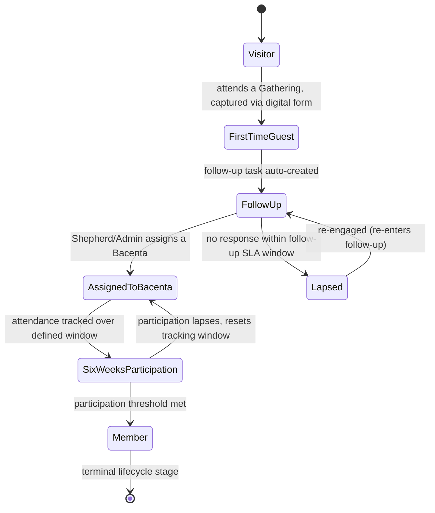

**Design note — the most consequential modeling decision in this document.** The discovery findings present the Member Journey as one continuous chain: Visitor → First-Time Guest → Follow-up → Assigned to Bacenta → Six Weeks Participation → Member → Worker → Shepherd → Pastor. Modeling this literally as a single linear lifecycle field would be a mistake, and it is worth stating plainly why, since it is exactly the kind of assumption this document is instructed to challenge.

A Shepherd does not stop being a Member when appointed. A Pastor does not stop being a Member, or a Worker, or (often) a Shepherd who once led a Bacenta. "Worker," "Shepherd," and "Pastor" are not further stages a person's fundamental relationship to the church passes *through and beyond* — they are **responsibilities layered on top of** the terminal lifecycle stage of "Member." Treating them as literal, mutually exclusive lifecycle stages would make it structurally impossible to answer a question the Resident Pastor persona explicitly needs answered (Section 11.2): "show me this Member's attendance, serving, and training history" — because the moment they became a "Shepherd" in a linear-stage model, their prior "Member" stage history would either be overwritten or require an awkward reconstruction.

**Resolution, stated as a normative rule:** `lifecycle_stage` is a field on `Person` with the state machine shown above, terminating at `Member`. "Worker," "Shepherd," "Assistant Pastor," "Resident Pastor," and "Treasurer" are `Role Assignment` records (Section 12.2) held by a Person whose `lifecycle_stage` is `Member`, each scoped to a specific `Group` or `Branch` and carrying its own effective date range. This is additive to the discovery findings, not a replacement of them: the *progression* Visitor → ... → Pastor described in discovery is preserved exactly as a narrative of how a person's relationship with the church deepens, while the *data model* correctly represents that progression as lifecycle-stage-to-terminal plus an accumulating set of role assignments. Business Rules (a later chapter) will state this as an enforceable rule: a Role Assignment of Worker, Shepherd, Assistant Pastor, Resident Pastor, or Treasurer requires the Person's current `lifecycle_stage` to be `Member`.

**Edge cases this state machine must handle:**

| Edge case | Handling |
|---|---|
| A First-Time Guest never responds to follow-up | Transitions to `Lapsed` after the configured SLA window (not deleted — the record and history are retained, since a Lapsed guest may return) |
| A guest attends once, then does not return for months, then reappears | Re-entry re-opens `FollowUp` from `Lapsed` rather than creating a duplicate Person record — this depends on the identity/de-duplication requirement in Section 13 (FR-PPL-02) |
| A member in Six Weeks Participation stops attending before reaching Member | Returns to `AssignedToBacenta` and the participation window resets; this is a deliberate design choice so "Member" status reflects sustained, not merely historical, participation |
| A Bacenta is reassigned mid-journey (e.g., the guest moves house) | Handled by `GROUP_MEMBERSHIP` history (Section 12.3), not by resetting `lifecycle_stage` |

### 12.6 Group (Bacenta / Basonta) model

| Attribute | Bacenta (`type = PASTORAL_CARE`) | Basonta (`type = MINISTRY`) |
|---|---|---|
| Membership cardinality per Person | Exactly one active membership at a time (hard business rule) | Zero or more concurrent active memberships |
| Primary purpose | Fellowship, pastoral care, discipleship, prayer, evangelism | Serving/ministry function (Choir, Media, Ushers, Technical, etc.) |
| Leader role | Bacenta Leader (Shepherd) | Basonta Leader |
| Owns which Gatherings | Bacenta Meetings | Basonta Meetings |
| Source of offerings | Yes — Bacentas collect and record offerings | No |
| Lifecycle states | Active, Splitting, Merging, Archived (Section 12.9) | Active, Archived |

```mermaid
stateDiagram-v2
    [*] --> Active
    Active --> Splitting: growth threshold triggers planned split (Horizon 3)
    Splitting --> Active: two resulting Bacentas, each Active; membership reassigned
    Active --> Merging: leadership decision to combine with another Bacenta/Basonta
    Merging --> Active: resulting single Group, Active; membership consolidated
    Active --> Archived: Group discontinued
    Archived --> [*]
```

This lifecycle exists specifically to satisfy the "Built to Grow" principle (Section 6): a Bacenta split or merge is a modeled, auditable transition (every affected `GROUP_MEMBERSHIP` gets a closed record and a new one, not a silent bulk update) rather than a manual data-migration exercise performed outside the system, which was named in Section 9.5 as a scope-boundary risk to design against from the outset even though the split/merge *workflow UI* itself is sequenced to Horizon 3 (Section 7.3, G3.4).

### 12.7 Financial Transaction state machine

Two distinct sub-flows exist under the single `FinancialTransaction` entity, reflecting the different accountability chains for money coming in (offerings/giving) versus money going out (expenses) — collapsing them into one state machine would obscure the separation-of-duties requirement (Section 6) that is the entire reason this domain is modeled this carefully.

**Inbound (Offering / Tithe / Special Offering / Pledge / Donation):**

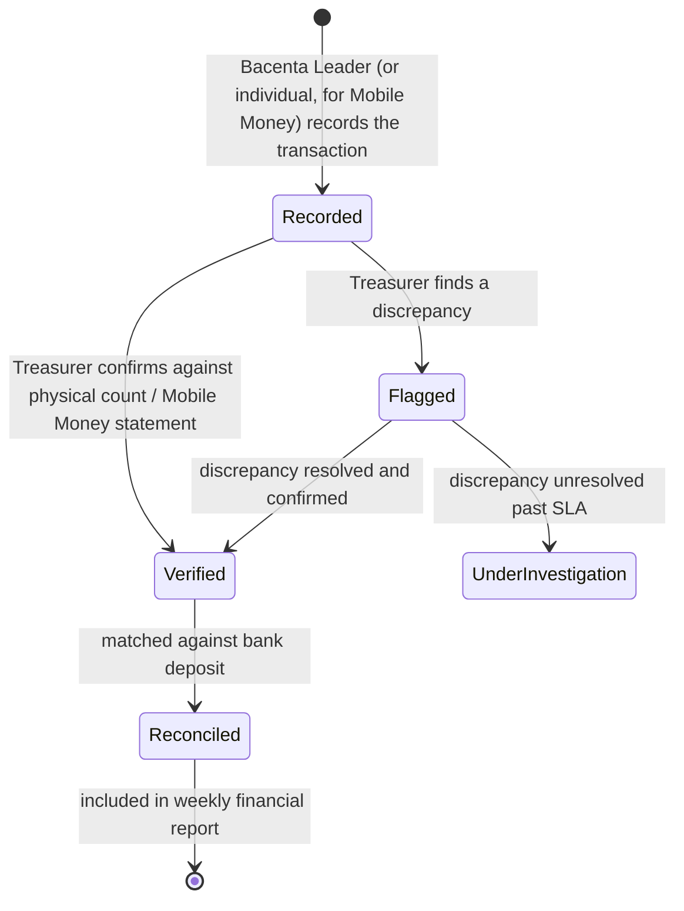

**Outbound (Expense):**

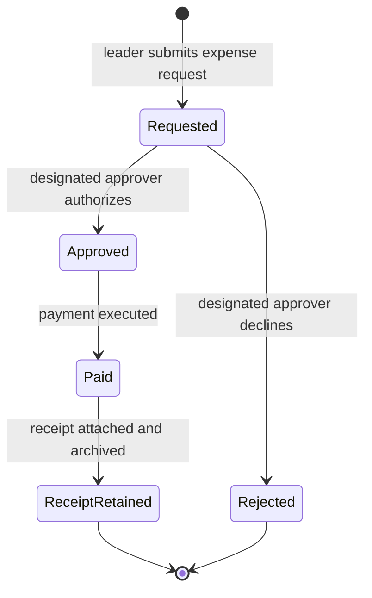

**Normative rule derived directly from discovery:** the actor who transitions `Recorded → Verified` must never be the same actor who performed `Recorded` for that specific transaction, and a Person holding the `Resident Pastor` or `Assistant Pastor` role must never be permitted to perform the `Recorded` transition on an inbound transaction at all (Pastors do not handle cash). This is stated here, in the domain model, because it must be enforced as a state-transition guard condition, not merely as a UI convention — Section 19 (Permissions, later chapter) will specify the exact role-to-transition matrix this implies.

**Edge case:** a Mobile Money transaction given directly by an individual member (bypassing the Bacenta collection flow entirely) enters the state machine at `Recorded` with no Bacenta as its source `Group` — its `source` is the giving Person directly. This is the mechanism by which G2.1 (Mobile Money simplicity) can eventually let a member give without a Bacenta Leader as an intermediary, while still landing in the same auditable state machine as cash offerings.

### 12.8 Church Pulse computation model

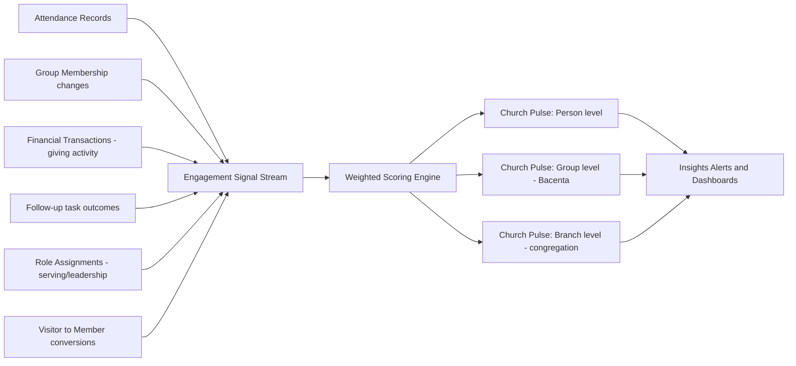

Church Pulse is deliberately modeled as a downstream consumer of an append-only Engagement Signal stream rather than a set of live joins across five domains' live tables. This is a direct consequence of the philosophy stated in Chapter 1 (Section 5.2): Insights must be able to react to what happens, not just report on it after the fact, which requires each domain to *emit* facts rather than Insights *polling* for them. The exact weighting formula, decay function (how much older signals count against recent ones), and alert thresholds are specified as functional requirements in the Insights functional domain chapter (a later chapter), since the precise algorithm is itself a requirement subject to review and tuning, not a fixed constant to bury in this architecture section.

**Partially resolved OQ-10 (§24):** the method for setting initial signal weights is confirmed — sourced from Bishop Francis's and the Assistant Pastors' own ranking of what most shifts their pastoral judgment of engagement, not an engineering guess — but the actual ranking has not yet been gathered. Release 1 ships with equal weighting across all six signal categories as an explicitly labeled provisional placeholder, to be replaced the moment that ranking conversation happens, and revisited again after one full quarter of real Phase 1.3 data.

### 12.9 Cross-domain relationship summary

| Entity | Owned by domain | Read by domain(s) |
|---|---|---|
| Person | People | Pastoral Care, Ministry, Gatherings, Stewardship, Insights |
| Group (Bacenta/Basonta) | People (structure) / Pastoral Care & Ministry (operation) | Gatherings, Stewardship, Insights |
| Gathering | Gatherings | Pastoral Care, Ministry, Insights |
| Attendance Record | Gatherings | Pastoral Care, Insights |
| Financial Transaction | Stewardship | Insights (aggregate only — see Section 10.5 privacy tension) |
| Role Assignment | People | Ministry, Pastoral Care, Insights, Permissions (later chapter) |
| Engagement Signal | Emitted by all domains | Insights (sole consumer) |

---

## 13. Functional Requirements

Functional requirements are grouped by domain and numbered for traceability (referenced later in User Stories, Workflows, and QA test plans). Each requirement states what the system must do, why (tracing back to a goal in Section 7, a problem in Section 4, or a persona need in Section 11), its target release horizon, and testable acceptance criteria. Requirements marked **Priority: R1** are Release 1 scope per Section 9.2; **H2**/**H3** correspond to the horizons defined in Section 7.

### 13.1 People domain

| ID | Requirement | Rationale | Priority | Acceptance criteria |
|---|---|---|---|---|
| FR-PPL-01 | The system shall create a Person record from any of: a digital visitor form, manual entry by an authorized role, or bulk migration import | Multiple entry points must converge on one identity model per Section 12.2 | R1 | A Person created via any of the three paths is retrievable through the same profile view and API shape |
| FR-PPL-02 | The system shall detect likely duplicate Person records (matching name + phone number, or name + Bacenta + approximate age) and require explicit merge or reject action by an authorized role before two records can coexist silently | Prevents a returning Visitor (Section 12.5 edge case) from fragmenting into two histories, which would corrupt Church Pulse and attendance-completeness metrics | R1 | Submitting a visitor form with a name and phone number matching an existing Person triggers a duplicate-candidate prompt rather than silently creating a second record |
| FR-PPL-03 | The system shall enforce the `lifecycle_stage` state machine defined in Section 12.5, rejecting any transition not explicitly modeled | This is the literal enforcement mechanism for the Member Journey being a governed progression, not a free-text status field | R1 | An attempt to set `lifecycle_stage` directly from `Visitor` to `Member` (skipping intermediate stages) is rejected by the system with an explicit error, not silently accepted |
| FR-PPL-04 | The system shall enforce exactly one active `GROUP_MEMBERSHIP` of type `PASTORAL_CARE` per Person at any time, automatically closing the prior membership when a new one is opened | Direct enforcement of "every member belongs to one Bacenta" | R1 | Assigning a Person to a new Bacenta while they hold an active Bacenta membership automatically closes the prior membership record (with an end date) rather than requiring a manual close step first |
| FR-PPL-05 | The system shall permit zero or more concurrent active `GROUP_MEMBERSHIP` records of type `MINISTRY` per Person | Direct enforcement of "a member may belong to multiple Basontas" | R1 | A Person can be added to a second and third Basonta without any system-imposed limit or warning |
| FR-PPL-06 | The system shall record a `Role Assignment` (Worker, Shepherd, Basonta Leader, Assistant Pastor, Resident Pastor, Treasurer) only for a Person whose current `lifecycle_stage` is `Member` | Enforces the Design Note resolution in Section 12.5 | R1 | Attempting to assign the Shepherd role to a Person still in `SixWeeksParticipation` is rejected with an explicit error identifying the lifecycle-stage prerequisite |
| FR-PPL-07 | The system shall maintain a complete, queryable history of a Person's `GROUP_MEMBERSHIP` and `Role Assignment` records, including closed/past ones | Directly serves the Resident Pastor persona's appointment-decision job-to-be-done (Section 11.2) | R1 | Viewing a Person's profile shows a chronological history of every Bacenta, Basonta, and role they have held, with dates |
| FR-PPL-08 | The system shall support configurable custom profile fields per Branch without requiring engineering changes | Serves "Configurable by Design" and the Admin persona (Section 11.9) | H2 | An Admin can add a new profile field (e.g., "Emergency Contact") through a configuration screen, and it appears on the Person profile form immediately |
| FR-PPL-09 | The system shall support an optional guardian/household link on a Person record, with no workflow or UI built around it in Release 1 | **Resolved OQ-01** (see §24): cheap to add now, expensive to backfill after Person records accumulate; kept schema-only pending a confirmed ministry need (e.g., children's ministry check-in) | R1 (schema only; no feature) | A Person record can optionally reference a `guardian_person_id`/`household_id`; no screen or workflow surfaces or requires it in Release 1 |

### 13.2 Pastoral Care domain

| ID | Requirement | Rationale | Priority | Acceptance criteria |
|---|---|---|---|---|
| FR-PC-01 | The system shall allow an authorized role to create and configure a Bacenta (name, leader, meeting schedule, meeting location) | Foundational structure requirement | R1 | A new Bacenta can be created and immediately assigned a leader and recurring `BacentaMeeting` Gathering series |
| FR-PC-02 | The system shall log every Bacenta reassignment as a discrete, timestamped, attributed event (who initiated it, when, from which Bacenta to which) | Directly required by the "Configurable by Design" note in Section 12.3 on why `GROUP_MEMBERSHIP` is its own entity | R1 | Reassigning a member produces a visible audit entry distinguishable from the original assignment |
| FR-PC-03 | The system shall automatically create a Follow-up task when a Person's `lifecycle_stage` enters `FirstTimeGuest` or when a Follow-up task's outcome requires re-engagement (`Lapsed` → `FollowUp`) | Directly addresses the "visitors fall through the cracks" failure mode (Section 4.2) by removing dependence on someone remembering to create the task manually | R1 | A first-time guest captured via digital form generates a Follow-up task within the same processing cycle, with no manual step required |
| FR-PC-04 | The system shall assign each Follow-up task to a specific Person (typically the relevant Shepherd) and track an SLA window, escalating to the Assistant Pastor if unactioned past that window | Serves the Assistant Pastor persona's job-to-be-done (Section 11.3: knowing which Bacentas need attention) and prevents follow-up from silently stalling | R1 | A Follow-up task unactioned past its configured SLA window appears in the Assistant Pastor's escalation view. **Resolved OQ-06 (§24):** default SLA is 3 days for First-Time Guest follow-up, 14 days for Lapsed re-engagement, both Branch-configurable per NFR-MAINT-01 |
| FR-PC-05 | The system shall detect and flag "silent drift": a Person with recorded attendance at Sunday/Wednesday/Friday Gatherings but absence from their Bacenta's meetings across a configurable number of consecutive occurrences | This is the direct system implementation of the pastoral concern explicitly named in discovery ("if someone attends Sunday regularly but does not attend Bacenta, it is considered a pastoral concern") | R1 | A Person meeting the configured drift criteria appears on their Shepherd's dashboard with the specific pattern shown (e.g., "3 Sundays present, 3 Bacenta meetings absent"). **Partially resolved OQ-04 (§24):** method confirmed (leadership's own pastoral judgment sets the real thresholds, not an engineering guess); ships with N=3/M=3 as an explicitly provisional placeholder pending one live calibration session with Bishop Francis and the Assistant Pastors |
| FR-PC-06 | The system shall track Poimen training enrollment and completion status per Person, linked to eligibility for the Shepherd Role Assignment. Whether Poimen completion is enforced as a hard precondition on the Shepherd Role Assignment, or surfaced only as an informational input to the Resident Pastor's decision, is a per-Branch/Council configuration flag, not a single fixed platform behavior | Serves G2.2 and the Resident Pastor persona's evidence-based appointment job-to-be-done. **Resolved OQ-02 (§24, overriding the original recommendation of a fixed soft-input model):** leadership confirmed this must be configurable per Council/Branch, directly exercising "Configurable by Design" (§6) rather than hard-coding one Branch's preference; River of Life's own setting defaults to soft-input (advisory) unless explicitly switched to hard-gate | H2 | A Person's profile shows Poimen module completion status; an Admin can view all Poimen-eligible candidates for Shepherd appointment; a Branch-level configuration flag determines whether an incomplete Poimen status blocks Shepherd Role Assignment creation or merely displays a warning |

### 13.3 Ministry domain

| ID | Requirement | Rationale | Priority | Acceptance criteria |
|---|---|---|---|---|
| FR-MIN-01 | The system shall allow an authorized role to create and configure a Basonta (name, leader, purpose/category) | Foundational structure requirement | R1 | A new Basonta (e.g., "Film Stars") can be created and assigned a leader |
| FR-MIN-02 | The system shall allow a Basonta Leader to define a staffing target for a specific upcoming Gathering (e.g., 8 workers needed for Convention) | Serves G2.3 and the Basonta Leader persona (Section 11.5) | H2 | A Basonta Leader can set a numeric staffing target against a specific Gathering instance |
| FR-MIN-03 | The system shall compute and display staffing adequacy (rostered workers vs. staffing target) per Basonta per upcoming Gathering | Direct implementation of the Section 8.2 "Basonta staffing adequacy" metric | H2 | A Basonta Leader sees a ratio (e.g., "5 of 8 rostered") updating as workers are added to the roster |
| FR-MIN-04 | The system shall flag a Person as rostered across a configurable-threshold number of concurrent Basontas/Gatherings as a possible overcommitment | Prevents burnout of the most willing servers and supports realistic staffing decisions | H2 | A worker rostered on 4+ overlapping Gathering commitments in one week is flagged to their Basonta Leader(s) |

### 13.4 Gatherings domain

| ID | Requirement | Rationale | Priority | Acceptance criteria |
|---|---|---|---|---|
| FR-GTH-01 | The system shall model all gathering types (Sunday First/Second Service, Wednesday Service, Friday Prayer Meeting, Bacenta Meeting, Basonta Meeting, and future Conference/Camp/Convention/Online types) as instances of one generalized `Gathering` entity with a type discriminator, per Section 12.4 | Prevents parallel, divergent event subsystems; the core "Everything Is A Gathering" requirement | R1 | Adding a new gathering type (e.g., "Camp") requires only configuration (a new type value and its config schema), not a new database table or duplicated attendance logic |
| FR-GTH-02 | The system shall support recurring Gathering series (e.g., "every Sunday") that generate individual dated instances, any one of which can be independently cancelled, rescheduled, or have its attendance recorded without altering the series definition | Addresses the recurrence edge case in Section 12.4 (a Bacenta's regular meeting cancelled in favor of a Convention) | R1 | Cancelling one instance of a recurring Bacenta Meeting series does not affect the following week's scheduled instance |
| FR-GTH-03 | The system shall record attendance per individual Gathering instance, with each Attendance Record queryable both at the Branch (whole-church) level and, where the Gathering's `ownerGroupId` is set, at the Bacenta level | Directly satisfies the explicit discovery requirement that attendance is recorded "per church, per Bacenta" | R1 | A report can be generated showing total Sunday attendance for the Branch and, separately, attendance for a named Bacenta's meetings, from the same underlying data |
| FR-GTH-04 | The system shall provide a digital visitor capture form usable at any Gathering, creating a new Person at `lifecycle_stage = Visitor` (or `FirstTimeGuest` if this is confirmed as their first attendance) upon submission | Directly replaces the manual paper-card process named as a discovery pain point and a Section 4.2 failure mode | R1 | A visitor form submission at a Sunday service creates a Person record and triggers FR-PC-03 (automatic follow-up task) without manual transcription |
| FR-GTH-05 | The system shall allow attendance to be recorded within a configurable window after a Gathering's scheduled end and shall flag Gatherings with no attendance recorded past that window | Supports the Section 8.2 "attendance capture completeness" metric and prevents Church Pulse from silently degrading due to missing, not merely negative, data | R1 | A Bacenta Meeting with no attendance recorded 48 hours after its scheduled end appears on an incompleteness report visible to the relevant Assistant Pastor |
| FR-GTH-06 | The system shall support an `OnlineGathering` type with attendance/participation semantics equivalent to in-person types (e.g., join confirmation as a proxy for attendance) | Serves G3.3 | H3 | An Online Gathering instance can record participant attendance and feeds the same Attendance Record and Church Pulse pipeline as in-person Gatherings |

### 13.5 Stewardship domain

| ID | Requirement | Rationale | Priority | Acceptance criteria |
|---|---|---|---|---|
| FR-STW-01 | The system shall allow a Bacenta Leader to record an inbound Financial Transaction (Offering, Tithe, or Special Offering) collected at a Bacenta Meeting, entering the `Recorded` state (Section 12.7) | Core stewardship recording requirement, matching "Bacenta leaders record offerings" | R1 | A Bacenta Leader can record a transaction against a specific Bacenta Meeting Gathering instance immediately after the meeting |
| FR-STW-02 | The system shall prevent any Person holding the Resident Pastor or Assistant Pastor role from performing the `Recorded` transition on an inbound transaction | Direct, hard enforcement of "Pastors do not handle cash" | R1 | An attempt by a Person with only Pastor-level roles to record a cash offering is rejected by the system, not merely discouraged by UI copy |
| FR-STW-03 | The system shall require a distinct Treasurer/Finance Team role to perform the `Recorded → Verified` transition, and shall disallow the same individual who performed `Recorded` from also performing `Verified` on that transaction | Direct enforcement of separation of duties (Section 6, "Stewardship with Accountability") | R1 | The system rejects a verification attempt where `recorded_by` and `verifying_user` are the same Person |
| FR-STW-04 | The system shall allow a Treasurer to mark a transaction `Flagged` with a reason if it does not match a physical count, and shall route flagged transactions to a visible discrepancy queue | Supports the Treasurer persona's job-to-be-done (Section 11.6): catching discrepancies immediately | R1 | A flagged transaction appears in a discrepancy queue distinct from the normal verification queue, with the flag reason attached |
| FR-STW-05 | The system shall support recording the giving channel (Cash or Mobile Money) on every inbound transaction | Matches discovery: "Members currently give through Cash, Mobile Money" | R1 | Every inbound transaction has a non-null channel value used in the Mobile Money adoption rate metric (Section 8.2) |
| FR-STW-06 | The system shall allow an individual member to record or initiate a Mobile Money transaction directly, without requiring a Bacenta as an intermediary | Supports the "one major goal is making Mobile Money giving simple" objective and the G2.1 goal | H2 | A member can submit a Mobile Money giving transaction from their own profile/app view, entering the same `Recorded` state as Bacenta-collected offerings |
| FR-STW-07 | The system shall aggregate `Verified` transactions into a weekly reconciliation view comparing recorded totals against confirmed bank deposits | Matches discovery: "money is banked weekly," "financial reports are prepared weekly" | R1 | A weekly reconciliation report can be generated showing, per Bacenta, total verified offerings against the corresponding bank deposit confirmation |
| FR-STW-08 | The system shall support Project entities against which Pledges and Donations can be tracked, distinct from recurring Tithe/Offering, with visible progress against a target. Where a reminder is sent for an outstanding pledge, it shall be a single, opt-in, gentle notice near the pledge's stated timeline — never a repeated or pressuring sequence | Matches discovery: "Projects support pledges and donations" and G2.4. **Resolved OQ-07 (§24):** automation here must strengthen, not substitute for, relational stewardship (per "Ministry First," §6) | H2 | A named Project (e.g., a building fund) shows total pledged, total received, and progress against a stated target; at most one reminder notification is generated per pledge, and only if the giver has opted in |
| FR-STW-09 | The system shall support an Expense request/approval workflow requiring a designated approver (leadership) distinct from the requester, with mandatory receipt attachment before an expense reaches its terminal state | Matches discovery: "expenses are approved by leadership," "receipts are retained" | R1 | An expense cannot reach `ReceiptRetained` (terminal) state without an attached receipt file, and cannot reach `Approved` without action from a Person other than the requester |
| FR-STW-10 | The system shall never allow a hard delete of any Financial Transaction; corrections must be represented as a new, linked, auditable correcting entry | Preserves the auditability the entire Stewardship model exists to guarantee | R1 | Attempting to delete a recorded, verified, or reconciled transaction is not possible through any standard interface; only a linked correcting entry can be created, and both entries remain visible in history |

### 13.6 Insights domain

| ID | Requirement | Rationale | Priority | Acceptance criteria |
|---|---|---|---|---|
| FR-INS-01 | The system shall compute a Church Pulse score at Person, Group (Bacenta), and Branch levels from the weighted Engagement Signal model in Section 12.8 | Core North Star metric requirement (Section 8.1) | R1 (Branch/Group level); H2–H3 (Person level, pending privacy design per Section 9.3) | A Church Pulse score (0–100) is visible for the Branch and for each Bacenta, updating on a defined cadence |
| FR-INS-02 | The system shall allow an authorized Admin to configure the relative weights of each Church Pulse signal category | Matches "Configurable by Design"; different churches may reasonably weight signals differently | H2 | An Admin can adjust signal-category weights through a configuration screen and see the resulting score recompute |
| FR-INS-03 | The system shall generate a proactive alert when a Bacenta's or Branch's Church Pulse trend declines beyond a configurable threshold over a configurable trailing window | Directly serves the Resident Pastor and Assistant Pastor personas' jobs-to-be-done (Sections 11.2, 11.3) | R1 | A Bacenta whose Church Pulse drops by more than the configured threshold over the trailing window generates a visible alert to the relevant Assistant Pastor and Resident Pastor |
| FR-INS-04 | The system shall present each role with an Insights view scoped to their organizational responsibility (a Shepherd sees their own Bacenta; an Assistant Pastor sees their cluster; the Resident Pastor sees the whole Branch) | Serves the RACI/scope boundaries defined in Section 10.4 and prevents information overload contrary to the Assistant Pastor persona's stated concern (Section 11.3) | R1 | A Shepherd's Insights view contains no data belonging to a Bacenta they do not lead |
| FR-INS-05 | The system shall record whether a leader acted on a proactive Insights alert (e.g., opened a follow-up, reassigned a member, contacted a Shepherd) versus dismissed it without action | Directly required to compute the Section 8.2 "leadership action rate on Insights prompts" metric | R1 | Each alert has a recorded resolution status (acted / dismissed) attributable to the responding user |

### 13.7 Platform & Administration (cross-cutting)

| ID | Requirement | Rationale | Priority | Acceptance criteria |
|---|---|---|---|---|
| FR-ADM-01 | The system shall provide a configuration interface for gathering types, group-type labels, and role labels, editable by an Admin without engineering involvement | Direct test of the "Configurable by Design" principle via the Admin persona (Section 11.9) | R1 | An Admin can rename "Basonta" to a different label (for a hypothetical differently-named future deployment) without a code deployment |
| FR-ADM-02 | The system shall maintain an immutable audit log of all state-transition events across People, Pastoral Care, Stewardship, and Ministry domains | Underpins auditability requirements across Sections 12.7 and 13.5, and supports QA/compliance verification | R1 | Every reassignment, verification, approval, and role-assignment event is retrievable from a single audit log view, attributed and timestamped |
| FR-ADM-03 | The system shall model Branch and Council as first-class entities from Release 1, even while operating with a single Branch | Directly implements the "Built to Grow" mechanism described in Section 12.2 | R1 | The data model contains non-nullable Branch references throughout, with exactly one Branch row present at Release 1, requiring no schema migration to add a second |

---

*End of Chapter 3.*

---

## 14. Non-Functional Requirements

Non-functional requirements (NFRs) are grouped by category, each with an ID, statement, rationale, target/threshold, and priority. Several categories here are weighted more heavily than a generic SaaS PRD would weight them, specifically because of facts established in Chapters 1–3: the heaviest-use persona (Shepherd Kwabena, Section 11.4) is a smartphone-only volunteer with brief usage windows and variable connectivity, and the Stewardship domain (Section 12.7, 13.5) carries a hard auditability requirement that is not optional or "nice to have" — it is the mechanism by which "Stewardship with Accountability" (Section 6) is real rather than aspirational.

### 14.1 Performance & responsiveness

| ID | Requirement | Rationale | Target | Priority |
|---|---|---|---|---|
| NFR-PERF-01 | Attendance capture for a Gathering with up to 30 attendees shall complete, from opening the attendance screen to confirmed save, in under 60 seconds of active user interaction | Directly required by Shepherd Kwabena's job-to-be-done (Section 11.4): "under a minute, so it doesn't eat into fellowship time" | ≤ 60 seconds active interaction time | R1 |
| NFR-PERF-02 | Core mobile screens (attendance, offering recording, member profile) shall render usable content within 2 seconds on a mid-tier Android device over a 3G-equivalent connection | Matches the device/connectivity reality of the primary ministry-side personas (Section 11), not an idealized flagship-device, high-bandwidth assumption | ≤ 2 seconds time-to-interactive on 3G-equivalent | R1 |
| NFR-PERF-03 | Church Pulse score recomputation shall propagate to affected dashboards within 15 minutes of the triggering Engagement Signal, not require a manual refresh cycle | Supports the event-driven Insights model (Section 12.8); a same-day-but-not-real-time latency is acceptable given pastoral (not operational/trading) use, but must not silently lag by days | ≤ 15 minutes signal-to-dashboard latency | R1 |

### 14.2 Scalability

| ID | Requirement | Rationale | Target | Priority |
|---|---|---|---|---|
| NFR-SCALE-01 | The platform shall support a single Branch scaling from tens to several thousand active Persons and hundreds of concurrent Bacentas/Basontas without requiring architectural change | Directly serves "Built to Grow" (Section 6) at the single-church level, independent of multi-branch Horizon 3 scaling | Linear cost/performance scaling to 5,000 active Persons per Branch, validated by load testing before general release | R1 (architecture); ongoing validation |
| NFR-SCALE-02 | The platform shall support a Council with multiple Branches (Horizon 3) without per-branch schema divergence | Direct consequence of the Branch/Council modeling decision in Section 12.2 | Onboarding a second Branch requires zero schema migration, only new configuration and data rows | H3 |
| NFR-SCALE-03 | Reporting and reconciliation queries (Section 13.5, FR-STW-07) shall complete within acceptable interactive time even as historical Financial Transaction volume grows across years of operation | Weekly reconciliation is a recurring, permanent operational rhythm (Section 4, discovery), not a one-time task; performance must not degrade as history accumulates | Weekly reconciliation report generation ≤ 10 seconds at 5 years of historical transaction volume for a single Branch | H2 |

### 14.3 Availability & reliability

| ID | Requirement | Rationale | Target | Priority |
|---|---|---|---|---|
| NFR-AVAIL-01 | Core attendance and offering-recording functions shall remain usable during a scheduled Gathering even if the backend is briefly unreachable, via local queuing and later sync (see 14.4, Offline Support) | The moment attendance/offering data is most needed to be captured (immediately after a Bacenta Meeting) is also a moment connectivity may be poor; the system must not create a perverse incentive to skip recording | Local capture succeeds and syncs automatically once connectivity resumes, with no data loss | R1 |
| NFR-AVAIL-02 | The platform shall target 99.5% availability for core ministry-facing functions, measured monthly, excluding scheduled maintenance windows announced at least 48 hours in advance | A church's operational rhythm (Sunday services, weekly reconciliation) is time-bound; unplanned downtime during a service window is disproportionately costly relative to typical business-hours SaaS usage | ≥ 99.5% monthly uptime for core functions | R1 |
| NFR-AVAIL-03 | Scheduled maintenance shall never be scheduled during a known recurring Gathering window (Sunday services, Wednesday service, Friday prayer meeting) for the affected Branch's time zone | Directly derived from the operational calendar established in discovery | Zero scheduled maintenance events overlapping configured recurring Gathering windows | R1 |

### 14.4 Offline support & connectivity resilience

| ID | Requirement | Rationale | Target | Priority |
|---|---|---|---|---|
| NFR-OFF-01 | The mobile client shall support offline-first capture of attendance and offering records, queuing them locally and syncing when connectivity is available | Directly serves the Shepherd persona's "variable connectivity" context (Section 11.1 summary table) and prevents Bacenta-level data (the platform's richest signal source) from being the most fragile to capture | Attendance/offering entries created while offline sync successfully within 5 minutes of connectivity resuming, with visible sync-status indication to the user | R1 |
| NFR-OFF-02 | The system shall resolve sync conflicts (e.g., two devices editing the same Attendance Record while offline) deterministically and without silent data loss, surfacing a conflict for manual resolution only when automatic resolution is not safe | Prevents the exact kind of silent data corruption that would undermine trust in Church Pulse and financial reconciliation | Zero silent overwrites of conflicting financial transaction data; all conflicts either auto-resolved by a documented rule or surfaced for review | R1 |

### 14.5 Security

| ID | Requirement | Rationale | Target | Priority |
|---|---|---|---|---|
| NFR-SEC-01 | All data in transit shall be encrypted (TLS 1.2 or higher); all data at rest, particularly Financial Transaction and Person records, shall be encrypted at the storage layer | Baseline expectation for any system handling financial and personal data, and specifically required given Stewardship's accountability mandate | 100% of network traffic over TLS 1.2+; storage-layer encryption enabled by default | R1 |
| NFR-SEC-02 | The system shall implement role-based access control (RBAC) enforcing the domain-level RACI boundaries (Section 10.4) and the state-transition guard conditions defined in the domain model (e.g., FR-STW-02, FR-STW-03) at the API/service layer, not only in the client UI | A UI-only restriction is not a security control; the separation-of-duties requirement must be unbypassable by direct API access | Zero privilege-escalation paths via direct API calls bypassing UI restrictions, verified by security testing | R1 |
| NFR-SEC-03 | The system shall support multi-factor authentication for roles with financial-transaction or leadership-appointment authority (Treasurer, Assistant Pastor, Resident Pastor) | Proportionate control given the sensitivity of the actions these roles can take | MFA available and enforceable per-role by Branch configuration | R1 (available); enforcement configurable |
| NFR-SEC-04 | The system shall maintain session and authentication logs sufficient to reconstruct who accessed or modified any Financial Transaction or Role Assignment record | Extends the audit-log requirement (FR-ADM-02) to the authentication layer, closing the gap between "what changed" and "who was actually logged in when it changed" | Every write operation on Financial Transaction and Role Assignment entities is attributable to an authenticated session | R1 |

### 14.6 Privacy & data protection

| ID | Requirement | Rationale | Target | Priority |
|---|---|---|---|---|
| NFR-PRIV-01 | The system shall treat pastoral-care detail (reasons for follow-up, notes on a member's circumstances) as a distinct, more restricted sensitivity tier than general attendance or profile data | Directly addresses the "pastoral privacy vs. leadership visibility" tension named in Section 10.5 | Pastoral notes are visible only to the assigned Shepherd and their direct oversight chain (Assistant Pastor, Resident Pastor), never to unrelated Bacenta leaders or Basonta leaders | R1 |
| NFR-PRIV-02 | Member-level Church Pulse scores shall not be released as a functional capability (FR-INS-01) until a defined access-control model for that specific data has been reviewed and approved, consistent with the deferral already stated in Section 9.3 | Prevents a sensitive, inferential score about an individual's spiritual/relational engagement from being exposed more broadly than pastorally appropriate before its access model is deliberately designed | No member-level Church Pulse score ships to any role until NFR-PRIV-01-equivalent scoping review is complete for that feature | H2–H3 gate |
| NFR-PRIV-03 | The system shall comply with the Ghana Data Protection Act, 2012 (Act 843) for the reference deployment, and shall structure consent, data-subject rights (access, correction, deletion requests), and cross-border data handling to be extensible to other jurisdictions' equivalent regimes as the platform expands beyond Ghana | River of Life Cathedral operates in Ghana; expansion to other countries (implied by "Built to Grow" and the long-term vision) requires the privacy architecture not be Ghana-specific by hard-coding | Documented compliance mapping against Act 843 completed before Release 1 general availability | R1 |

### 14.7 Auditability & compliance

| ID | Requirement | Rationale | Target | Priority |
|---|---|---|---|---|
| NFR-AUD-01 | Every Financial Transaction state transition (Section 12.7) shall be immutably logged with actor, timestamp, and prior/new state, retrievable for no less than 7 years | Matches typical minimum financial record-retention expectations and directly supports the Treasurer persona's "prove exactly where every cedi came from" job-to-be-done | 100% of transaction transitions logged; 7-year minimum retrievability | R1 |
| NFR-AUD-02 | The audit log (FR-ADM-02) itself shall be append-only and tamper-evident (e.g., cryptographic hash chaining or an equivalent mechanism) | An audit log that can itself be edited without a trace is not an audit log; this is a direct integrity requirement flowing from "Stewardship with Accountability" | Any modification to a historical audit record is detectable | H2 |

### 14.8 Usability & accessibility

| ID | Requirement | Rationale | Target | Priority |
|---|---|---|---|---|
| NFR-USA-01 | Core ministry-facing workflows (attendance, offering recording, follow-up) shall be operable by a user with no prior formal software training, within a single guided session | Matches the volunteer-leader reality (Shepherds, Bacenta/Basonta leaders are not IT professionals) named throughout the Personas chapter | ≥ 90% first-time task success rate in usability testing for attendance and offering recording, without external help | R1 |
| NFR-USA-02 | The interface shall support text scaling and high-contrast display modes to accommodate a broad age range of leaders, including older Shepherds and Pastors | Church leadership (per the discovery leadership hierarchy) spans a wide age range; this is a direct accessibility requirement, not a generic checkbox | Compliance with WCAG 2.1 AA for text contrast and resizing on all core ministry-facing screens | H2 |

### 14.9 Localization & internationalization

| ID | Requirement | Rationale | Target | Priority |
|---|---|---|---|---|
| NFR-L10N-01 | The system shall support English as the Release 1 language, with the underlying architecture supporting additional languages (e.g., Twi, other Ghanaian languages, and languages relevant to future denominational deployments) without redesign | Serves both the immediate reference deployment and the "Built to Grow" ambition toward denominations and regions beyond River of Life | All user-facing strings externalized to translatable resources from Release 1, even if only English is shipped initially | R1 (architecture); H2+ (additional languages) |
| NFR-L10N-02 | Currency handling shall default to Ghana Cedi (GHS) for the reference deployment while supporting per-Branch currency configuration for future deployments outside Ghana | Financial figures (Stewardship domain) must be correctly denominated and must not hard-code a single currency assumption into the schema | Financial Transaction entities carry an explicit currency field, not an implicit global default | R1 |

### 14.10 Interoperability & integration

| ID | Requirement | Rationale | Target | Priority |
|---|---|---|---|---|
| NFR-INT-01 | The Stewardship domain shall support integration with at least one Mobile Money provider API (e.g., MTN MoMo) for transaction confirmation, reducing manual entry of Mobile Money gifts | Directly required to progress G2.1 beyond manual recording toward genuine simplicity | Automated Mobile Money transaction confirmation reduces manual entry steps to zero for supported providers | H2 |
| NFR-INT-02 | The platform shall provide a data export capability (at minimum, structured file export; ideally an API) allowing Financial Transaction and reporting data to be consumed by a dedicated accounting/bookkeeping system | Consistent with the explicit non-goal (Section 7.4) that Ecclesia is not a general-ledger system; it must integrate with one rather than isolate church data from one | Weekly financial report data exportable in a structured format (e.g., CSV) suitable for import into common accounting tools | H2 |

### 14.11 Maintainability & extensibility

| ID | Requirement | Rationale | Target | Priority |
|---|---|---|---|---|
| NFR-MAINT-01 | New Gathering types, Group-type labels, and Role labels shall be addable via configuration, per FR-ADM-01, without a code deployment | Direct technical realization of "Configurable by Design" | Adding a new Gathering type is achievable by an Admin through a configuration interface | R1 |
| NFR-MAINT-02 | The Church Pulse weighting model (Section 12.8) shall be implemented as configurable parameters, not hard-coded constants, so that signal weights can be tuned without a code deployment | Supports FR-INS-02 and acknowledges that the "correct" weighting is a hypothesis to be refined with real operating data, not a fixed constant known in advance | Signal weights are stored as configuration data and adjustable through an authorized interface | H2 |

### 14.12 Data retention, backup & disaster recovery

| ID | Requirement | Rationale | Target | Priority |
|---|---|---|---|---|
| NFR-DR-01 | The system shall perform automated, encrypted backups of all Branch data at least daily, with tested restore procedures | Baseline operational resilience; a church's entire pastoral and financial history must not be a single point of failure | Daily backups; documented restore test performed at least quarterly | R1 |
| NFR-DR-02 | Recovery Point Objective (RPO) for core Stewardship and Pastoral Care data shall not exceed 24 hours; Recovery Time Objective (RTO) for core ministry-facing functions shall not exceed 4 hours | Financial and pastoral-care data loss has outsized real-world consequence relative to typical SaaS data given the accountability and care mandates in Chapter 1 | RPO ≤ 24h, RTO ≤ 4h for core functions | R1 |

---

## 15. Business Rules

This section consolidates every hard business rule referenced across Chapters 1–3 into a single, authoritative catalog, organized by domain. Where a rule was already stated as part of a functional requirement's rationale, it is restated here in canonical form with its enforcement point named explicitly, because a business rule that lives only inside a requirement's rationale text is easy to lose track of during implementation; a consolidated catalog is what QA (Section 10.3, Delivery stakeholders) tests against directly. Rules marked **[Discovery]** are stated directly in the authoritative discovery findings; rules marked **[Derived]** are logical extensions this PRD introduces to make a discovery rule implementable without contradicting it.

### 15.1 People & Membership

| ID | Rule | Source | Enforcement point |
|---|---|---|---|
| BR-PPL-01 | Every Member belongs to exactly one Bacenta at any given time | [Discovery] | `GROUP_MEMBERSHIP` uniqueness constraint (type = PASTORAL_CARE), FR-PPL-04 |
| BR-PPL-02 | A Member may belong to zero or more Basontas concurrently | [Discovery] | `GROUP_MEMBERSHIP` (type = MINISTRY) permits multiple active rows, FR-PPL-05 |
| BR-PPL-03 | The Member Journey lifecycle stage is: Visitor → First-Time Guest → Follow-up → Assigned to Bacenta → Six Weeks Participation → Member, and terminates at Member | [Discovery] | `lifecycle_stage` state machine, Section 12.5, FR-PPL-03 |
| BR-PPL-04 | Worker, Shepherd, Assistant Pastor, Resident Pastor, and Treasurer are Role Assignments, not further lifecycle stages, and require the holder's `lifecycle_stage` to be Member | [Derived] — see Design Note, Section 12.5 | FR-PPL-06 |
| BR-PPL-05 | Leadership appointments (Worker → Shepherd, Shepherd → Pastor, and Assistant Pastor/Treasurer designation) are made by Pastors, not by self-nomination or automatic system promotion | [Discovery] | Role Assignment creation restricted to Resident Pastor/Assistant Pastor-held permission, formalized in Section 19 (Permissions, later chapter) |
| BR-PPL-06 | Future leaders are trained through Poimen prior to appointment consideration | [Discovery] | Poimen completion tracked (FR-PC-06). **Resolved OQ-02 (§24):** whether completion is a hard gate or an informational input is a per-Branch/Council configuration flag, not a single fixed rule — River of Life defaults to informational (soft-input) unless explicitly configured otherwise |

### 15.2 Pastoral Care

| ID | Rule | Source | Enforcement point |
|---|---|---|---|
| BR-PC-01 | A Bacenta functions simultaneously as a fellowship, pastoral care group, discipleship group, prayer group, and evangelism unit — it is not a single-purpose entity | [Discovery] | Reflected in Bacenta configuration (Section 12.6) supporting multiple concurrent purposes rather than a single "purpose" enum value |
| BR-PC-02 | A Person attending Sunday/Wednesday/Friday Gatherings regularly while not attending their assigned Bacenta's meetings constitutes a pastoral concern ("silent drift") | [Discovery] | FR-PC-05; exact thresholds (what counts as "regularly," how many consecutive absences trigger the flag) are configuration, not hard-coded, per NFR-MAINT-01 |
| BR-PC-03 | A First-Time Guest must have a Follow-up task created automatically upon capture, not dependent on manual initiation | [Derived] — directly closes the Section 4.2 "visitors fall through the cracks" failure mode | FR-PC-03 |
| BR-PC-04 | An unactioned Follow-up task past its configured SLA window escalates to the assigned Person's organizational superior (typically Shepherd → Assistant Pastor) | [Derived] | FR-PC-04 |

### 15.3 Ministry

| ID | Rule | Source | Enforcement point |
|---|---|---|---|
| BR-MIN-01 | A Basonta is a serving/ministry unit distinct in purpose from a Bacenta, and membership in one does not imply or substitute for membership in the other | [Discovery] | `Group.type` discriminator (Section 12.6); a Person's Bacenta assignment (BR-PPL-01) is independent of their Basonta memberships (BR-PPL-02) |
| BR-MIN-02 | Basonta staffing needs should be visible ahead of major Gatherings, not discovered on the day of the event | [Derived] — from the Basonta Leader persona's stated pain point (Section 11.5) | FR-MIN-02, FR-MIN-03 |

### 15.4 Gatherings

| ID | Rule | Source | Enforcement point |
|---|---|---|---|
| BR-GTH-01 | Attendance must be recordable and reportable at both the whole-church (Branch) level and the individual Bacenta level | [Discovery] | `AttendanceRecord` scoping via `Gathering.ownerGroupId`, FR-GTH-03 |
| BR-GTH-02 | All named gathering types (current and future) are modeled as a single generalized entity, not independent event subsystems | [Discovery] ("Everything Is A Gathering" is named explicitly as an Important Product Concept) | Section 12.4, FR-GTH-01 |
| BR-GTH-03 | Visitor capture must be achievable digitally at the point of attendance, replacing dependence on manual paper records | [Discovery] ("the future system should support digital visitor forms") | FR-GTH-04 |

### 15.5 Stewardship

| ID | Rule | Source | Enforcement point |
|---|---|---|---|
| BR-STW-01 | Pastors do not handle cash under any circumstance | [Discovery] | FR-STW-02; hard guard condition on the `Recorded` transition, not a UI-level suggestion |
| BR-STW-02 | Bacentas collect offerings; Bacenta leaders record those offerings; the recorded offerings then go to the church (Finance Team) for verification | [Discovery] | FR-STW-01, defines the canonical flow direction: Bacenta → Bacenta Leader (record) → Treasurer (verify) |
| BR-STW-03 | The Finance Team (Treasurers) counts, verifies, and records offerings as their designated function | [Discovery] | FR-STW-03; note the apparent tension with BR-STW-02 ("Bacenta leaders record") is resolved as: Bacenta Leaders perform the *initial* recording at collection point, Treasurers perform *count-verification* against that recording — both are accurately described as "recording" activity at different points in the chain, and the state machine (Section 12.7) distinguishes them as `Recorded` (Bacenta Leader) vs. `Verified` (Treasurer) |
| BR-STW-04 | The individual who records a transaction must not be the same individual who verifies it | [Derived] — direct implementation of separation of duties required by "Stewardship with Accountability" (Section 6) | FR-STW-03 |
| BR-STW-05 | Members give via Cash or Mobile Money | [Discovery] | `channel` field on Financial Transaction, FR-STW-05 |
| BR-STW-06 | Projects support pledges and donations, tracked distinctly from recurring tithe/offering giving | [Discovery] | FR-STW-08 |
| BR-STW-07 | Expenses require leadership approval before payment | [Discovery] | FR-STW-09; `Requested → Approved` transition restricted to a designated leadership approver role |
| BR-STW-08 | Receipts are retained for all expenses | [Discovery] | FR-STW-09; `ReceiptRetained` terminal state cannot be reached without an attached receipt |
| BR-STW-09 | Financial reports are prepared weekly | [Discovery] | FR-STW-07; weekly reconciliation cadence is the default configuration, adjustable per Branch |
| BR-STW-10 | Money is banked weekly | [Discovery] | Reflected in the `Reconciled` state's expected cadence (Section 12.7); the system does not itself move money but must track bank-deposit confirmation on this cadence |
| BR-STW-11 | No Financial Transaction may be hard-deleted; corrections are additive, linked entries | [Derived] — required for the auditability mandate to be meaningful, not merely nominal | FR-STW-10 |

### 15.6 Insights

| ID | Rule | Source | Enforcement point |
|---|---|---|---|
| BR-INS-01 | Engagement (Church Pulse) must be computed from multiple signals — attendance, Bacenta participation, serving, follow-up, leadership engagement, visitor retention — and must not be reducible to attendance alone | [Discovery] (Church Pulse is defined explicitly against this exact conflation) | Section 12.8 scoring model; weighting configuration prevents any single signal from being set to 100% of the score by omission of the others' minimum weight floor (a safeguard to be formalized in the Insights functional domain chapter) |
| BR-INS-02 | A role may only view Insights data within its organizational scope (own Bacenta, own cluster, or whole Branch, per the RACI in Section 10.4) | [Derived] | FR-INS-04 |

### 15.7 Organizational

| ID | Rule | Source | Enforcement point |
|---|---|---|---|
| BR-ORG-01 | Leadership hierarchy flows Resident Pastor → Assistant Pastors → Bacenta Leaders (Shepherds) → Members | [Discovery] | Role Assignment scoping and the escalation chain in BR-PC-04 |
| BR-ORG-02 | River of Life Cathedral is a Council Church; the Council oversees multiple branches | [Discovery] | Branch/Council entity model, Section 12.2, NFR-SCALE-02 |
| BR-ORG-03 | Resident Pastor succession is formally announced, with a defined interim/acting authority holding the role during the transition period. System access for an incoming Resident Pastor is confirmed and provisioned only by Council action — never self-confirmed by the outgoing Resident Pastor, and never automated without that confirmation | **[Derived]** — Resolved OQ-03 (§24), per leadership's stated succession process | Documented manual runbook (not an in-app automated workflow) for Release 1; see the Technical Blueprint's Authentication chapter for the access-provisioning procedure. RISK-08 status updated from open to mitigated-via-documented-process |

### 15.8 Decision tree — silent-drift detection logic

The following formalizes BR-PC-02 as an implementable decision tree, since "regularly" and "considered a pastoral concern" in the discovery findings are qualitative and require a precise, configurable operationalization for engineering to build against:

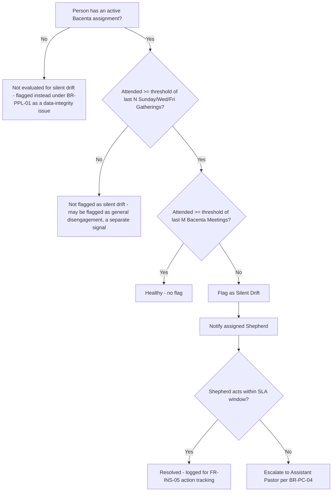

The specific values of N, M, and the attendance thresholds are configuration (per NFR-MAINT-01), not hard-coded — a value that works for River of Life Cathedral's cadence may not generalize to a future deployment with a different meeting frequency, and hard-coding it here would silently violate "Configurable by Design" the first time the platform is deployed to a second church.

---

*End of Chapter 4.*

---

## 16. Functional Domains (Detailed Specification)

Chapter 3 (Section 13) specified *what the system must do*, as discrete, testable requirements. This chapter specifies *how each domain behaves as a cohesive whole* — its full capability set, the surfaces (screens/interactions) it presents to different personas, what it captures and emits, what it must explicitly refuse to do (its boundary with adjacent domains), and its dependencies. This is the level of detail a domain-owning engineering team should be able to build a design doc directly from.

### 16.1 People

**Purpose.** The authoritative identity and lifecycle system for every Person known to the church, from first contact through the full leadership pipeline.

**Capabilities.**

| Capability | Description |
|---|---|
| Identity creation & de-duplication | Creates a Person from visitor forms, manual entry, or migration; runs duplicate-candidate detection (FR-PPL-02) on every creation |
| Lifecycle stage management | Enforces the state machine in Section 12.5; surfaces the current stage and available next transitions to authorized roles |
| Group membership management | Manages Bacenta (single, enforced) and Basonta (multiple, unconstrained) memberships with full history |
| Role assignment management | Grants/revokes Worker, Shepherd, Basonta Leader, Assistant Pastor, Resident Pastor, Treasurer roles, gated by BR-PPL-04 |
| Profile management | Core fields (name, contact, date of birth where known, address) plus configurable custom fields (FR-PPL-08) |
| Search & directory | Role-scoped search (a Shepherd searches within their Bacenta context by default; an Admin searches the whole Branch) |

**Key surfaces.**

| Surface | Primary persona | Notes |
|---|---|---|
| Person profile view | All operator roles | Shows current stage, current Group memberships, role history, attendance summary, giving summary (permission-gated) |
| New Person / visitor intake form | Ushers, Shepherds, self-service (Horizon 2, member-facing) | Minimal required fields at capture to reduce friction (name, phone, how they heard about the church); everything else can be completed later |
| Duplicate resolution queue | Admin, Church Administration | Presents candidate duplicate pairs with a merge/reject decision |
| Bacenta/Basonta reassignment flow | Shepherd, Assistant Pastor, Admin | Requires a reason code (e.g., "moved house," "family request") captured alongside the reassignment for audit clarity |

**Data captured.** Name, contact details, lifecycle stage and transition history, Group membership history, Role Assignment history, configurable custom fields.

**Notifications emitted.** Lifecycle stage change (to the Person's assigned Shepherd); duplicate-candidate detected (to Admin/Church Administration).

**Domain boundary.** People owns *identity and structural membership*. It does not own attendance records (Gatherings), financial giving history (Stewardship, though it may display a read-only summary), or engagement scoring (Insights, though it is the primary source entity Insights scores). This boundary matters because it prevents the People domain from becoming an unbounded "do everything about a person" module that duplicates logic already owned elsewhere.

### 16.2 Pastoral Care

**Purpose.** Operationalizes the shepherding relationship: Bacenta structure, follow-up, and early detection of disengagement.

**Capabilities.**

| Capability | Description |
|---|---|
| Bacenta configuration | Create/edit Bacenta name, leader, meeting schedule/location |
| Follow-up workflow management | Auto-creates, assigns, tracks SLA, and escalates Follow-up tasks (FR-PC-03, FR-PC-04) |
| Silent-drift detection & alerting | Runs the decision tree in Section 15.8 against attendance data, surfacing flags to the relevant Shepherd |
| Poimen training tracking (H2) | Tracks enrollment, module completion, and readiness signal per candidate |
| Pastoral notes | Private, permission-gated notes a Shepherd or Pastor can attach to a Person's care history |

**Key surfaces.**

| Surface | Primary persona | Notes |
|---|---|---|
| Shepherd's Bacenta dashboard | Bacenta Leader (Shepherd) | Roster, attendance trend, active follow-ups, silent-drift flags — this is the single most important screen in the product relative to the mission statement, since it is where "care for people" becomes an actual daily action |
| Follow-up task queue | Shepherd, Assistant Pastor (escalations) | Sorted by SLA urgency |
| Assistant Pastor cluster view | Assistant Pastor | Aggregates Church Pulse trend across all Bacentas in their cluster, ranked by which needs attention (serves Section 11.3 job-to-be-done directly) |
| Poimen tracker (H2) | Resident Pastor, Assistant Pastor | Candidate list with module completion status |

**Data captured.** Follow-up task creation/assignment/outcome, silent-drift flag history and resolution, pastoral notes (restricted per NFR-PRIV-01), Poimen module completion.

**Notifications emitted.** New follow-up assigned; follow-up SLA breach (escalation); silent-drift flag raised; Bacenta Church Pulse decline alert (consumed from Insights, surfaced here contextually).

**Domain boundary.** Pastoral Care owns the *response to* engagement signals (follow-up, escalation, notes) but does not own the *computation* of Church Pulse or the underlying attendance records themselves — those belong to Insights and Gatherings respectively. Pastoral Care is a consumer of both, and an actor upon their outputs.

### 16.3 Ministry

**Purpose.** Organizes serving — who is equipped and available to serve where, and whether teams are adequately resourced.

**Capabilities.**

| Capability | Description |
|---|---|
| Basonta configuration | Create/edit Basonta name, leader, category |
| Roster management | Add/remove workers, track active vs. inactive status per Basonta |
| Staffing target & adequacy (H2) | Set numeric staffing targets per upcoming Gathering; compute and display adequacy ratio |
| Overcommitment detection (H2) | Flags workers rostered across a configurable threshold of concurrent commitments |

**Key surfaces.**

| Surface | Primary persona | Notes |
|---|---|---|
| Basonta roster view | Basonta Leader | Current workers, availability status |
| Staffing gap view (H2) | Basonta Leader | Ahead-of-event staffing adequacy, directly addressing the Section 11.5 pain point |
| Worker availability self-service (H2) | Worker/Member | Lets a worker mark themselves unavailable for a date range (e.g., travel), feeding staffing adequacy calculations |

**Data captured.** Basonta membership history, staffing targets per Gathering, worker availability windows.

**Notifications emitted.** Staffing gap alert ahead of a major Gathering (H2); overcommitment flag (H2).

**Domain boundary.** Ministry owns *who serves where* but not the Gatherings those workers serve at (Gatherings domain) nor the Bacenta pastoral relationship a worker also has (Pastoral Care/People) — a worker's Ministry involvement and Bacenta membership are related but independently modeled, consistent with BR-MIN-01.

### 16.4 Gatherings

**Purpose.** The generalized event and attendance system underlying every form of church gathering, per "Everything Is A Gathering."

**Capabilities.**

| Capability | Description |
|---|---|
| Gathering type configuration | Admin-defined types and their config schema (FR-GTH-01) |
| Recurrence management | Define recurring series; manage individual instance exceptions (FR-GTH-02) |
| Attendance recording | Per-instance attendance capture, scoped to Branch and/or Group (FR-GTH-03) |
| Digital visitor capture | Form-based visitor intake at any Gathering (FR-GTH-04) |
| Attendance completeness monitoring | Flags Gatherings with no attendance recorded past the configured window (FR-GTH-05) |
| Online Gathering support (H3) | Participation tracking equivalent to in-person attendance (FR-GTH-06) |

**Key surfaces.**

| Surface | Primary persona | Notes |
|---|---|---|
| Gathering calendar | All operator roles | Upcoming and past Gatherings, filterable by type and Group |
| Attendance capture screen | Ushers, Shepherds, Basonta Leaders | Optimized for speed (NFR-PERF-01): pre-populated roster with tap-to-mark-present interaction, not a blank form |
| Visitor intake form | Ushers, self-service (future) | Minimal-friction digital replacement for the paper card |
| Attendance completeness report | Assistant Pastor, Admin | Surfaces Gatherings missing attendance data past the configured window |

**Data captured.** Gathering schedule and instance data, Attendance Records (status per Person per instance), visitor intake submissions.

**Notifications emitted.** Attendance not yet recorded reminder (to the responsible leader, ahead of the completeness-monitoring escalation); new visitor captured (to Pastoral Care, triggering FR-PC-03).

**Domain boundary.** Gatherings owns *what happened and who was there*. It does not interpret what that attendance means pastorally (that is Pastoral Care and Insights) and does not own offering collection, even though an offering is frequently collected at a Gathering (that transaction is owned by Stewardship, merely referencing the Gathering instance it occurred at).

### 16.5 Stewardship

**Purpose.** Faithful, auditable management of giving and expenditure, structurally enforcing separation of duties.

**Capabilities.**

| Capability | Description |
|---|---|
| Inbound transaction recording | Offering/Tithe/Special Offering recording by Bacenta Leaders; individual Mobile Money recording (H2) |
| Verification workflow | Treasurer count-verification against recorded transactions, with discrepancy flagging |
| Reconciliation | Weekly matching of verified totals against bank deposit confirmation |
| Project/pledge tracking (H2) | Named Projects with pledge and donation tracking against a target |
| Expense workflow | Request → Approval → Payment → Receipt retention |
| Financial reporting | Weekly report generation from reconciled data; ad hoc historical reporting |

**Key surfaces.**

| Surface | Primary persona | Notes |
|---|---|---|
| Offering recording screen | Bacenta Leader | Fast entry immediately after a Bacenta Meeting (mobile-first, offline-capable per NFR-OFF-01) |
| Verification queue | Treasurer | Lists Recorded transactions awaiting verification, with a clear accept/flag action |
| Discrepancy queue | Treasurer, Finance Team lead | Flagged transactions requiring investigation |
| Reconciliation dashboard | Treasurer, Resident Pastor (view-only) | Weekly view of verified totals vs. bank deposit confirmation |
| Expense request form | Any authorized requester | Submission with description, amount, and (eventually) receipt attachment |
| Expense approval queue | Designated approver (leadership) | Approve/reject with mandatory rationale on rejection |
| Project progress view (H2) | Any role (visibility level TBD in Permissions, Section 17) | Pledged vs. received vs. target |

**Data captured.** All Financial Transaction records and their full state history (Section 12.7), expense receipts, project targets and pledge commitments.

**Notifications emitted.** New transaction awaiting verification (to Treasurer); discrepancy flagged (to Finance Team lead); expense awaiting approval (to designated approver); weekly reconciliation ready (to Resident Pastor, Treasurer).

**Domain boundary.** Stewardship owns money-related facts exclusively. Notably, it does not own *who* a Person is (that's People) even though it references Persons as givers/recorders/verifiers, and it must expose only aggregate, not line-item, financial data to Insights (Section 12.9 cross-domain table) to avoid the domain boundary becoming a privacy leak — an individual member's giving history is not a component of the Church Pulse engagement score's *visible detail*, even if giving activity contributes to the score computation (this distinction — using a signal in a score vs. exposing the underlying raw data — is elaborated in Section 17.6).

### 16.6 Insights

**Purpose.** Turns raw signals from every other domain into proactive, actionable understanding of church health — the mechanism through which "intelligent technology" (Chapter 1, Mission) is realized.

**Capabilities.**

| Capability | Description |
|---|---|
| Engagement Signal ingestion | Consumes events emitted by every other domain (Section 12.8) |
| Church Pulse computation | Weighted scoring at Person (gated, H2-H3), Group, and Branch levels |
| Trend & threshold alerting | Detects and surfaces meaningful declines, not just point-in-time scores |
| Role-scoped dashboards | Presents each role only the data within their organizational scope (FR-INS-04) |
| Alert action tracking | Records whether a leader acted on a prompt (FR-INS-05), feeding the Section 8.2 leadership-action-rate metric |
| Weight configuration | Admin-adjustable signal weighting (FR-INS-02) |

**Key surfaces.**

| Surface | Primary persona | Notes |
|---|---|---|
| Resident Pastor's church-wide dashboard | Resident Pastor | Branch-level Church Pulse, trend, and top alerts across all clusters |
| Assistant Pastor's cluster dashboard | Assistant Pastor | Bacenta-level Church Pulse ranked by trend within their cluster (same surface referenced in 16.2) |
| Shepherd's Bacenta pulse view | Bacenta Leader | Own-Bacenta trend only, contextualized with the follow-up and drift data from Pastoral Care |
| Alert inbox | All leadership roles, scoped | Actionable prompts with an explicit act/dismiss action captured for FR-INS-05 |
| Weight configuration panel (H2) | Admin | Adjustable signal category weights |

**Data captured.** Engagement Signal stream (append-only), computed Church Pulse scores and their history, alert generation and resolution records.

**Notifications emitted.** Church Pulse decline alert (Bacenta and Branch level); (future) staffing/engagement composite alerts as additional signal types are incorporated.

**Domain boundary.** Insights owns *interpretation*, not *source data* — it must never become the system of record for attendance, financial, or membership facts (those remain owned by their originating domains), or the architecture in Section 12.8 (event-stream consumption rather than direct table ownership) has been violated in practice.

---

## 17. Permissions & Role-Based Access Control (RBAC) Specification

### 17.1 Design principles for the permission model

Three principles from earlier chapters translate directly into RBAC design constraints, and are restated here specifically as constraints on this section, because a permissions model that does not visibly trace back to them would contradict the chapters that precede it:

1. **Separation of duties is enforced by role, not merely by convention** (Section 6, Section 15.5 BR-STW-01 through BR-STW-04). This means the permission model must support *action-level* restrictions that consider *who else acted on the same record*, not just static role-to-permission mapping. A conventional RBAC matrix (role X can/cannot perform action Y) is necessary but not sufficient; Section 17.4 specifies the additional same-record-different-actor constraint.
2. **Scope follows the RACI/oversight hierarchy** (Section 10.4): a role's visibility and authority is bounded by its position in the leadership hierarchy (Resident Pastor → Assistant Pastors → Bacenta Leaders → Members), not global by default.
3. **Pastoral sensitivity creates a data classification layer orthogonal to role hierarchy** (NFR-PRIV-01): some data (pastoral notes, eventually member-level Church Pulse) is restricted regardless of a role's general seniority, because seniority does not automatically imply a need or right to relational detail about a specific person.

### 17.2 Role catalog

| Role | Defined by | Scope of authority | Notes |
|---|---|---|---|
| Resident Pastor | Discovery (top of leadership hierarchy) | Whole Branch | Exactly one active holder per Branch under normal operation; the system should support a defined succession/handover workflow (flagged as an open question in a later chapter) |
| Assistant Pastor | Discovery | A configured cluster of Bacentas/Basontas, or Branch-wide by configuration | Multiple concurrent holders per Branch; cluster assignment is itself a configuration, not a hard-coded structure |
| Bacenta Leader (Shepherd) | Discovery | Their own single Bacenta | Exactly one active Bacenta Leader per Bacenta at a time. **Resolved OQ-05 (§24):** co-leadership is deliberately deferred, not built, in v1.0 — single-leader is the only supported model. No schema cost to revisiting later, since Role Assignment already supports multiple concurrent holders without migration |
| Basonta Leader | Discovery (implied by Ministry structure) | Their own Basonta(s) | A Person may lead more than one Basonta |
| Treasurer / Finance Team member | Discovery | Branch-wide (Stewardship domain only) | Multiple concurrent holders; verification actions are individually attributed even when several Treasurers share the role |
| Worker | Discovery (leadership pipeline stage) | Self plus the Basonta(s) they serve in | A Role Assignment, not a lifecycle stage, per BR-PPL-04 |
| Member | Discovery (Member Journey terminus) | Self only | Baseline authenticated role; can view own profile, own giving history, own attendance |
| Visitor / First-Time Guest | Discovery (Member Journey origin) | None (typically no login) | Subject-only; may have limited self-service access in future (e.g., confirming their own follow-up contact details) |
| Admin / Church Administrator | Derived (Section 11.9) | Configuration surfaces Branch-wide | Does not by default gain pastoral-content visibility (e.g., pastoral notes) merely by holding this role — configuration authority and pastoral-content authority are deliberately separated |
| Council Overseer (Horizon 3) | Discovery (Council oversees branches) | Read-only, cross-Branch aggregate | No write authority over any individual Branch's operational data by default |

### 17.3 Permission matrix (domain-action level)

Legend: **C** = Create, **R** = Read, **U** = Update, **V** = Verify/Approve, **X** = Explicitly Denied (hard system rule, not merely unassigned), **—** = Not applicable to this role's scope.

| Domain / Action | Resident Pastor | Assistant Pastor | Bacenta Leader | Basonta Leader | Treasurer | Worker | Member | Admin |
|---|---|---|---|---|---|---|---|---|
| Person: create/edit profile | R, U (Branch) | R, U (cluster) | R, U (own Bacenta) | R (own Basonta) | R (name only, for transaction attribution) | R (self) | R, U (self) | C, R, U (Branch) |
| Person: assign lifecycle stage | R | U (cluster) | U (own Bacenta) | — | — | — | — | U (Branch) |
| Role Assignment: grant Shepherd/Worker/etc. | C, U (Branch) | C, U (cluster) | — | — | — | — | — | R only (no grant authority) |
| Bacenta/Basonta: reassign member | U (Branch) | U (cluster) | U (own Bacenta, own members only) | U (own Basonta) | — | — | — | U (Branch, admin correction only) |
| Gathering: create/configure | R | C, U (cluster) | C, U (own Bacenta Meetings) | C, U (own Basonta Meetings) | — | — | — | C, U, configure types (Branch) |
| Attendance: record | R | C (any within cluster) | C (own Bacenta) | C (own Basonta) | — | — | — | C (Branch, support cases only) |
| Financial Transaction: record (`Recorded`) | **X** (hard rule, BR-STW-01) | **X** (hard rule) | C (own Bacenta's offerings) | — | C (individual Mobile Money entries only, H2) | — | C (own Mobile Money giving, H2) | — |
| Financial Transaction: verify (`Verified`) | R only | R only | **X** (cannot verify own recorded transactions) | — | V (not own recorded entries) | — | — | — |
| Financial Transaction: reconcile | R | R | — | — | V | — | — | — |
| Expense: request | C | C | C | C | C | — | — | — |
| Expense: approve | V (Branch) | V (cluster, if delegated) | — | — | — | — | — | — |
| Follow-up task: create/assign | R, U (Branch) | C, U (cluster) | C, U (own Bacenta) | — | — | — | — | R |
| Pastoral notes: view/create | R, C (Branch, sensitive) | R, C (cluster) | R, C (own Bacenta only) | — | — | — | — | **X** (no default access, per NFR-PRIV-01) |
| Insights: Branch-level dashboard | R | R (summary only) | — | — | — | — | — | R |
| Insights: cluster-level dashboard | R | R (own cluster) | — | — | — | — | — | — |
| Insights: own-Bacenta dashboard | R (drill-down) | R (drill-down, own cluster) | R (own Bacenta) | — | — | — | — | — |
| Configuration: gathering/role/group types | R | R | — | — | — | — | — | C, U (Branch) |
| Audit log: view | R (Branch) | R (cluster-relevant entries) | R (own-Bacenta-relevant entries) | — | R (Stewardship entries) | — | — | R (Branch, full) |

**Reading note.** Cells marked **X** are not merely "no permission assigned" — they are explicit denials enforced even against a role that might otherwise seem senior enough to warrant access (most importantly, Resident Pastor and Assistant Pastor being barred from the `Recorded` financial transition regardless of any other privilege they hold). This distinction between *unassigned* and *explicitly denied* must be a first-class concept in the underlying permission engine, not an implementation detail — an engine that only supports "granted vs. not granted" cannot correctly express "denied even to otherwise-privileged roles," which is precisely the enforcement mechanism BR-STW-01 requires.

### 17.4 Same-record, different-actor constraint (separation-of-duties enforcement)

Static role permissions are insufficient to enforce BR-STW-04 ("the individual who records a transaction must not be the same individual who verifies it") in the realistic case of a small Bacenta or a small church where the same Person might, over time, hold both a Bacenta Leader role and (in an unusual but not impossible configuration) a Treasurer role. The permission engine must therefore evaluate, at the point of the `Verified` transition, not just "does this Person's role permit verification" but "is this Person distinct from the Person who performed `Recorded` on this specific transaction." This is a record-level, not role-level, authorization check and must be implemented as such regardless of how convenient a simpler role-only check would be to build.

### 17.5 Permission inheritance and scope resolution

Scope resolution follows the leadership hierarchy (Section 10.1, BR-ORG-01) directionally downward for *authority* and upward for *visibility aggregation*:

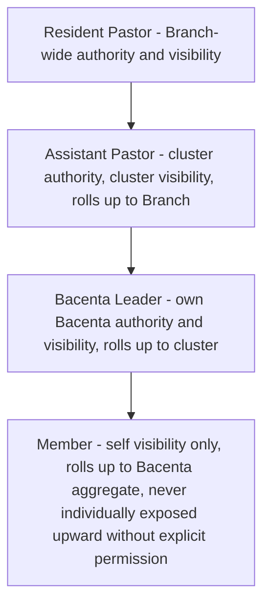

A Bacenta Leader's data is visible to their Assistant Pastor and, in aggregate, to the Resident Pastor — but a Member's individual pastoral detail is not automatically visible above their own Shepherd and that Shepherd's direct oversight chain, per NFR-PRIV-01. This is a deliberate asymmetry: *authority* to reassign, approve, or configure flows downward from Resident Pastor; *aggregated* visibility flows upward through the same chain; but *individually detailed pastoral content* does not automatically follow either direction beyond the immediate Shepherd-to-Pastor oversight relationship, which is the specific, narrower channel Section 10.5 and NFR-PRIV-01 already established.

### 17.6 Aggregate-vs-raw-data boundary (Insights/Stewardship privacy interaction)

Section 16.5 flagged that Stewardship must expose only aggregate financial signals to Insights, not line-item giving history, even though giving activity is one of the six Church Pulse signal categories (Chapter 1, "Important Product Concepts"). The permission model realizes this as follows: the Engagement Signal a Financial Transaction emits (Section 12.8) is a normalized fact ("Person X gave in week Y": boolean/frequency, not amount), consumed by Insights for scoring purposes only. No role's Insights view, including the Resident Pastor's, displays an individual's giving amount through the Insights surface — that detail, if ever needed, is accessed exclusively through the Stewardship domain's own permissioned views (Section 17.3), where the audit trail (NFR-AUD-01) governs who looked at what and when. This prevents Insights from becoming a backdoor around Stewardship's own access controls.

---

*End of Chapter 5.*

---

## 18. User Stories

User stories are organized into epics aligned with the functional domains (Chapter 3, Section 13; Chapter 5, Section 16). Each story follows the standard "As a / I want / so that" form, carries testable acceptance criteria, and is traced to the Functional Requirement(s) it implements — this traceability is what allows QA and engineering to verify that every FR in Chapter 3 has at least one corresponding story, and that no story exists without a governing requirement behind it.

### Epic A — Visitor Capture & Follow-up

| ID | Story | Acceptance criteria | Linked FR | Priority |
|---|---|---|---|---|
| US-A1 | As an Usher, I want to capture a first-time guest's details on a digital form during the service, so that they are never dependent on a paper card being collected and transcribed later | Given a guest fills the digital form, when submitted, then a Person record is created at the appropriate lifecycle stage and a Follow-up task is auto-generated within the same processing cycle | FR-GTH-04, FR-PC-03 | R1 |
| US-A2 | As a Shepherd, I want new visitors assigned to my Bacenta's follow-up queue automatically when they express interest in my area/group, so that I don't have to ask an Admin to route them to me manually | Given a visitor form indicates a Bacenta preference or geographic proximity, when submitted, then the Follow-up task defaults to the matching Shepherd, editable by an Admin | FR-PC-03 | R1 |
| US-A3 | As an Assistant Pastor, I want to see all Follow-up tasks in my cluster that have breached their SLA, so that I can intervene before a visitor is lost entirely | Given a Follow-up task exceeds its configured SLA window unactioned, when I open my escalation view, then that task appears with the elapsed time and the originally assigned Shepherd shown | FR-PC-04 | R1 |
| US-A4 | As a Shepherd, I want to record the outcome of a follow-up contact (reached, no response, not interested, assigned to Bacenta), so that the visitor's journey stage updates automatically rather than me updating it separately | Given I log a follow-up outcome of "assigned to Bacenta," when saved, then the Person's lifecycle stage transitions to AssignedToBacenta without a separate manual step | FR-PC-03, FR-PPL-03 | R1 |
| US-A5 | As a returning guest who visited months ago and is now attending again, I want the system to recognize me rather than treat me as brand new, so that my prior visit isn't lost and staff don't ask me the same intake questions twice | Given a new visitor form submission matches an existing Lapsed Person on name and phone number, when submitted, then a duplicate-candidate prompt is raised rather than a second Person record silently created | FR-PPL-02 | R1 |

### Epic B — Bacenta Membership & Lifecycle

| ID | Story | Acceptance criteria | Linked FR | Priority |
|---|---|---|---|---|
| US-B1 | As an Admin, I want to reassign a member from one Bacenta to another with a reason recorded, so that the change is auditable and the member's care history isn't lost | Given a member is reassigned, when the change is saved, then the prior GROUP_MEMBERSHIP record is closed (not deleted) and a new one opened, both visible in history | FR-PC-02, FR-PPL-04 | R1 |
| US-B2 | As a Shepherd, I want to see how long each member in my Bacenta has been in their current lifecycle stage, so that I can identify anyone stuck in Six Weeks Participation longer than expected | Given a member has remained in SixWeeksParticipation past a configurable duration, when I view my Bacenta roster, then that member is visually flagged | FR-PPL-03 | H2 |
| US-B3 | As a Resident Pastor, I want to view a candidate's full history (attendance, serving, Poimen completion) before appointing them as a Shepherd, so that my decision is evidence-based rather than based on impression alone | Given I open a Member's profile who holds the Worker role, when I view their history tab, then attendance, Basonta serving record, and Poimen status are all visible in one place | FR-PPL-07, FR-PC-06 | R1 (history); H2 (Poimen) |
| US-B4 | As a Member, I want to see my own attendance and giving summary, so that I have visibility into my own engagement without needing to ask church staff | Given I log into my own profile, when I view my summary, then I see my attendance history and (if applicable) my own giving history, and no other member's data | FR-PPL-07 (self-scope) | H2 |

### Epic C — Ministry Staffing

| ID | Story | Acceptance criteria | Linked FR | Priority |
|---|---|---|---|---|
| US-C1 | As a Basonta Leader, I want to set a staffing target for an upcoming Convention, so that I have a clear number to recruit against instead of a vague sense of "enough people" | Given I set a staffing target of 8 for a named Gathering, when I view my staffing dashboard, then it shows rostered-vs-target as a ratio that updates live as workers are added | FR-MIN-02, FR-MIN-03 | H2 |
| US-C2 | As a Basonta Leader, I want to be alerted two weeks before a major Gathering if my team is understaffed, so that I have time to recruit rather than discovering the gap on the day | Given a staffing target is set and rostered workers fall short at the two-week mark before the Gathering, when the threshold check runs, then I receive a staffing-gap alert | FR-MIN-03 | H2 |
| US-C3 | As a Worker, I want to mark myself unavailable for a specific date range (e.g., travel), so that Basonta Leaders don't count on me for gatherings I can't attend | Given I set an unavailability window, when a Basonta Leader views staffing adequacy for a Gathering in that window, then I am excluded from the available-worker count | FR-MIN-03 (dependency) | H2 |

### Epic D — Gatherings & Attendance

| ID | Story | Acceptance criteria | Linked FR | Priority |
|---|---|---|---|---|
| US-D1 | As a Shepherd, I want to take attendance for my Bacenta Meeting in under a minute from my phone, so that it doesn't eat into fellowship time | Given a pre-populated roster for the meeting, when I tap present/absent for each member and save, then the full process completes in under 60 seconds of active interaction | FR-GTH-03, NFR-PERF-01 | R1 |
| US-D2 | As a Shepherd recording attendance with no internet connection, I want my entry saved locally and synced automatically once I'm back online, so that poor connectivity never causes me to lose the record or skip recording it | Given I record attendance offline, when connectivity resumes, then the record syncs within 5 minutes without requiring me to re-enter anything | NFR-OFF-01 | R1 |
| US-D3 | As an Assistant Pastor, I want to see which Gatherings in my cluster have no attendance recorded 48 hours after they ended, so that I can follow up on the gap in data, not just the gap in care | Given a Bacenta Meeting has no attendance recorded 48 hours past its scheduled end, when I view the completeness report, then it appears listed with the responsible Shepherd identified | FR-GTH-05 | R1 |
| US-D4 | As an Admin, I want to configure a new Gathering type (e.g., "Youth Camp") without engineering support, so that the platform adapts to the church's actual calendar of events | Given I create a new Gathering type through the configuration screen, when I save it, then it becomes available for scheduling immediately, with attendance and reporting working the same as any built-in type | FR-GTH-01, FR-ADM-01 | R1 |

### Epic E — Stewardship: Giving

| ID | Story | Acceptance criteria | Linked FR | Priority |
|---|---|---|---|---|
| US-E1 | As a Bacenta Leader, I want to record the offering collected at my Bacenta Meeting immediately after the meeting from my phone, so that it's never left to memory or delayed paperwork | Given a Bacenta Meeting has just ended, when I open the offering-recording screen, then I can enter the amount and type (Offering/Tithe/Special) and it enters the Recorded state, tagged to that specific Gathering instance | FR-STW-01 | R1 |
| US-E2 | As a Treasurer, I want to verify a Bacenta's recorded offering against my physical count with a single accept action when they match, so that verification is fast when everything is correct | Given a Recorded transaction matches my count, when I tap "Verify," then it transitions to Verified with my identity attributed, and I am blocked from verifying my own recorded entries | FR-STW-03 | R1 |
| US-E3 | As a Treasurer, I want to flag a transaction with a specific reason when my count doesn't match what was recorded, so that discrepancies are investigated immediately rather than discovered at month-end | Given a mismatch, when I flag the transaction with a reason, then it enters the discrepancy queue visible to the Finance Team lead | FR-STW-04 | R1 |
| US-E4 | As the Resident Pastor, I want to view the weekly reconciliation report without being able to record or alter any transaction myself, so that I retain full financial visibility while never touching cash-handling actions | Given I open the reconciliation dashboard, when I view it, then I see verified totals against bank deposits in read-only form, with no available action to create or edit a transaction | FR-STW-02, FR-STW-07 | R1 |
| US-E5 | As a Member, I want to give via Mobile Money directly from my own profile, so that giving is as easy as sending money to a friend | Given I initiate a Mobile Money gift from my profile, when I confirm the amount, then a transaction is created in the Recorded state attributed to me directly, without requiring a Bacenta Leader as an intermediary | FR-STW-06 | H2 |
| US-E6 | As a Treasurer, I want the weekly financial report to compile automatically from reconciled transactions, so that I'm exporting a report, not manually reconstructing one in a spreadsheet | Given all of a week's transactions reach Reconciled state, when I generate the weekly report, then it compiles automatically without manual re-entry of figures already in the system | FR-STW-07 | R1 |

### Epic F — Stewardship: Expenses & Projects

| ID | Story | Acceptance criteria | Linked FR | Priority |
|---|---|---|---|---|
| US-F1 | As a Ministry Leader, I want to submit an expense request with a description and amount, so that leadership can review and approve it before I spend church funds | Given I submit an expense request, when saved, then it enters the Requested state visible to the designated approver | FR-STW-09 | R1 |
| US-F2 | As the Resident Pastor, I want to approve or reject an expense request with a mandatory reason on rejection, so that decisions are transparent and traceable | Given a Requested expense, when I reject it, then I must provide a reason before the rejection is saved | FR-STW-09 | R1 |
| US-F3 | As a requester, I want to be blocked from marking my own expense as fully paid/receipted without attaching a receipt, so that the record can't reach a false "complete" state | Given an Approved expense with no receipt attached, when I attempt to mark it ReceiptRetained, then the system blocks the transition until a receipt file is attached | FR-STW-09 | R1 |
| US-F4 | As a Member, I want to see progress toward a named building-fund Project I've pledged to, so that I can track how the collective giving is progressing | Given a Project has pledges and donations recorded against it, when I view the Project page, then I see total pledged, total received, and progress against the stated target | FR-STW-08 | H2 |

### Epic G — Insights & Church Pulse

| ID | Story | Acceptance criteria | Linked FR | Priority |
|---|---|---|---|---|
| US-G1 | As the Resident Pastor, I want to see a single Church Pulse number for the whole church when I open the app, so that I immediately know whether to celebrate or intervene | Given the Branch-level Church Pulse score is computed, when I open my dashboard, then it is the first and most prominent element shown | FR-INS-01, FR-INS-04 | R1 |
| US-G2 | As an Assistant Pastor, I want my Bacentas ranked by Church Pulse trend, so that I spend my limited oversight time on the ones that need it most, not in the order they happen to appear alphabetically | Given multiple Bacentas in my cluster, when I view my cluster dashboard, then they are sorted by trend severity (largest decline first) by default | FR-INS-04 | R1 |
| US-G3 | As a Shepherd, I want to be told specifically why a member is flagged (e.g., "3 Sundays present, 3 Bacenta meetings absent"), not just that they're "at risk," so that I know exactly what conversation to have with them | Given a member is flagged under silent-drift logic, when I view the flag, then the specific attendance pattern behind the flag is shown, not a generic risk label | FR-PC-05, FR-INS-01 | R1 |
| US-G4 | As an Admin, I want to adjust how heavily "serving" counts toward Church Pulse relative to "attendance," so that the score reflects our church's own values, not a fixed formula we can't influence | Given I open the weight configuration panel, when I adjust the serving-signal weight and save, then subsequent Church Pulse computations reflect the new weighting | FR-INS-02 | H2 |
| US-G5 | As the Resident Pastor, I want to see whether Assistant Pastors are actually acting on the alerts the system sends them, so that I know if Insights is changing behavior or being ignored | Given alerts have been sent and resolved (acted or dismissed) over a period, when I view the leadership engagement report, then I see the action rate per Assistant Pastor | FR-INS-05 | R1 |

### Epic H — Administration & Configuration

| ID | Story | Acceptance criteria | Linked FR | Priority |
|---|---|---|---|---|
| US-H1 | As an Admin, I want to rename "Basonta" to a different label if a future deployment uses different terminology, so that the product speaks the language of whatever church is using it | Given I change a group-type label in configuration, when I save it, then the new label appears everywhere in the UI referencing that group type, with no code change required | FR-ADM-01 | R1 |
| US-H2 | As an Admin, I want to view a single audit log of every reassignment, verification, and approval across the church, so that I can answer any "who did this and when" question without contacting engineering | Given any state-transition event occurs in People, Pastoral Care, Ministry, or Stewardship, when I open the audit log, then that event is listed, attributed, and timestamped | FR-ADM-02 | R1 |

---

## 19. Workflows

Each workflow below states its trigger, participating actors, preconditions, the numbered step sequence, postconditions, and known exceptions. The two workflows with the highest operational stakes (Weekly Offering Reconciliation and Visitor-to-Bacenta Assignment) are additionally expressed as sequence diagrams, since their multi-actor handoffs are exactly where the failure modes named in Section 4.2 historically occur.

### 19.1 Workflow: Visitor Capture Through Bacenta Assignment

**Trigger.** A first-time guest attends any Gathering.

**Actors.** Usher (or self-service guest), Shepherd, Assistant Pastor (exception path only), Admin (duplicate-resolution path only).

**Preconditions.** A digital visitor form is available at the Gathering.

**Steps.**

1. Usher (or the guest directly) submits the digital visitor form during or immediately after the Gathering.
2. System checks for a likely duplicate Person (FR-PPL-02). If a match is found, an Admin is prompted to merge or reject before proceeding; otherwise, continue.
3. System creates a Person at `lifecycle_stage = FirstTimeGuest` and automatically creates a Follow-up task (FR-PC-03), assigned by default rule (geographic/Bacenta preference, or a rotation among Shepherds if no preference given).
4. Shepherd receives the Follow-up task and makes contact within the configured SLA window.
5. Shepherd logs the outcome: Assigned to Bacenta (proceeds to step 6), No Response (task remains open until SLA breach), or Not Interested (task closed, Person remains `FirstTimeGuest` with no further automatic action).
6. On "Assigned to Bacenta" outcome, system transitions `lifecycle_stage` to `AssignedToBacenta` and opens a `GROUP_MEMBERSHIP` record linking the Person to the Shepherd's Bacenta.
7. System begins tracking attendance across a configured window for the `SixWeeksParticipation` threshold.
8. On sustained participation meeting the threshold, system transitions `lifecycle_stage` to `Member`.

**Postconditions.** The guest is either a tracked Member with full history from first contact, or remains in a defined, non-terminal state (Lapsed, Not Interested) with their entire interaction history preserved rather than lost.

**Exceptions.**

| Exception | Handling |
|---|---|
| Guest never responds to follow-up within SLA | Task escalates to Assistant Pastor (FR-PC-04); if still unresolved past a second, longer window, `lifecycle_stage` moves to `Lapsed` |
| Guest reappears after being marked `Lapsed` | Re-entry re-opens `FollowUp` from `Lapsed` rather than creating a new Person (Section 12.5 edge case) |
| Guest is assigned to a Bacenta but then relocates | Standard reassignment workflow (Section 19, Epic B, US-B1) applies; lifecycle stage is unaffected, only Group membership changes |

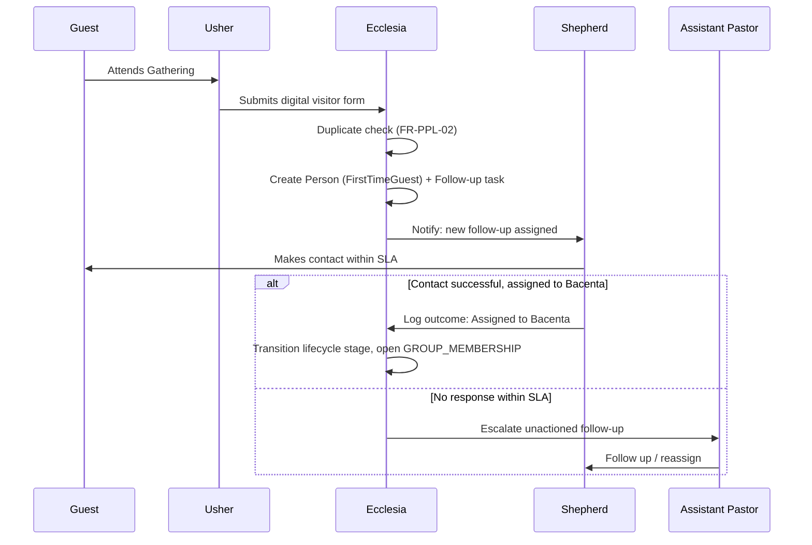

### 19.2 Workflow: Weekly Offering Collection, Verification & Reconciliation

**Trigger.** A Bacenta Meeting (or Sunday/Wednesday/Friday Gathering) concludes with an offering collected.

**Actors.** Bacenta Leader (records), Treasurer/Finance Team (verifies, reconciles), Resident Pastor (read-only oversight).

**Preconditions.** The Gathering instance exists in the system; the Bacenta Leader has offering-recording permission for that Gathering.

**Steps.**

1. Bacenta Leader counts the physical offering immediately after the meeting and records it in the app (type: Offering/Tithe/Special Offering; channel: Cash/Mobile Money), entering the `Recorded` state.
2. System notifies the Treasurer/Finance Team of a new transaction awaiting verification.
3. Treasurer independently counts (for cash) or checks the Mobile Money statement, and compares against the recorded entry.
4. If matching, Treasurer marks it `Verified`; the system enforces that the verifying Treasurer is not the same Person who performed the `Recorded` step (BR-STW-04, Section 17.4).
5. If not matching, Treasurer marks it `Flagged` with a reason; it enters the discrepancy queue for follow-up with the recording Bacenta Leader.
6. At the end of the week, all `Verified` transactions are aggregated and compared against the confirmed bank deposit; matching entries transition to `Reconciled`.
7. The weekly financial report is generated automatically from `Reconciled` transactions and made available (read-only) to the Resident Pastor.

**Postconditions.** Every cedi collected has a traceable path from Bacenta collection through verification to bank deposit, with no step performed and independently confirmed by the same individual, and no Pastor having handled cash at any point.

**Exceptions.**

| Exception | Handling |
|---|---|
| Discrepancy is never resolved | Transaction remains in `Flagged`/`UnderInvestigation` and is explicitly excluded from that week's `Reconciled` total, visible as an open item on the reconciliation dashboard rather than silently dropped |
| Bank deposit total does not match aggregated `Verified` total | Reconciliation step (6) fails to close automatically; a discrepancy at the aggregate level is raised to the Finance Team lead, distinct from an individual transaction-level flag |
| A Person holds both a Bacenta Leader and Treasurer role (small-church edge case) | System blocks that individual from verifying any transaction they personally recorded (Section 17.4), regardless of their combined role privileges |

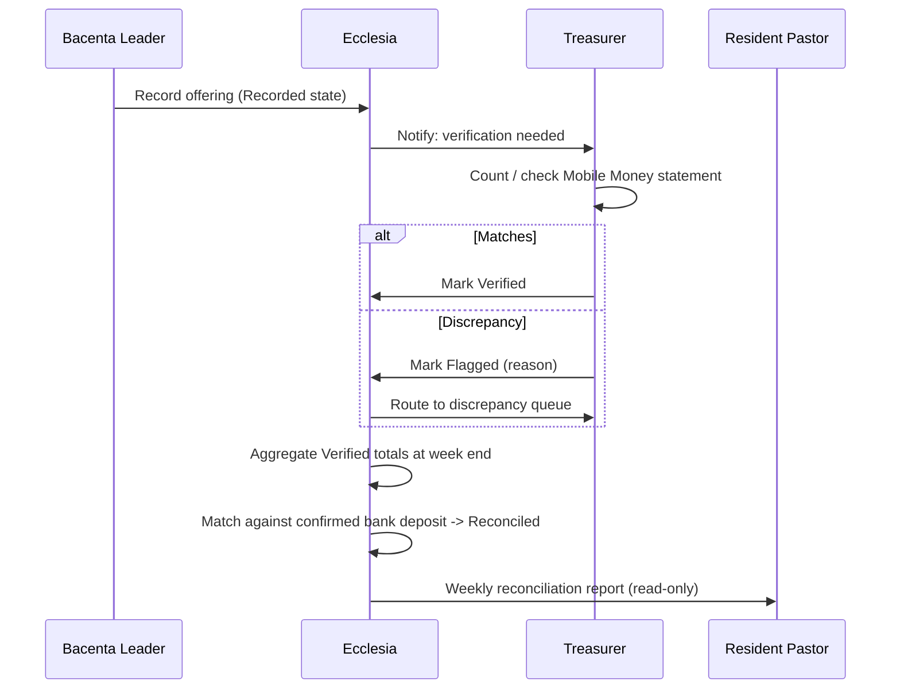

### 19.3 Workflow: Silent-Drift Detection & Pastoral Response

**Trigger.** Scheduled evaluation run (e.g., nightly) against the decision tree in Section 15.8.

**Actors.** System (automated detection), Shepherd, Assistant Pastor (escalation only).

**Steps.**

1. System evaluates each active Member with a current Bacenta assignment against their recent Sunday/Wednesday/Friday attendance and their recent Bacenta Meeting attendance.
2. Where Sunday/Wednesday/Friday attendance meets the configured threshold but Bacenta attendance does not, system flags the Member as Silent Drift and notifies the assigned Shepherd, including the specific pattern (Section 15.8, decision tree).
3. Shepherd reviews the flag and reaches out within the configured SLA.
4. Shepherd logs the outcome (reconnected, in progress, unable to reach), which is recorded for the Section 8.2 silent-drift re-engagement metric.
5. If unactioned past SLA, the flag escalates to the Assistant Pastor (BR-PC-04).

**Postconditions.** Every silent-drift case has a recorded, attributed response, closing the exact gap named in Section 4.2 ("members disengage silently").

**Exceptions.** A Member with no active Bacenta assignment is excluded from this workflow entirely and instead surfaces as a BR-PPL-01 data-integrity issue (Section 15.8, node Z1) — the two failure modes (drift vs. no Bacenta at all) must not be conflated, since their correct interventions differ (pastoral outreach vs. administrative assignment).

### 19.4 Workflow: Leadership Appointment (Poimen to Shepherd)

**Trigger.** Resident Pastor or Assistant Pastor identifies a Worker as a potential Shepherd candidate, or a structural need arises (e.g., a new Bacenta is formed and needs a leader).

**Actors.** Resident Pastor (or Assistant Pastor, if delegated), candidate Worker, Admin (record-keeping support).

**Steps.**

1. Candidate is enrolled in Poimen training (if not already), tracked per FR-PC-06.
2. System tracks module completion and surfaces readiness status on the candidate's profile.
3. Resident Pastor reviews the candidate's full history (attendance, serving record, Poimen completion) per US-B3.
4. Resident Pastor creates a Shepherd Role Assignment for the candidate, scoped to a specific Bacenta.
5. System enforces the lifecycle-stage precondition (BR-PPL-04): the assignment is only permitted if the candidate's `lifecycle_stage` is `Member`.
6. The prior Bacenta Leader (if any, e.g., in a leadership transition) has their Role Assignment closed with an end date, preserving history.

**Postconditions.** The Bacenta has a new, appropriately-vetted Shepherd, with the appointment and its evidentiary basis fully traceable after the fact.

**Exceptions.** Poimen completion is not currently modeled as a hard gate on the Shepherd Role Assignment (only lifecycle stage is a hard gate) — whether it should become one is flagged explicitly as an open question in the Open Questions chapter, since the discovery findings state training happens through Poimen but do not state that completion is an absolute prerequisite versus a strong input to the Pastor's judgment.

### 19.5 Workflow: Expense Request & Approval

**Trigger.** A ministry or administrative need requires spending church funds.

**Actors.** Requester (any authorized role), designated Approver (leadership).

**Steps.**

1. Requester submits an expense request with description and amount, entering `Requested` state.
2. Designated Approver reviews and either approves (→ `Approved`) or rejects (→ `Rejected`, with mandatory reason).
3. On approval, payment is executed outside or within the system depending on the payment method, and the transaction moves to `Paid`.
4. Requester (or an authorized delegate) attaches a receipt, moving the transaction to its terminal `ReceiptRetained` state.

**Postconditions.** No expense reaches a fully closed state without both leadership approval and a retained receipt, directly satisfying BR-STW-07 and BR-STW-08.

**Exceptions.** A `Paid` expense with no receipt attached past a configurable grace period is flagged on a compliance report, since an indefinitely open `Paid`-but-not-`ReceiptRetained` transaction would otherwise be an invisible gap in the audit trail.

### 19.6 Workflow: Basonta Staffing for a Major Gathering (Horizon 2)

**Trigger.** A major Gathering (e.g., Convention) is scheduled with staffing targets set per participating Basonta.

**Actors.** Basonta Leader, Worker.

**Steps.**

1. Basonta Leader sets a staffing target against the Gathering instance.
2. Workers are rostered against the target as they confirm availability; Workers may also proactively mark themselves unavailable for the relevant dates.
3. System computes staffing adequacy continuously as rostering changes.
4. At a configured lead time before the Gathering (e.g., two weeks), if adequacy is below target, system alerts the Basonta Leader.
5. Basonta Leader recruits against the visible gap.

**Postconditions.** Staffing gaps are identified with enough lead time to be solved, rather than discovered on the day of the event — directly resolving the Basonta Leader persona's named pain point (Section 11.5).

**Exceptions.** A Worker rostered across a configurable threshold of concurrent commitments in the same period is flagged as a possible overcommitment (FR-MIN-04) rather than silently counted toward multiple Basontas' adequacy simultaneously as if fully available to each.

---

*End of Chapter 6.*

---

## 20. Risks

Risks are catalogued with likelihood and impact rated Low/Medium/High, a mitigation approach, and an owning stakeholder group (Section 10). This register should be reviewed and updated at each release gate (Section 22), not treated as a one-time exercise.

| ID | Risk | Category | Likelihood | Impact | Mitigation | Owner |
|---|---|---|---|---|---|---|
| RISK-01 | Premature genericization: engineering builds a fully generic small-group/event/finance platform speculatively before a second real deployment validates the abstraction, slowing Release 1 | Product/Technical | Medium | High | Scope discipline per Section 9.5; invariant core built for generality now, configurable surface area added only when a real Horizon 2/3 need requires it | Product Management |
| RISK-02 | Shepherd data-entry fatigue: the volunteer Bacenta Leader persona (Section 11.4) disengages from consistent attendance/offering recording because the tool is too slow or interrupts fellowship time | Product/Adoption | Medium | High | NFR-PERF-01 (sub-60-second attendance capture) is treated as a release gate, not an aspiration; usability testing (NFR-USA-01) specifically with actual Shepherds, not proxies | Design, Product Management |
| RISK-03 | Connectivity and device variability across Ghanaian church contexts causes data loss or abandonment of digital capture in favor of reverting to paper | Technical/Operational | Medium | High | Offline-first architecture (NFR-OFF-01, NFR-OFF-02) is a Release 1 requirement, not deferred; field testing under real network conditions before general availability | Engineering |
| RISK-04 | Resistance to digitizing offering handling: Treasurers or Bacenta Leaders distrust the app-based process relative to familiar manual counting/paper-record habits, undermining the very auditability the system exists to provide | Organizational/Adoption | Medium | Medium | Phased rollout (Section 22) starting with a pilot Bacenta cluster; parallel-running the digital and manual process briefly during transition rather than an abrupt cutover | Implementation/Onboarding, Church Administration |
| RISK-05 | Mobile Money provider API access (for NFR-INT-01, G2.1) is delayed, restricted, or commercially unavailable on acceptable terms, stalling the "simple Mobile Money giving" goal | Technical/Vendor | Medium | Medium | Manual Mobile Money recording (FR-STW-05) ships in Release 1 as a functioning fallback independent of API access; automated integration is explicitly sequenced to Horizon 2, not a Release 1 dependency | Engineering, Product Management |
| RISK-06 | Member-level Church Pulse scoring ships before its access-control model is properly designed, exposing sensitive inferential data about individuals more broadly than pastorally appropriate | Privacy/Compliance | Low (if NFR-PRIV-02 gate is honored) | High | NFR-PRIV-02 is a hard release gate: no member-level score ships until access-control review is complete, independent of feature-readiness pressure | Product Management, Security |
| RISK-07 | Overreliance on automated Insights alerts leads leaders to substitute the system's flags for genuine relational discernment ("the app says my Bacenta is fine" replacing actually knowing one's people) | Product/Philosophical | Medium | Medium | Insights is explicitly positioned (Section 5.2, Section 16.6) as a prompt to action, not a verdict; UI language and training materials should frame alerts as "worth a conversation," never as a substitute for one | Design, Product Management |
| RISK-08 | **RESOLVED (OQ-03, §24).** No defined succession/handover workflow existed for the Resident Pastor role. Mitigated via a documented manual runbook: succession is formally announced, a defined interim authority holds the role during transition, and new system access is confirmed exclusively by Council action, never self-confirmed by the outgoing Resident Pastor | Organizational/Technical | Low | High (pre-mitigation) | Documented runbook implemented per BR-ORG-03; see Technical Blueprint Authentication chapter | Product Management, Church Administration |
| RISK-09 | **RESOLVED (OQ-02, §24).** Poimen completion's gating status is now a per-Branch/Council configuration flag rather than an undecided fixed behavior, preventing inconsistent or disputed appointment decisions | Organizational/Product | Medium (pre-mitigation) | Medium (pre-mitigation) | Configurable hard-gate/soft-input flag implemented per FR-PC-06, BR-PPL-06 | Product Management, Resident Pastor (River of Life) |
| RISK-10 | Duplicate-detection logic (FR-PPL-02) produces false positives (blocking legitimate distinct individuals) or false negatives (missing true duplicates), eroding trust in the People domain as the authoritative source | Technical/Data Quality | Medium | Medium | Duplicate detection surfaces candidates for human confirmation (never auto-merges); detection rules are tuned iteratively against real data post-launch | Engineering, Data/Analytics |
| RISK-11 | Multi-branch (Horizon 3) architecture assumptions are not validated until a second real Branch actually onboards, risking late discovery of scaling or configuration gaps | Technical/Architectural | Medium | Medium | NFR-SCALE-02's "zero schema migration for a second Branch" claim should be validated with a synthetic second-Branch dry run before the first real multi-branch customer, not left untested until it happens live | Engineering |
| RISK-12 | The Church Administrator/Admin persona (Section 11.9) is often a single volunteer; their unavailability stalls routine configuration changes | Organizational | Medium | Low–Medium | Configuration actions should be limited to what genuinely requires that role, and Resident Pastor should hold override/backup configuration authority | Church Administration |
| RISK-13 | Onboarding a church with years of existing paper/spreadsheet records requires data migration effort that is easy to underestimate, delaying go-live | Operational | High | Medium | Migration scope and tooling should be explicitly planned as part of the Release 1 implementation plan, not assumed to be a trivial import step | Implementation/Onboarding |

---

## 21. Assumptions

The following assumptions underlie this PRD's requirements and are distinct from deliberate design decisions (Chapters 12–17): they are beliefs about context that, if wrong, would require revisiting specific requirements. Each is stated so it can be explicitly validated or invalidated during implementation, rather than remaining an unexamined premise.

| ID | Assumption | Requirements affected if invalid |
|---|---|---|
| ASM-01 | Bacenta Leaders (Shepherds) at River of Life Cathedral have access to a smartphone capable of running the mobile client, even if not a high-end device | NFR-PERF-02, all mobile-first Shepherd workflows (Section 16.2, 16.4, 16.5) |
| ASM-02 | At least one Mobile Money provider (e.g., MTN MoMo) operating in Ghana offers an API suitable for transaction confirmation integration | NFR-INT-01, G2.1 |
| ASM-03 | The church will designate Finance Team members distinct from Bacenta Leaders and Pastors, i.e., enough people are willing to hold the Treasurer role to make separation of duties (BR-STW-04) practically achievable, not just theoretically correct | FR-STW-03, the entire separation-of-duties enforcement model (Section 17.4) |
| ASM-04 | Each Branch belongs to exactly one Council at a time; overlapping or dual Council affiliation is not a scenario this model needs to support | Branch/Council entity model (Section 12.2), NFR-SCALE-02 |
| ASM-05 | English is an acceptable Release 1 interface language for River of Life Cathedral's leadership and members | NFR-L10N-01 |
| ASM-06 | The "Six Weeks Participation" duration and other named thresholds (silent-drift window, follow-up SLA) are illustrative of current practice, not fixed forever, and are expected to be configured rather than hard-coded | FR-PPL-03, Section 15.8 decision tree, NFR-MAINT-01 |
| ASM-07 | Poimen training content and curriculum structure will be defined and maintained by church leadership as subject-matter input; the product provides tracking infrastructure, not curriculum content | FR-PC-06 |
| ASM-08 | River of Life Cathedral holds existing visitor/member records in some manual form (paper cards, spreadsheets, notebooks) that will need one-time import at onboarding | Implementation/onboarding scope, RISK-13 |
| ASM-09 | The Ghana Data Protection Act, 2012 (Act 843) remains the applicable regulatory framework for the reference deployment through Release 1, with no material regulatory change assumed during the initial build | NFR-PRIV-03 |
| ASM-10 | A single individual will not simultaneously need to hold conflicting Stewardship roles as standard practice (the Section 17.4 same-record check is a safeguard for an edge case, not the expected steady-state operating model) | BR-STW-04, Section 17.4 |

---

## 22. Release Strategy

### 22.1 Principle: capability sequencing within Release 1, not just across horizons

Section 9 defined Release 1 scope at the horizon level. In practice, even Release 1 cannot ship as a single atomic release — the domains have dependencies on each other (Stewardship's offering recording depends on Gatherings existing to attach transactions to; Insights depends on all other domains emitting Engagement Signals) that impose a natural internal sequence. The phased plan below reflects that dependency order, not an arbitrary split.

| Phase | Scope | Dependency rationale | Release gate before proceeding |
|---|---|---|---|
| **Phase 1.0 — Foundation** | People domain (identity, lifecycle, Group model) + Gatherings domain (unified Gathering model, attendance recording, digital visitor capture) | Every other domain references Person and Gathering; nothing else can be meaningfully tested without this foundation | Attendance capture completeness metric (Section 8.2) reaches an acceptable baseline in pilot use; FR-PPL-04 (one-Bacenta enforcement) verified with zero violations over the pilot period |
| **Phase 1.1 — Pastoral Care** | Bacenta structure, follow-up workflow, silent-drift detection | Depends on People (lifecycle stages) and Gatherings (attendance data) already being reliable | Visitor-to-Member conversion rate and follow-up SLA adherence (Section 8.2) are measurable and trending in the expected direction during pilot |
| **Phase 1.2 — Stewardship** | Offering recording, verification, reconciliation, expense workflow | Depends on Gatherings (transactions attach to Gathering instances) and People (recorder/verifier attribution) | Reconciliation cycle time (Section 8.2) demonstrably improves over the pre-Ecclesia manual baseline during pilot, with zero same-actor record/verify violations |
| **Phase 1.3 — Insights** | Church Pulse (Branch and Bacenta level), silent-drift alerting integration, role-scoped dashboards | Depends on Engagement Signals being reliably emitted by all preceding phases | Leadership action rate on Insights prompts (Section 8.2) is being measured and is non-zero, indicating leaders are actually engaging with alerts, not ignoring them |

### 22.2 Rollout approach: pilot before congregation-wide launch

Release 1 should not launch to River of Life Cathedral's full congregation simultaneously. A staged rollout is recommended: begin with a small number of pilot Bacentas (representing a range of Shepherd technical comfort levels, not only the most tech-savvy leaders, to avoid a false-positive usability signal), running Phase 1.0–1.2 in parallel with the existing manual process for a defined transition window before full cutover. This directly mitigates RISK-04 (resistance to digitizing offering handling) and RISK-02 (Shepherd data-entry fatigue) by surfacing real friction with a small, recoverable group before the whole church depends on the system.

### 22.3 Training & change management

Because the heaviest-use personas (Section 11) are volunteers, not paid staff with mandatory training time, rollout must include short, task-specific training (e.g., a 10-minute guided walkthrough of attendance capture, not a comprehensive manual) delivered at the point of need, consistent with NFR-USA-01's "operable within a single guided session" requirement. Training materials are a release deliverable, not an afterthought.

### 22.4 Horizon 2 and Horizon 3 releases

| Release | Scope | Primary gate to enter this release |
|---|---|---|
| **Release 2.0 (Horizon 2)** | Mobile Money simplification (NFR-INT-01), Poimen tracking (FR-PC-06), Ministry staffing adequacy (FR-MIN-02/03), Project/pledge tracking (FR-STW-08), member-level Church Pulse (pending NFR-PRIV-02 gate) | Release 1 phases fully adopted and stable in production at River of Life Cathedral for a defined minimum period (e.g., two full quarters), with Section 8 metrics trending positively |
| **Release 3.0 (Horizon 3)** | Multi-branch/Council consolidation, Online Gatherings, modeled Bacenta/Basonta split-merge workflows | A second real Branch is ready to onboard, providing the validation Section 9.5 and RISK-11 identify as necessary before multi-branch architecture claims are trusted at scale |

---

## 23. Future Roadmap

Beyond the three horizons already scoped, the following directions are named to give engineering and design a sense of where the platform is heading — consistent with the vision of becoming "the world's most comprehensive Church Operating System" — without over-specifying capabilities that depend on validated learning from earlier releases first.

| Direction | Description | Depends on |
|---|---|---|
| Communication channel integration | Direct integration with messaging platforms already in heavy informal use by church leadership and members in this context (e.g., WhatsApp) for follow-up notifications and Basonta staffing recruitment, reducing reliance on in-app notifications alone reaching busy volunteers | Release 2.0 stability; a defined integration and consent model |
| Multi-denominational configuration templates | Pre-built configuration templates for congregational-model churches (without a mandatory small-group structure) alongside the current cell/Bacenta-model template, broadening the addressable market beyond Council-structured churches like UDOLGC | Validated Horizon 3 multi-branch architecture; a second reference deployment with a different structural model |
| Predictive engagement modeling | Extending Church Pulse from a descriptive/leading-indicator score toward predictive modeling of attrition risk, trained on accumulated historical data | Sufficient historical Engagement Signal volume; careful attention to the same privacy gating applied to member-level scores (NFR-PRIV-02) |
| Financial forecasting & budgeting | Budget-vs-actual planning tools building on the Stewardship transaction history, without expanding into full general-ledger accounting (Section 7.4 non-goal remains in force) | Release 2.0 Project/pledge tracking maturity |
| Give-in-kind stewardship tracking | Recording non-cash contributions (materials, services) toward Projects, extending the Stewardship model beyond monetary transactions | Release 2.0 Project model |
| Household/family relationship modeling | Revisiting the explicitly deferred household-linking capability (Section 13.1) if a validated ministry need (e.g., children's ministry check-in tied to a guardian) emerges | Explicit ministry requirement validated with a real deployment, not spun up speculatively |
| Council/marketplace scale | Supporting multiple Councils (not just multiple Branches within one Council) as the platform's footprint grows across denominational contexts | Release 3.0 proven in production with at least one full Council |

---

## 24. Open Questions — Resolved Decisions Log

This section originally consolidated ten open questions flagged throughout the preceding chapters. All ten were taken through a dedicated *Open Questions Resolution Workshop* with product leadership; eight are now fully decided and applied throughout this document (see the cross-references in each row below). Two (OQ-04, OQ-10) have their resolution *method* decided but still require one live pastoral-calibration conversation with Bishop Francis and the Assistant Pastors before their specific numeric values are final — both ship with clearly labeled provisional placeholders in the interim, per NFR-MAINT-01's configurability. This section is retained as the permanent decision record rather than deleted, so the reasoning behind each decision remains traceable.

| ID | Question | Final Decision | Applied at |
|---|---|---|---|
| OQ-01 | Should household/family relationships between Person records be modeled? | **Decided:** Add an optional guardian/household link to the Person schema now, with no workflow or UI built around it in Release 1 | FR-PPL-09 (§13.1) |
| OQ-02 | Is Poimen training completion a hard gate on Shepherd Role Assignment, or an informational input? | **Decided:** Configurable per Council/Branch (not a single fixed platform behavior); River of Life defaults to informational (soft-input) | FR-PC-06 (§13.2), BR-PPL-06 (§15.1), RISK-09 (§20) |
| OQ-03 | What is the Resident Pastor succession/handover workflow? | **Decided:** A documented manual runbook (not in-app automation) for Release 1. Succession is formally announced, a defined interim authority holds the role during transition, and new system access is confirmed exclusively by Council action — never self-confirmed by the outgoing Resident Pastor | BR-ORG-03 (§15.7), RISK-08 (§20) |
| OQ-04 | What are the correct default silent-drift thresholds (N Sunday attendances, M Bacenta absences)? | **Partially decided:** Method confirmed — leadership's own pastoral judgment sets the real thresholds, not an engineering guess. Numeric values still pending one live calibration conversation with Bishop Francis and the Assistant Pastors; ships with N=3/M=3 as an explicit placeholder | FR-PC-05 (§13.2), §15.8 |
| OQ-05 | Should a single Bacenta be permitted co-leadership? | **Decided:** Deferred. Single-leader-per-Bacenta is the only supported model in Release 1; no schema cost to revisiting later since Role Assignment already supports multiple concurrent holders | §17.2 |
| OQ-06 | What is the appropriate default Follow-up SLA window, and does it vary by lifecycle stage? | **Decided:** Differentiated defaults — 3 days for First-Time Guest follow-up, 14 days for Lapsed re-engagement, both Branch-configurable | FR-PC-04 (§13.2), §19.1 |
| OQ-07 | Should recurring/scheduled reminders be built for Project pledges? | **Decided:** A single, opt-in, gentle reminder near a pledge's stated timeline; never a repeated or pressuring sequence, per the "Ministry First" principle | FR-STW-08 (§13.5) |
| OQ-08 | What data residency requirements apply if Ecclesia expands beyond Ghana? | **Decided:** Deferred; not applicable to Release 1. Revisit only when a specific non-Ghana deployment is actually scheduled | NFR-PRIV-03 (§14.6) |
| OQ-09 | Should Visitors/First-Time Guests eventually have self-service login? | **Decided:** No self-service in any near-term release; the fully staff-mediated model (§19.1) stands. Revisit only if Phase 1.1 pilot data shows follow-up speed, not just capture, is a real bottleneck | §17.2 |
| OQ-10 | What is the correct initial Church Pulse signal weighting? | **Partially decided:** Method confirmed — sourced from Bishop Francis's and the Assistant Pastors' own ranking of what most shifts their pastoral judgment of engagement. Ranking still pending that conversation; ships with equal weighting across all six categories as an explicit placeholder | §12.8, FR-INS-02 |

*Full context for each decision — the options considered, the rationale, and the specific questions put to leadership — is preserved in the companion document, the Ecclesia PRD Open Questions Resolution Workshop.*

---

## 25. Glossary

| Term | Definition |
|---|---|
| **Bacenta** | A pastoral care small group functioning simultaneously as a fellowship, discipleship group, prayer group, and evangelism unit. Every Member belongs to exactly one Bacenta (Section 6, BR-PPL-01). Modeled as a `Group` of type `PASTORAL_CARE` (Section 12.6). |
| **Basonta** | A ministry/serving team (e.g., Choir, Media, Ushers, Technical, Film Stars, Dancing Stars, Airport Stars). A Member may belong to multiple Basontas concurrently (BR-PPL-02). Modeled as a `Group` of type `MINISTRY` (Section 12.6). |
| **Branch** | A single local church (e.g., River of Life Cathedral) belonging to a Council. Modeled as a first-class entity from Release 1 to support future multi-branch scale (Section 12.2). |
| **Church Pulse** | Ecclesia's composite, weighted engagement score (0–100), computed from attendance, Bacenta participation, serving, follow-up responsiveness, leadership engagement, and visitor retention signals. The platform's North Star metric (Section 8.1). Deliberately distinct from a raw attendance count. |
| **Council** | The overseeing body for one or more Branches (e.g., UDOLGC — United Denominations Originating from the Lighthouse Group of Churches). River of Life Cathedral is a Council Church within UDOLGC. |
| **Ecclesia** | The product name; a Church Operating System designed to help churches care for people, strengthen ministry, and steward resources faithfully. |
| **Engagement Signal** | A timestamped, typed fact emitted by any domain (e.g., attendance taken, follow-up completed) consumed by the Insights domain to compute Church Pulse (Section 12.8). |
| **"Everything Is A Gathering"** | The architectural principle that all event types (Sunday services, Bacenta/Basonta meetings, conferences, camps, conventions, online gatherings) are modeled as one generalized `Gathering` entity with a type discriminator, rather than as separate subsystems (Section 12.4). |
| **Financial Transaction** | The generalized Stewardship entity covering offerings, tithes, special offerings, pledges, donations, and expenses, each following a typed state machine (Section 12.7). |
| **First-Time Guest** | A Member Journey lifecycle stage: a person confirmed to be attending for the first time, following initial capture as a Visitor. |
| **Follow-up** | (1) The Member Journey lifecycle stage following First-Time Guest; (2) the workflow and task system (Section 16.2) through which a Shepherd or other assigned Person makes contact with a Visitor or disengaging Member. |
| **Gathering** | A generalized, schedulable event entity with attendance semantics underlying every specific gathering type (Section 12.4). |
| **Group** | The generalized entity underlying both Bacenta (`PASTORAL_CARE` type) and Basonta (`MINISTRY` type), distinguished by purpose and membership cardinality rule (Section 12.2, 12.6). |
| **Group Membership** | The timestamped join entity linking a Person to a Group, preserving full historical membership even after reassignment (Section 12.3). |
| **Horizon 1 / 2 / 3** | This PRD's sequencing framework for goals and scope (Section 7): Horizon 1 (single-church foundation), Horizon 2 (depth, still single-church/small-Council), Horizon 3 (multi-branch Council scale). |
| **Lifecycle Stage** | The field on a Person representing their position in the Member Journey state machine (Visitor → First-Time Guest → Follow-up → Assigned to Bacenta → Six Weeks Participation → Member), terminating at Member (Section 12.5). Distinct from Role Assignment. |
| **Member** | (1) The terminal Member Journey lifecycle stage; (2) informally, any person who is part of the congregation. |
| **Member Journey** | The discovery-defined progression: Visitor → First-Time Guest → Follow-up → Assigned to Bacenta → Six Weeks Participation → Member → Worker → Shepherd → Pastor. See the Section 12.5 Design Note for how this is represented as lifecycle stage plus layered Role Assignments. |
| **Poimen** | The training pathway through which future leaders are prepared, tracked in the Pastoral Care domain (FR-PC-06). |
| **RACI** | Responsible / Accountable / Consulted / Informed — the governance framework used in Section 10.4 to assign organizational ownership at the domain level. |
| **RBAC** | Role-Based Access Control — the permission model specified in Section 17, governing who may perform which actions within which scope. |
| **Resident Pastor** | The final authority over a local church (Branch); appoints Assistant Pastors and Shepherds; Branch-wide scope of authority (Section 10.1, 17.2). |
| **Role Assignment** | A join entity linking a Person to a named Role (Worker, Shepherd, Basonta Leader, Assistant Pastor, Resident Pastor, Treasurer) with an effective date range and scope, layered on top of — not replacing — a Person's lifecycle stage (Section 12.5). |
| **Shepherd** | The informal/functional title for a Bacenta Leader — the Person directly responsible for the pastoral care of their Bacenta's members (Section 11.4). |
| **Silent Drift** | The pastoral concern in which a Person attends Sunday/Wednesday/Friday Gatherings consistently but is disengaged from their assigned Bacenta's meetings; detected via the decision tree in Section 15.8 (BR-PC-02). |
| **Six Weeks Participation** | The Member Journey lifecycle stage during which sustained attendance is tracked over a configurable window before a Person is recognized as a Member (Section 12.5). |
| **Stewardship** | The domain governing financial giving, offerings, tithes, pledges, donations, and expenses, structurally enforcing separation of duties (Section 6, 12.7, 13.5, 16.5). |
| **UDOLGC** | United Denominations Originating from the Lighthouse Group of Churches — the Council to which River of Life Cathedral belongs. |
| **Visitor** | The initial Member Journey lifecycle stage: a person who has not yet been confirmed as attending, or who is captured at first point of contact. |
| **Worker** | A Role Assignment representing a Member actively serving on one or more Basontas; a stage in the informal leadership pipeline preceding Shepherd (Section 12.5 Design Note). |

---

*End of Chapter 7. This concludes the Ecclesia Product Requirements Document (Sections 1–25), locked as Version 1.0. The document is internally cross-referenced throughout — every Functional Requirement traces to a goal, problem, or persona need from Chapters 1–2; every Business Rule traces to either an authoritative discovery finding or a stated derivation; every open design tension (Member Journey vs. Role Assignment modeling, the "who records vs. who verifies offerings" apparent conflict, Poimen's gating status) is resolved explicitly or, for OQ-04 and OQ-10, carried forward with a labeled provisional value pending one live pastoral-calibration conversation (Section 24). With the companion Technical Blueprint (PTB v2.0) also at Version 1.0, the next step is Sprint 0: engineering foundation (CI/CD, monorepo scaffolding, RBAC executable test harness) followed directly by implementation.*
