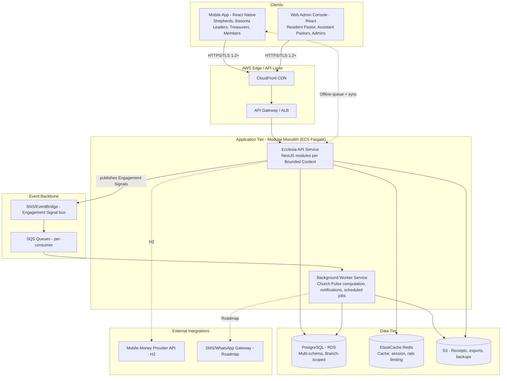
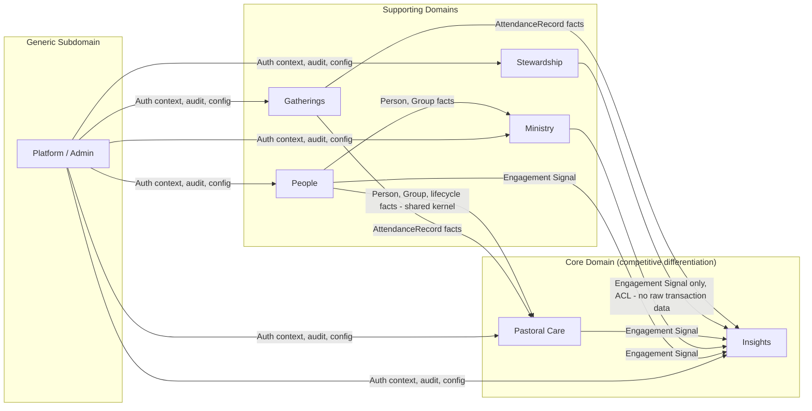
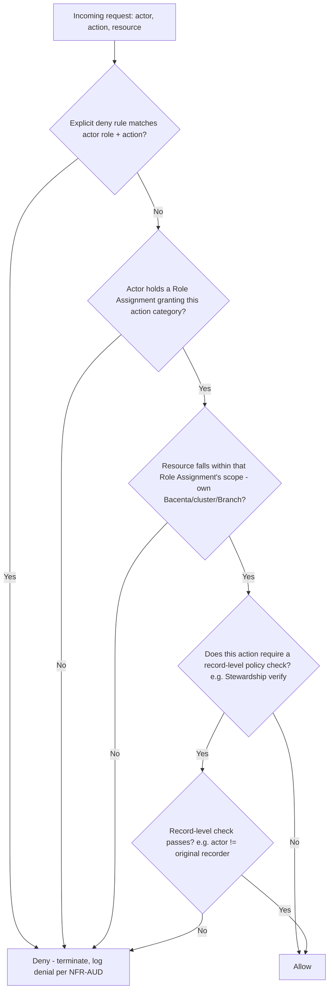
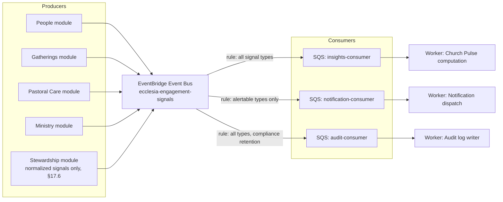
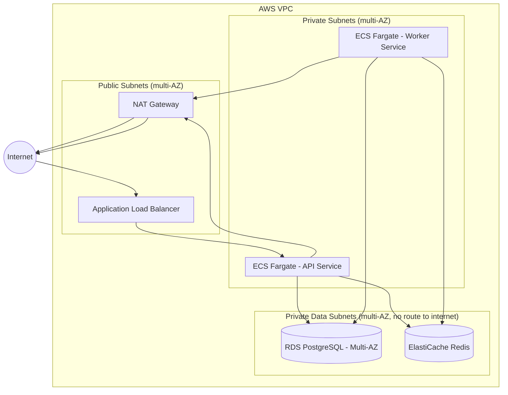
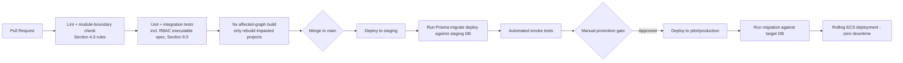

# Ecclesia — Technical Blueprint (PTB v2.0)
## How Ecclesia Will Be Built

**Document Status:** Version 1.0 — LOCKED (updated to reflect the PRD Open Questions Resolution Workshop; two items, silent-drift thresholds and Church Pulse weighting, remain PRD-side configuration values pending one live session and do not affect anything in this document)
**Classification:** Internal — Engineering, Architecture, Platform, Security
**Companion documents:** *Ecclesia PRD* (v1.0, Sections 1–25) — this document assumes the PRD as authoritative for *what* the system must do; this document specifies *how* it is built. Every architectural decision below traces back to a PRD requirement, business rule, or non-functional requirement, cited by ID. *Ecclesia PRD Open Questions Resolution Workshop* — the decision record for schema/permission-affecting choices applied in Chapters 2, 3, and 8 below.
**Assumed stack (confirmed):** Backend — Node.js / TypeScript (modular, NestJS-style); Mobile — React Native; Database — PostgreSQL; Cloud — AWS.

| Field | Value |
|---|---|
| Document version | 1.0 |
| Last updated | 2026-07-31 |
| Intended audience | Staff/Principal Engineers, Platform team, Security, DevOps/SRE, Mobile team, Engineering leadership |
| Prerequisite reading | Ecclesia PRD (v1.0), especially Chapter 3 (Domain Model & Functional Requirements), Chapter 4 (NFRs & Business Rules), Chapter 5 (Functional Domains & Permissions), and §24 (Resolved Decisions Log) |

### 0.1 Changelog

| Version | Date | Change |
|---|---|---|
| 0.1 | 2026-07-31 | Initial draft of Chapter 1 (Purpose → Bounded Contexts) |
| 0.2–0.6 | 2026-07-31 | Chapters 2–7 drafted (Package/DB Strategy through Coding Standards/ADR Index) |
| 1.0 | 2026-07-31 | Updated to reflect PRD Open Questions Resolution Workshop decisions: household/guardian schema link (Ch. 2), configurable Poimen-gate policy (Ch. 3), Resident Pastor succession runbook with Council-confirmed access and time-bound interim authority (Ch. 8). Locked as v1.0 alongside PRD v1.0. |

---

## 1. Purpose & Relationship to the PRD

The PRD establishes forty-plus functional requirements, a domain model, and a permission matrix as the authoritative statement of *what* Ecclesia must do and *why*. None of that is re-litigated here. This document exists to answer the question the PRD deliberately leaves open: given those requirements, what is the concrete technical shape of the system a team should build — its module boundaries, its data strategy, its authentication and event architecture, how it deploys and scales, and the standards its code should be held to.

Three PRD commitments constrain every decision in this document and are worth restating up front because they will recur as justifications throughout:

1. **"Configurable by Design" (PRD §6)** means the architecture must separate invariant domain logic from tenant-configurable data (gathering types, role labels, Church Pulse weights) at the code and schema level, not just conceptually. Section 5 of this chapter and later chapters on database strategy and package structure operationalize this.
2. **"Built to Grow" (PRD §6, §12.2)** means Branch and Council are first-class entities from day one, and the architecture must not require a rewrite to go from one Branch to many. This directly informs the modular-monolith decision in Section 4.
3. **Stewardship's separation-of-duties requirement (PRD §12.7, §17.4)** is not a UI convention — it must be enforced at the service/API layer as a record-level authorization check. This is a hard constraint on the authentication/RBAC chapter (Chapter 3 of this document) and on how the Stewardship bounded context exposes its write paths.

### 1.1 How to read this document

Each chapter states a decision, the alternatives considered, and the rationale — in the style of an Architecture Decision Record (ADR) — rather than presenting a single option as if it were the only one considered. Where a decision is genuinely contingent on scale not yet reached (e.g., "revisit if X"), that trigger condition is stated explicitly, consistent with the PRD's own practice of naming open questions rather than pretending false certainty.

---

## 2. Architectural Philosophy & Guiding Principles

| Principle | Statement | Technical consequence |
|---|---|---|
| **Domain-aligned modularity** | The codebase's module boundaries mirror the PRD's domain boundaries (People, Pastoral Care, Ministry, Gatherings, Stewardship, Insights, Platform/Admin) exactly, not an alternative technical decomposition (e.g., not split by "CRUD service" vs. "reporting service") | Any engineer who has read PRD §16 (Functional Domains) should be able to predict which module owns a given piece of logic without reading code first |
| **Monolith first, service-extractable later** | Release 1 ships as a single deployable modular monolith (Section 4), not microservices, because the team, traffic, and organizational scale (PRD §7 Horizon 1) do not yet justify the operational cost of distributed systems | Module boundaries are enforced by internal architectural convention and lint rules (Chapter 7, Coding Standards) today, and by process/network boundaries only if and when a specific module's scaling or team-ownership needs diverge enough to justify extraction (see ADR-001) |
| **Event-driven where the PRD requires it, synchronous everywhere else** | The PRD (§12.8) mandates that Insights consume an Engagement Signal stream rather than poll other domains' tables. This is the *only* place event-driven architecture is a hard requirement; other inter-module calls default to direct, synchronous, in-process calls unless a specific cross-cutting concern (audit logging, notification fan-out) argues otherwise | Prevents the common failure mode of adopting event-driven architecture uniformly "because it's more scalable," which would add operational complexity (Chapter 6) to parts of the system that do not need it at Horizon 1 scale |
| **Offline-first is a mobile architecture requirement, not a mobile UI nicety** | PRD NFR-OFF-01/02 requires local queuing and deterministic sync conflict resolution for attendance and offering capture | The mobile client is architected around a local-first data layer (Section 2.4, and detailed in the Mobile Architecture chapter) with sync as an explicit, testable subsystem, not an afterthought bolted onto a otherwise-online-only app |
| **Auditability is a data-model property, not a logging feature** | PRD BR-STW-11, NFR-AUD-01/02 require immutable, append-only financial and role-assignment history | Financial Transaction and Role Assignment tables are designed append-only from the schema level up (Chapter 2, Database Strategy), not retrofitted with a separate audit-log table that could drift from the operational data |
| **Security and permission enforcement live at the service boundary, never only in the client** | PRD NFR-SEC-02 explicitly requires this | Every API endpoint independently re-validates authorization; the mobile/web clients' UI-level restrictions are a UX convenience, never the actual security boundary (Chapter 3) |

---

## 3. High-Level System Architecture



**Rationale for the modular-monolith-plus-worker split (rather than one process or full microservices).** A single API service keeps the domain modules co-located and transactionally consistent (critical for the People/Group/GROUP_MEMBERSHIP invariants in PRD §12.3 that must be enforced within one database transaction). A separate background Worker service exists specifically because Church Pulse computation (PRD §12.8), notification fan-out, and scheduled jobs (silent-drift detection sweeps, PRD §15.8) are asynchronous by nature and should not share request/response latency budgets (NFR-PERF-02) with user-facing API calls, and should scale independently from API request volume.

---

## 4. Modular Architecture

### 4.1 ADR-001: Modular Monolith over Microservices for Release 1

**Status:** Accepted.

**Context.** The PRD's Horizon 1 scope (§7.1, §9.2) is a single Branch. Horizon 3 (§7.3) introduces multi-branch/Council scale, which is the point at which distributed-systems tradeoffs (independent scaling, independent deployment, team-boundary alignment) become easier to justify against their operational cost (network reliability, distributed transactions, observability complexity — Chapter 6).

**Decision.** Ecclesia ships as a modular monolith: one deployable API service composed of strictly-separated internal modules corresponding 1:1 to the PRD's bounded contexts (Section 5), plus one background Worker service for asynchronous processing. Microservice extraction is deferred and treated as a per-module decision made only when a concrete trigger condition is met (below), not adopted uniformly as a starting architecture.

**Consequences.** Inter-module calls are in-process function calls (fast, transactionally consistent, easy to debug) rather than network calls, at the cost of requiring architectural discipline (enforced via lint rules, Chapter 7) to prevent modules from silently coupling to each other's internals. Extraction to a separate service later requires the module to already expose a clean interface — which is required practice from day one regardless (Section 4.3) — making later extraction an infrastructure change, not a rewrite.

**Extraction trigger conditions (evaluate per module, not as a single global switch):**

| Trigger | Applies most plausibly to |
|---|---|
| A module's read/write volume scales independently and disproportionately from the rest of the system | Insights (Church Pulse computation is read-heavy and computationally distinct from transactional writes elsewhere) |
| A module requires a different technology fit than the rest of the platform | Insights, if predictive modeling (PRD Roadmap §23) eventually requires a Python/ML-oriented runtime |
| A module is owned by a distinct team with a genuine need for independent deployment cadence | Not applicable at Horizon 1–2 team size; revisit only if headcount grows substantially |
| Regulatory/data-isolation requirements demand physical separation | Stewardship, if a future jurisdiction's financial regulation requires it (PRD OQ-08) |

### 4.2 Module inventory

| Module | Bounded context (Section 5) | Owns |
|---|---|---|
| `people` | People | Person, lifecycle stage, Group, GroupMembership, RoleAssignment |
| `pastoral-care` | Pastoral Care | Bacenta operational logic, Follow-up tasks, silent-drift evaluation, Poimen tracking |
| `ministry` | Ministry | Basonta operational logic, staffing targets/adequacy, worker availability |
| `gatherings` | Gatherings | Gathering entity/types, recurrence, AttendanceRecord, visitor intake |
| `stewardship` | Stewardship | FinancialTransaction, verification/reconciliation, expenses, projects |
| `insights` | Insights | EngagementSignal ingestion, Church Pulse computation, alerting, dashboards' backing data |
| `platform` | Platform/Admin (cross-cutting) | Branch/Council, configuration, audit log, auth/RBAC primitives (Chapter 3) |

### 4.3 Module boundary rules (enforced, not aspirational)

1. **No module imports another module's internal (non-exported) types or repositories directly.** Each module exposes a narrow public interface (a small set of service classes and DTOs); all cross-module interaction goes through that interface. This is enforced by an ESLint boundary rule (`eslint-plugin-boundaries` or equivalent, configured per-module) that fails CI on violation — not a code-review-only convention, since conventions erode under deadline pressure and lint rules do not.
2. **A module may depend "downward" on Platform (shared primitives: auth context, audit logging, configuration) but Platform never depends upward on a domain module.** This keeps Platform a true shared kernel rather than a dumping ground that accretes domain logic.
3. **Insights depends only on the Engagement Signal stream, never directly on other modules' repositories/tables**, even though it runs in the same process (Section 6 elaborates the mechanism). This is the one boundary rule justified by a specific PRD requirement (§12.8) rather than general hygiene, and is therefore treated as non-negotiable even under time pressure.
4. **Cross-module transactions are avoided by design; where a single business operation must atomically affect two modules' data (e.g., closing a GroupMembership and opening a new one, PRD §12.3), that operation is owned by the module that owns the invariant being protected (`people`), and the other module is called through its public interface within that same request** — not orchestrated externally by a caller assembling two separate calls.

---

## 5. Bounded Contexts

### 5.1 Context map



**Why Pastoral Care and Insights are the Core Domain, not People or Stewardship.** In Domain-Driven Design terms, the Core Domain is where the product's actual competitive differentiation lives — the reason the PRD (§4.3) argues Ecclesia is a different category from incumbent ChMS tools. People and Gatherings are necessary, well-understood supporting domains (most ChMS products already model identity and attendance adequately); Stewardship, while operationally critical, follows well-established separation-of-duties patterns common to any financial system. Pastoral Care (silent-drift detection, the Shepherd relationship model) and Insights (Church Pulse as a multi-signal composite, PRD BR-INS-01) are where Ecclesia's actual thesis — "manages ministry, not records" (PRD §5) — is either true in the software or it isn't. Engineering effort, code review rigor, and design iteration budget should be weighted accordingly: a bug in the Platform module's configuration screen is an inconvenience; a bug in silent-drift detection logic is a mission failure by the PRD's own definition.

### 5.2 Context relationship patterns

| Relationship | Pattern used | Why |
|---|---|---|
| People → Pastoral Care, Ministry, Gatherings | **Shared Kernel** (Person, Group, GroupMembership types are shared, not duplicated or translated) | These entities are referenced so pervasively and must stay so tightly consistent (PRD §12.3's `GROUP_MEMBERSHIP` cardinality rules) that a translation layer between contexts would itself become a source of the exact data-integrity bugs PRD §4.2 identifies as the core problem being solved |
| Stewardship → Insights | **Anti-Corruption Layer / Open Host Service via Engagement Signal only** | PRD §17.6 explicitly requires that Insights never receive raw financial line-item data, only normalized signals — this is a deliberate context boundary enforcing a privacy requirement, not an oversight to be "optimized away" later |
| Gatherings → Pastoral Care / Insights | **Published Language (Engagement Signal + direct AttendanceRecord read)** | Attendance data is not sensitive in the way financial data is, so Pastoral Care and Insights may read AttendanceRecord data directly (via Gatherings' public interface) in addition to receiving derived signals, since PRD §16.2/16.6 do not impose the same isolation requirement here that §17.6 imposes on Stewardship |
| Platform → all domain contexts | **Shared Kernel (auth/audit primitives) + Open Host Service (configuration)** | Configuration (gathering types, labels, Church Pulse weights) must be readable by every domain module without each one re-implementing configuration-fetching logic |

### 5.3 Context-to-module-to-database-schema mapping (preview)

Each bounded context maps to exactly one module (Section 4.2) and, as detailed in the Database Strategy chapter to follow, to its own PostgreSQL schema within a single database — giving each context clear ownership and independent migration history while still allowing the transactional consistency a monolith provides. This mapping is stated here as a preview specifically so that Section 4 (module boundaries) and the forthcoming Database Strategy chapter are read as one coherent decision, not two independently-arrived-at ones.

---

*End of Chapter 1.*

---

## 6. Package & Repository Structure

### 6.1 ADR-002: Monorepo over polyrepo

**Status:** Accepted.

**Context.** Ecclesia consists of an API service, a background Worker, a React Native mobile app, a React web admin console, shared domain types/contracts, and infrastructure-as-code. These artifacts share types extensively (e.g., a `FinancialTransaction` DTO must be identical between API and both clients) and are developed by a small team at Horizon 1–2 scale (PRD §7).

**Decision.** A single monorepo, managed with Nx (chosen over Turborepo primarily for its stronger built-in module-boundary enforcement via tags/constraints, which directly implements Section 4.3's lint-enforced module rules), containing all applications and shared libraries.

**Consequences.** Shared types (Section 6.3) are refactored atomically across producer and consumers in one commit, eliminating an entire class of client/server contract-drift bugs. The cost — a larger single repository, and CI that must be scoped to only rebuild/retest affected projects — is mitigated by Nx's affected-graph computation, which is a solved problem in this tooling, not a risk this decision introduces.

**Revisit trigger.** If a module is extracted to a separate service per ADR-001's trigger conditions, its code may be split into its own repository at that time, but this is not anticipated before Horizon 3.

### 6.2 Repository layout

```
ecclesia/
├── apps/
│   ├── api/                      # Modular monolith API service (NestJS)
│   │   └── src/
│   │       ├── modules/
│   │       │   ├── people/
│   │       │   ├── pastoral-care/
│   │       │   ├── ministry/
│   │       │   ├── gatherings/
│   │       │   ├── stewardship/
│   │       │   ├── insights/
│   │       │   └── platform/
│   │       ├── main.ts
│   │       └── app.module.ts
│   ├── worker/                   # Background worker (Church Pulse, notifications, scheduled jobs)
│   │   └── src/
│   │       ├── jobs/
│   │       │   ├── church-pulse-recompute.job.ts
│   │       │   ├── silent-drift-sweep.job.ts
│   │       │   ├── follow-up-sla-sweep.job.ts
│   │       │   └── attendance-completeness-sweep.job.ts
│   │       └── consumers/        # SQS consumers per Engagement Signal subscription
│   ├── mobile/                    # React Native client
│   │   └── src/
│   │       ├── screens/
│   │       ├── offline/           # Local-first data layer (Section 6.4 preview; detailed in Mobile Architecture chapter)
│   │       └── sync/
│   └── web-admin/                 # React web console
│       └── src/
├── libs/
│   ├── domain/                    # Pure domain logic per bounded context - framework-agnostic
│   │   ├── people/
│   │   ├── pastoral-care/
│   │   ├── ministry/
│   │   ├── gatherings/
│   │   ├── stewardship/
│   │   └── insights/
│   ├── contracts/                 # Shared DTOs, Zod schemas, OpenAPI-generated types - consumed by api, mobile, web-admin
│   ├── rbac/                      # Shared permission-matrix definitions and guard primitives (Chapter 3)
│   ├── config/                    # Shared configuration-loading utilities
│   └── testing/                   # Shared test fixtures/factories
├── infra/                         # Infrastructure-as-code (Terraform/CDK) - Chapter 5
│   ├── environments/
│   │   ├── dev/
│   │   ├── staging/
│   │   └── production/
│   └── modules/
├── db/
│   ├── migrations/                # Prisma migration history (Section 7.6)
│   └── schema.prisma
├── nx.json
├── package.json
└── pnpm-workspace.yaml
```

**Rationale for separating `libs/domain` from `apps/api/src/modules`.** The `modules/*` directories contain NestJS-specific wiring (controllers, decorators, dependency injection) while `libs/domain/*` contains the actual business rules (state machine transitions, the silent-drift decision tree logic, separation-of-duties checks) as plain TypeScript with no framework dependency. This directly serves two PRD-derived needs: unit tests for business logic (e.g., "verify BR-STW-04 is enforced") run without spinning up a NestJS application context, and the domain logic itself becomes portable if a future module extraction (ADR-001) or a different delivery mechanism (e.g., a CLI migration tool) needs to reuse it without re-implementing the rules.

### 6.3 Contract sharing strategy

| Concern | Approach | Why |
|---|---|---|
| API request/response types | Defined once in `libs/contracts` using Zod schemas; TypeScript types are inferred from the Zod schemas (`z.infer<>`), and the same schemas are used for runtime validation at the API boundary | A single source of truth prevents the "backend changed a field, mobile app didn't know" class of bug that would be especially costly given offline-queued mobile writes (a stale contract could silently corrupt a queued sync payload) |
| OpenAPI documentation | Auto-generated from the NestJS controllers' decorated DTOs (which are the same Zod-derived types) | Keeps documentation from drifting out of sync with the actual contract, without a hand-maintained OpenAPI spec as a second source of truth |
| Permission matrix (PRD §17.3) | Defined once in `libs/rbac` as a structured data table (role × action × scope), consumed by both the API's authorization guards (Chapter 3) and the mobile/web clients' UI-level "should I show this button" logic | Ensures the client-side convenience checks and the server-side enforcement checks are mechanically derived from the same source, so they can never silently diverge into "the button is hidden but the API allows it anyway" or vice versa |

### 6.4 Internal module structure (per bounded context)

Each of the seven modules in `apps/api/src/modules/*` follows an identical internal layout, so that a developer who has learned one module's structure can navigate any other module without relearning conventions:

```
modules/stewardship/
├── stewardship.module.ts
├── controllers/
│   └── financial-transaction.controller.ts
├── services/
│   ├── financial-transaction.service.ts     # Orchestrates use cases; calls into libs/domain/stewardship for rules
│   └── reconciliation.service.ts
├── repositories/
│   └── financial-transaction.repository.ts  # Prisma-backed persistence, schema-scoped (Section 7.2)
├── dto/
│   └── (imports shared types from libs/contracts, adds Nest-specific validation decorators only where needed)
├── events/
│   └── financial-transaction.events.ts      # Engagement Signal emission (Section 6, this chapter's database section, and the Event Architecture chapter)
└── guards/
    └── same-actor-verification.guard.ts     # BR-STW-04 enforcement (Section 17.4 of the PRD) - this module's one custom guard beyond the shared RBAC guards in libs/rbac
```

---

## 7. Database Strategy

### 7.1 ADR-003: Single PostgreSQL database, schema-per-bounded-context, row-level multi-tenancy

**Status:** Accepted.

**Context.** PRD NFR-SCALE-02 requires that onboarding a second Branch require "zero schema migration, only new configuration and data rows." Two common multi-tenancy patterns were considered: schema-per-tenant (each Branch gets its own PostgreSQL schema or database) and row-level multi-tenancy (all Branches share tables, distinguished by a `branch_id` column). Schema-per-tenant gives strong physical isolation but means every schema migration must be replayed across every tenant's schema — directly contradicting the "zero schema migration" requirement's spirit once there are more than a handful of Branches, and complicating any Horizon 3 cross-Branch consolidation query (PRD §7.3, G3.1) into a fan-out across N schemas.

**Decision.** One PostgreSQL database, with tables organized into schemas by bounded context (`people`, `pastoral_care`, `ministry`, `gatherings`, `stewardship`, `insights`, `platform` — mirroring Section 4.2's module list), and multi-tenancy achieved via a `branch_id` column on every Branch-scoped table, enforced with PostgreSQL Row-Level Security (RLS) policies rather than relying solely on application-layer filtering.

**Consequences.** A single schema migration applies to all Branches simultaneously (satisfying NFR-SCALE-02 literally). Cross-Branch Council-level reporting (G3.1) becomes a normal SQL query with a `council_id` join, not a distributed fan-out. The tradeoff — a bug in application-layer query construction could theoretically leak cross-Branch data — is mitigated specifically by RLS as a second, database-enforced layer that does not depend on every developer remembering to filter by `branch_id` in every query (see Section 7.3).

**Revisit trigger.** If a specific Council customer's regulatory environment (PRD OQ-08) requires physical data isolation per Branch, that Branch's data can be migrated to a dedicated database without changing the schema design itself, since the schema-per-bounded-context structure is orthogonal to the physical database it lives in.

### 7.2 Schema-to-module mapping

| PostgreSQL schema | Owning module | Representative tables |
|---|---|---|
| `people` | People | `persons` (includes optional nullable `guardian_person_id` — resolved PRD §24 OQ-01: schema-only household/guardian link, no workflow built in v1.0), `groups`, `group_memberships`, `role_assignments` |
| `pastoral_care` | Pastoral Care | `follow_up_tasks`, `silent_drift_flags`, `poimen_enrollments`, `pastoral_notes` |
| `ministry` | Ministry | `staffing_targets`, `worker_availability` |
| `gatherings` | Gatherings | `gatherings`, `gathering_series`, `attendance_records`, `visitor_intake_submissions` |
| `stewardship` | Stewardship | `financial_transactions`, `financial_transaction_events`, `expenses`, `projects`, `pledges` |
| `insights` | Insights | `engagement_signals`, `pulse_scores`, `pulse_score_history`, `alerts` |
| `platform` | Platform/Admin | `branches`, `councils`, `configurations`, `audit_log`, `users`, `sessions` |

A module's repository code (Section 6.4) only ever queries its own schema directly; if it needs data owned by another module, it calls that module's public service interface (Section 4.3, rule 1), which may involve a cross-schema query executed *by the owning module*, not by the caller reaching across schema boundaries itself.

### 7.3 Row-Level Security enforcement

Every Branch-scoped table carries a non-nullable `branch_id` column, and RLS policies are enabled by default:

```sql
ALTER TABLE stewardship.financial_transactions ENABLE ROW LEVEL SECURITY;

CREATE POLICY branch_isolation ON stewardship.financial_transactions
    USING (branch_id = current_setting('app.current_branch_id')::uuid);
```

The API service sets `app.current_branch_id` as a session-local setting at the start of every request (derived from the authenticated user's Branch context, Chapter 3), so that even a query with a missing or incorrect application-layer `WHERE branch_id = ...` clause cannot return another Branch's rows — RLS is the backstop, not the primary mechanism, precisely because NFR-SEC-02 requires that authorization not depend solely on every developer remembering every check in every query.

### 7.4 Append-only financial data model

PRD BR-STW-11 and NFR-AUD-01/02 require that Financial Transactions never be hard-deleted and that their full state history be immutably retrievable. This is implemented as an event-sourced-within-a-table pattern rather than mutable rows with a bolted-on audit log:

```sql
CREATE TABLE stewardship.financial_transactions (
    id                UUID PRIMARY KEY DEFAULT gen_random_uuid(),
    branch_id         UUID NOT NULL REFERENCES platform.branches(id),
    type              TEXT NOT NULL CHECK (type IN ('OFFERING','TITHE','SPECIAL_OFFERING','PLEDGE','DONATION','EXPENSE')),
    source_group_id   UUID REFERENCES people.groups(id),        -- nullable: e.g., individual Mobile Money gifts (FR-STW-06)
    giver_person_id   UUID REFERENCES people.persons(id),
    channel           TEXT CHECK (channel IN ('CASH','MOBILE_MONEY')),
    amount_minor      BIGINT NOT NULL,                          -- stored in minor currency units to avoid float rounding error
    currency          TEXT NOT NULL DEFAULT 'GHS',              -- NFR-L10N-02
    current_state     TEXT NOT NULL,                            -- denormalized for query performance; see trigger below
    created_at        TIMESTAMPTZ NOT NULL DEFAULT now()
);

-- Append-only event log: every state transition is an insert, never an update to this table
CREATE TABLE stewardship.financial_transaction_events (
    id                    UUID PRIMARY KEY DEFAULT gen_random_uuid(),
    transaction_id        UUID NOT NULL REFERENCES stewardship.financial_transactions(id),
    from_state            TEXT,
    to_state               TEXT NOT NULL,
    actor_user_id         UUID NOT NULL REFERENCES platform.users(id),
    reason                TEXT,                                  -- required for Flagged/Rejected transitions, enforced at service layer
    occurred_at           TIMESTAMPTZ NOT NULL DEFAULT now()
);
-- No UPDATE or DELETE grants on financial_transaction_events for the application's database role;
-- only INSERT and SELECT, enforced at the database-role permission level, not merely by application code discipline.

-- A trigger keeps financial_transactions.current_state in sync purely as a read-optimization,
-- with financial_transaction_events remaining the single source of truth for history.
```

The same-actor-different-verifier rule (BR-STW-04, Section 17.4 of the PRD) is enforced at the service layer (the `same-actor-verification.guard.ts` referenced in Section 6.4) by comparing the `actor_user_id` of the `Recorded` event against the `actor_user_id` attempting the `Verified` transition — a check that reads the append-only event history directly, which is precisely why that history must be a reliable, immutable source rather than a mutable `recorded_by`/`verified_by` pair of columns that could be edited independently of each other.

### 7.5 Temporal membership history (GROUP_MEMBERSHIP)

PRD §12.3 requires `GROUP_MEMBERSHIP` to preserve history rather than being overwritten on reassignment, and §12.6/FR-PPL-04 requires exactly one active `PASTORAL_CARE` membership per Person:

```sql
CREATE TABLE people.group_memberships (
    id            UUID PRIMARY KEY DEFAULT gen_random_uuid(),
    person_id     UUID NOT NULL REFERENCES people.persons(id),
    group_id      UUID NOT NULL REFERENCES people.groups(id),
    group_type    TEXT NOT NULL,             -- denormalized from groups.type for the partial index below
    started_at    TIMESTAMPTZ NOT NULL DEFAULT now(),
    ended_at      TIMESTAMPTZ,               -- NULL = currently active
    reason        TEXT                        -- required on close, per FR-PC-02 audit requirement
);

-- Enforces BR-PPL-01: exactly one active PASTORAL_CARE membership per person
CREATE UNIQUE INDEX one_active_bacenta_per_person
    ON people.group_memberships (person_id)
    WHERE group_type = 'PASTORAL_CARE' AND ended_at IS NULL;
```

Reassignment (FR-PC-02) is implemented as a single transaction that sets `ended_at` on the prior active row and inserts a new row, never an `UPDATE` of `group_id` on the existing row — preserving the exact history PRD §12.3's design note argues is non-negotiable.

### 7.6 ORM and migration tooling

**Decision:** Prisma, over TypeORM or a raw query builder (Knex).

**Rationale.** Prisma's schema-first approach generates fully-typed query clients, which pairs naturally with the shared-contract strategy (Section 6.3) and reduces an entire class of runtime type errors between the database layer and the DTOs consumed by clients. Prisma's migration tooling (`prisma migrate`) produces reviewable, versioned SQL migration files (not just an ORM-internal state), which matters given this database's schema changes (Section 7.1's "zero migration for a second Branch" claim) need to be auditable artifacts, not opaque ORM magic. The one known limitation — Prisma's relatively weaker support for advanced raw-SQL patterns like the RLS policies and partial unique indexes above — is handled by writing those specific constructs as raw SQL within Prisma migration files (`migration.sql`), which Prisma explicitly supports, rather than avoiding those constructs to stay within the ORM's abstraction.

### 7.7 Read/write separation for reporting and Insights

PRD NFR-SCALE-03 requires reconciliation and reporting queries to remain performant as historical volume grows, and NFR-PERF-03 requires Church Pulse recomputation without contending with OLTP write latency. An RDS read replica is provisioned for the Worker service (Section 3) and for reporting/export queries (FR-STW-07, NFR-INT-02), so that Church Pulse computation sweeps and weekly reconciliation report generation read from the replica rather than competing with live attendance/offering-recording write traffic on the primary — a concrete mechanism for the Section 3 rationale that Worker and API have independent scaling needs.

### 7.8 Backup, PITR, and disaster recovery

Directly implementing PRD NFR-DR-01/02:

| Requirement | Implementation |
|---|---|
| Daily automated, encrypted backups | RDS automated backups, encrypted at rest via KMS, retained per a configured window (minimum 35 days for financial-data compliance headroom beyond the NFR's daily minimum) |
| RPO ≤ 24 hours | RDS Point-In-Time Recovery (PITR) via continuous WAL archiving provides RPO measured in minutes, exceeding the NFR's minimum bar rather than merely meeting it, at negligible additional cost over daily-snapshot-only backup |
| RTO ≤ 4 hours | A documented, quarterly-tested restore runbook (NFR-DR-01's "tested restore procedures") targets a specific, measured restore time; Horizon 3 (multi-branch) may warrant a warm standby (Multi-AZ, already enabled by default for production) to reduce this further as Branch count grows |

---

*End of Chapter 2.*

---

## 8. Authentication

### 8.1 ADR-004: AWS Cognito as the identity provider, over self-managed auth

**Status:** Accepted.

**Context.** PRD NFR-SEC-01/03/04 require encrypted credential handling, role-conditional MFA, and reliable session/auth audit logs. Building and maintaining this correctly (password hashing, MFA enrollment/verification flows, token issuance and rotation, breach-monitoring) is a substantial, security-critical undertaking that is not where Ecclesia's differentiated value lives (PRD §5.3's Core Domain reasoning applies here in reverse: authentication is squarely a Generic Subdomain, PRD §5.1).

**Decision.** AWS Cognito User Pools as the identity provider, integrated with the API service via standard OIDC/JWT validation middleware, rather than a self-built Passport.js/bcrypt solution.

**Consequences.** MFA (NFR-SEC-03), password policy enforcement, and account-recovery flows are handled by a managed, independently-audited service rather than custom code the team must secure and maintain indefinitely. The cost is a dependency on Cognito's specific feature set and quota/pricing model; this is judged acceptable because Cognito's phone-number-based authentication (Section 8.2) and per-user-pool MFA configuration directly fit the requirements without significant customization.

### 8.2 Authentication method by persona

| Persona (PRD §11) | Primary auth method | Rationale |
|---|---|---|
| Bacenta Leader (Shepherd), Basonta Leader, Member, Worker | Phone number + OTP (SMS-based one-time code via Cognito custom auth flow) | These personas are smartphone-first (PRD §11 summary table) and, per discovery, may not reliably have or check email; a phone number is the identifier most consistently available and matches how Mobile Money and most locally-relevant services already authenticate users, minimizing the "unfamiliar login pattern" friction NFR-USA-01 warns against |
| Treasurer / Finance Team | Email + password, MFA mandatory (TOTP via authenticator app, Cognito software token MFA) | NFR-SEC-03 explicitly names this role for mandatory MFA given financial-transaction authority |
| Assistant Pastor, Resident Pastor | Email + password, MFA mandatory | Same NFR-SEC-03 basis; also the roles with leadership-appointment authority (Role Assignment grants) |
| Admin / Church Administrator | Email + password, MFA mandatory | Configuration-surface authority (FR-ADM-01) plus, per Section 17.5 of the PRD, no default pastoral-content access, so MFA here specifically protects configuration integrity, not pastoral data |

Phone-based OTP and email/password are both first-class Cognito authentication flows in the same User Pool, distinguished by a custom attribute (`auth_method`) set at account provisioning based on the Person's assigned Role — a Person who is later granted a Treasurer or Pastor-tier Role Assignment (PRD BR-PPL-04) is required to complete email/password + MFA enrollment as part of that role grant workflow (Section 19.4 of the PRD), not permitted to continue operating that role under OTP-only authentication.

### 8.3 Token strategy

| Token | Lifetime | Storage (mobile) | Purpose |
|---|---|---|---|
| Access token (JWT) | 15 minutes | In-memory only, never persisted to disk | Presented on every API request; short lifetime bounds the blast radius of a leaked token |
| Refresh token | 30 days, rotated on use | Device Keychain (iOS) / Keystore (Android) via encrypted secure storage, never in plain AsyncStorage/localStorage | Silently re-issues access tokens without requiring re-authentication, balancing NFR-USA-01 (avoid repeated friction for volunteer users) against session-hijacking risk |
| Device-bound refresh claim | Tied to a device identifier at issuance | Same secure storage | Allows a compromised or lost device's refresh tokens to be revoked individually (via Cognito's device tracking) without invalidating the user's sessions on their other devices |

### 8.4 Offline authentication handling

This is the authentication-layer consequence of NFR-OFF-01/02 (offline-first attendance/offering capture) that a purely online-auth design would silently break: a Shepherd recording attendance immediately after a Bacenta Meeting, per US-D2 of the PRD, may have no connectivity at all at that moment.

**Design.** The mobile client caches the last-valid access token and its claims (user identity, Role Assignments, Branch/Bacenta scope) locally at the moment of last successful online authentication. While offline, the client operates against this cached identity context for authorization *decisions made client-side* (e.g., which screens/actions to show) — but every write (attendance record, offering record) queued offline is stamped with the cached user's identity and a client-generated timestamp, and is **not considered authoritative until the server independently re-validates it at sync time**. On reconnection, the client first attempts a token refresh; if the refresh token is still valid, queued writes are submitted under a freshly-issued access token and pass through the exact same server-side authorization checks (Section 9) as an online-created request — offline operation defers *when* authorization is server-verified, it never bypasses *that* it is server-verified. If the refresh token has expired (beyond the offline grace period, configurable, default aligned to the 30-day refresh lifetime), the client requires re-authentication before syncing queued writes, and queued data is preserved locally, not discarded, until that re-authentication succeeds.

```mermaid
sequenceDiagram
    participant App as Mobile App
    participant Cache as Local Secure Storage
    participant API as Ecclesia API

    App->>API: Authenticate (OTP or password+MFA)
    API-->>App: Access token + Refresh token
    App->>Cache: Store refresh token (encrypted); keep access token in memory

    Note over App: Connectivity lost
    App->>App: Record attendance/offering locally (queued, stamped with cached identity)

    Note over App: Connectivity restored
    App->>API: Refresh access token
    alt Refresh token valid
        API-->>App: New access token
        App->>API: Submit queued writes under new access token
        API->>API: Server-side authorization check (Section 9) on each write, as if created online
    else Refresh token expired
        API-->>App: Refresh rejected
        App->>App: Prompt re-authentication; queued writes preserved locally
    end
```

### 8.5 Session and authentication audit logging

Directly implementing NFR-SEC-04: every authentication event (login, MFA challenge outcome, token refresh, token revocation) is logged to `platform.audit_log` with the authenticated user, device identifier, IP address (where available), and outcome — joinable against the `financial_transaction_events` and `role_assignments` audit trails (Section 7.4, 7.5) so that "who was logged in when this record changed" (NFR-SEC-04's literal requirement) is answerable by a single join, not by correlating logs across separate systems.

### 8.6 Resident Pastor succession runbook (resolved PRD §24 OQ-03 / BR-ORG-03)

RISK-08 (PRD §20) flagged that the Resident Pastor role's Branch-wide authority had no defined transition process. Leadership's resolution — a documented manual runbook, not in-app automation, with succession formally announced, a defined interim authority, and **Council confirmation as the only route to provisioning a new Resident Pastor's access** — is implemented as follows, deliberately reusing existing mechanisms rather than introducing special-case code:

1. **Interim authority is modeled as an ordinary, time-bound Role Assignment**, not a new entity type: an `ACTING_RESIDENT_PASTOR` role, scoped to the Branch, with an `effective_to` date set at grant time (or left open and closed explicitly when the transition concludes). This reuses the same Role Assignment mechanism (Chapter 2, Section 7.2; PRD §12.2) already built for every other role, rather than inventing succession-specific data structures.
2. **Provisioning a new Resident Pastor's Cognito account and RBAC role is a manual, two-person-confirmed runbook step**, executed by an Admin or DevOps engineer only after receiving a recorded Council confirmation (an artifact — meeting minutes, a signed letter, or equivalent — attached to the audit log entry created for this action). The runbook explicitly documents that this confirmation cannot come from the outgoing Resident Pastor alone, matching BR-ORG-03 exactly.
3. **The outgoing Resident Pastor's Role Assignment is closed (not deleted)** at the point the incoming Pastor's access is confirmed, preserving full history per the same append-only philosophy applied to Bacenta reassignment (Chapter 2, Section 7.5) — a Resident Pastor transition is auditable years later in exactly the same way a Bacenta reassignment is.
4. **No automated workflow triggers this sequence** in v1.0, consistent with the low-frequency, high-stakes nature of the event (Blueprint Section 4's general principle: reserve engineering investment for what recurs, not what happens once a decade) — but the runbook itself is a required, tested artifact (verified via a tabletop exercise before Release 1 general availability), not merely assumed to be improvised correctly under real pressure.

---

## 9. Role-Based Access Control (RBAC) Implementation

### 9.1 ADR-005: Hybrid RBAC + ABAC, deny-overrides-allow

**Status:** Accepted.

**Context.** PRD §17.3's permission matrix is not a pure role-to-permission mapping: an Assistant Pastor's authority is scoped to *their cluster*, a Bacenta Leader's to *their own Bacenta*, and — critically — PRD §17.4 requires a record-level check (the same Person cannot both record and verify one specific transaction) that no static role table can express. Pure RBAC (role → permission) cannot represent scope-bounded or record-level authorization; pure ABAC (attribute-based rules with no role concept) would discard the clear, PRD-native vocabulary of named roles that Chapter 5's permission matrix is built around and that non-technical stakeholders (PRD §10, Section 17.2) reason in.

**Decision.** A hybrid model: **role** determines the *category* of actions a Person can potentially take (RBAC), **scope attributes** (which Bacenta/Basonta/cluster/Branch a given Role Assignment applies to, per PRD §12.2's Role Assignment entity) narrow that to *which resources*, and a small set of **record-level policy functions** (ABAC-style) handle the cases — currently only Stewardship's same-actor rule — that depend on facts about the specific record being acted on, not just the actor's role and scope. Authorization evaluation is **deny-overrides-allow**: an explicit deny (PRD §17.3's "X" cells — Pastor barred from `Recorded`, Admin barred from pastoral notes) is checked first and, if matched, terminates evaluation regardless of any role-based grant that would otherwise apply.

**Consequences.** This directly mirrors PRD §17.3's own structure (role × action × scope, with explicit denials as a distinct concept from unassigned permissions) rather than forcing that table into a simpler model that would lose the distinction the PRD's Section 17.3 "Reading note" specifically insists on preserving.

### 9.2 Authorization evaluation flow



### 9.3 Code representation of the permission matrix

The PRD §17.3 table is not merely documentation to be manually reimplemented in code — it is transcribed directly into a structured, version-controlled data file in `libs/rbac`, so that the PRD table and the enforced behavior share one source of truth in intent, even though they physically live in two documents:

```typescript
// libs/rbac/src/permission-matrix.ts
export const PERMISSION_MATRIX: PermissionRule[] = [
  {
    role: 'RESIDENT_PASTOR',
    action: 'stewardship.transaction.record',
    effect: 'DENY',                      // BR-STW-01 - hard rule, not merely unassigned
    reason: 'Pastors do not handle cash (PRD BR-STW-01)',
  },
  {
    role: 'ASSISTANT_PASTOR',
    action: 'stewardship.transaction.record',
    effect: 'DENY',
    reason: 'PRD BR-STW-01',
  },
  {
    role: 'BACENTA_LEADER',
    action: 'stewardship.transaction.record',
    effect: 'ALLOW',
    scope: 'OWN_GROUP',                  // resource.source_group_id must equal actor's led Bacenta
  },
  {
    role: 'TREASURER',
    action: 'stewardship.transaction.verify',
    effect: 'ALLOW',
    scope: 'BRANCH',
    recordLevelCheck: 'DIFFERENT_ACTOR_THAN_RECORDER',  // BR-STW-04 / PRD Section 17.4
  },
  {
    role: 'ADMIN',
    action: 'pastoral_care.notes.read',
    effect: 'DENY',
    reason: 'NFR-PRIV-01 - configuration authority does not imply pastoral-content access',
  },
  {
    role: 'RESIDENT_PASTOR',
    action: 'people.role_assignment.grant_shepherd',
    effect: 'ALLOW',
    scope: 'BRANCH',
    recordLevelCheck: 'POIMEN_GATE_IF_ENABLED',   // resolved PRD §24 OQ-02
    reason: 'BR-PPL-06 / FR-PC-06 - Poimen gating is a per-Branch/Council configuration flag, not a fixed rule',
  },
  // ... remainder of PRD Section 17.3 transcribed exhaustively
];
```

**Configurable Poimen gate (resolved PRD §24 OQ-02).** Unlike the Stewardship same-actor check (a fixed rule), whether incomplete Poimen training blocks a Shepherd Role Assignment is itself Branch-configurable — leadership confirmed this must support either policy, not just the recommended default. The `POIMEN_GATE_IF_ENABLED` record-level check reads a `poimen_gate_enabled` boolean from `platform.configurations` for the target Branch before deciding: if the flag is off (River of Life's default), the check always passes and Poimen status is advisory-only, surfaced to the Resident Pastor per FR-PC-06's acceptance criteria but never blocking; if on, the check additionally requires the candidate's Poimen enrollment status to be `COMPLETE`. This is a direct, concrete instance of "Configurable by Design" (PRD §6) implemented as a policy function parameterized by configuration data, exactly the same pattern used for gathering types and Church Pulse weights (Chapters 1, 4) — one mechanism, reused, rather than a one-off special case.

Each `PermissionRule` cites the PRD section or business rule ID it implements in its `reason` field specifically so that a future engineer questioning "why can't Admins read pastoral notes" finds the PRD citation in the code itself, rather than needing institutional memory to know this was a deliberate decision (NFR-PRIV-01) and not an oversight.

### 9.4 Guard architecture

```typescript
// Usage on a controller method
@RequirePermission('stewardship.transaction.verify')
@UseGuards(RbacGuard, RecordLevelPolicyGuard)
async verifyTransaction(@Param('id') id: string, @CurrentUser() user: AuthenticatedUser) {
  // RbacGuard has already confirmed role + scope by this point;
  // RecordLevelPolicyGuard has already confirmed user.id !== transaction's recordedBy actor
  return this.financialTransactionService.verify(id, user);
}
```

`RbacGuard` is a single, generic guard shared across all seven modules (living in `libs/rbac`, not duplicated per module), evaluating the flow in Section 9.2 up through the scope check. `RecordLevelPolicyGuard` is likewise generic infrastructure, but is parameterized per-endpoint with the specific record-level policy function named in the matrix (Section 9.3's `recordLevelCheck` field) — new record-level rules are added by writing one policy function and referencing it in the matrix, not by writing a new guard class per rule.

### 9.5 Permission matrix as an executable specification

Because PRD §17.3 is the authoritative statement of intended behavior, the QA verification strategy (referenced in PRD §10.3) treats that table as a test oracle: a generated test suite iterates every (role, action, scope) combination in the PRD table and asserts the API's actual authorization decision matches it exactly, including the explicit-deny cells. This test suite fails on any divergence — whether the divergence came from a code bug or from an undocumented change to the matrix — which is the concrete mechanism ensuring the PRD's permission chapter and the shipped system cannot silently drift apart from each other over years of maintenance, directly answering the PRD's own instruction (§10.3) that "every rule in this document [be] testable."

### 9.6 Denial audit logging

Every DENY outcome from Section 9.2's evaluation flow — not just every ALLOW — is logged to `platform.audit_log` with the attempted action, actor, resource, and the specific rule that produced the denial. This serves two purposes distinct from the general audit requirement (NFR-AUD-01): it gives Security a signal for detecting privilege-escalation probing (repeated denied attempts against sensitive actions like `stewardship.transaction.record` from a Pastor-role account would be anomalous and alertable), and it gives Product a real usage signal for whether the permission model itself is too restrictive in practice (a legitimate role hitting frequent denials on an action they arguably should have suggests the PRD matrix, not just the code, may need revisiting).

---

*End of Chapter 3.*

---

## 10. Event Architecture

### 10.1 ADR-006: Amazon EventBridge as the Engagement Signal backbone

**Status:** Accepted.

**Context.** PRD §12.8 mandates that Insights consume an event stream rather than poll other domains' tables, and this is the *only* place in the system (Section 2, Architectural Philosophy) where event-driven architecture is a hard requirement rather than a default. Candidates considered: Apache Kafka (rejected — operational overhead of running/managing a Kafka cluster is disproportionate to the actual throughput this system produces at Horizon 1–2 scale, PRD §7; this is exactly the kind of premature-scaling decision Section 2 warns against), raw SNS+SQS (viable, but lacks a schema registry and native event archive/replay), and Amazon EventBridge.

**Decision.** Amazon EventBridge as the Engagement Signal bus, with SQS queues as per-consumer subscriptions off EventBridge rules.

**Consequences.** EventBridge's schema registry gives the Engagement Signal envelope (Section 10.3) a versioned, discoverable contract as new signal types are added over the platform's life (PRD Roadmap §23 anticipates new signal categories). Its content-based filtering means a producer module publishes one event type without needing to know which consumers exist or care about it — directly reinforcing the Section 4.3 rule that Insights depends only on the stream, never on other modules' internals, and symmetrically that other modules never need to know Insights exists. EventBridge's native archive/replay is available but, per Section 10.9, is not relied upon as the system's actual replay mechanism — Postgres remains the durable system of record.

### 10.2 Position in the architecture



Every producer publishes to a single bus; which consumers exist and what they care about is entirely a matter of EventBridge rule configuration, never producer-side code. This means adding a new consumer (e.g., a future analytics export pipeline) requires zero changes to the six domain modules that produce events — only a new rule and queue.

### 10.3 Event envelope and schema versioning

```typescript
// libs/contracts/src/events/engagement-signal.envelope.ts
interface EngagementSignalEnvelope<T = unknown> {
  eventId: string;          // UUID, used as idempotency key (Section 10.5)
  eventType: string;        // e.g., 'attendance.recorded', 'follow_up.completed'
  schemaVersion: number;    // incremented only on breaking change; additive fields never bump this
  branchId: string;
  occurredAt: string;       // ISO 8601, set by the producer at the moment of the underlying domain fact, not at publish time
  subjectPersonId?: string;
  subjectGroupId?: string;
  payload: T;
}
```

**Evolution rule.** New fields are always additive and optional; consumers must ignore fields they don't recognize (standard tolerant-reader pattern) rather than failing on unknown properties. A breaking change (removing or repurposing a field) requires a new `schemaVersion` and a deprecation window during which both versions are accepted by consumers — this is stated explicitly because Church Pulse's weighting model (FR-INS-02) is expected to evolve, and an event schema that cannot evolve without a coordinated big-bang consumer upgrade would silently reintroduce the tight coupling this architecture exists to avoid.

### 10.4 Engagement Signal catalog

Mapped directly to the six Church Pulse signal categories named in the PRD's Important Product Concepts and Section 12.8:

| Church Pulse category (PRD) | Event type | Producer module | Payload (abridged) |
|---|---|---|---|
| Attendance | `attendance.recorded` | Gatherings | `{ personId, gatheringId, gatheringType, status }` |
| Bacenta participation | `bacenta_meeting.attendance_recorded` | Gatherings | `{ personId, groupId, status }` (distinguished from general attendance so Insights can weight Bacenta-specific participation per BR-INS-01) |
| Serving | `role_assignment.active` / `basonta_roster.updated` | People / Ministry | `{ personId, groupId, roleType }` |
| Follow-up | `follow_up.completed`, `follow_up.sla_breached` | Pastoral Care | `{ personId, outcome }` / `{ taskId, personId, assignedTo }` |
| Leadership engagement | `insights.alert_action_recorded` | Insights (self-referential — see Section 10.6 exception) | `{ leaderId, alertId, action: 'acted' \| 'dismissed' }` |
| Visitor retention | `lifecycle_stage.transitioned` | People | `{ personId, fromStage, toStage }` |
| (Stewardship contribution, normalized) | `giving.activity_recorded` | Stewardship | `{ personId, occurredAt }` — **explicitly no amount, no transaction ID, no channel**, per PRD §17.6's aggregate-vs-raw-data boundary |

The Stewardship row's payload minimalism is not an oversight to be "completed later" — it is the literal implementation of the privacy boundary PRD §17.6 mandates, and any future change to add more detail to this event requires revisiting that PRD section's ratified decision first, not just a schema migration.

### 10.5 Idempotency and delivery guarantees

EventBridge/SQS provide at-least-once delivery, meaning any consumer must tolerate receiving the same event more than once without corrupting state. Every consumer (most importantly the Insights Worker's Church Pulse recomputation job) uses `eventId` as an idempotency key: a `processed_events` table (per consumer) records which `eventId`s have already been applied, and processing is a no-op on replay. This is simpler and more robust than attempting to configure exactly-once delivery semantics, which AWS's own messaging services do not natively guarantee end-to-end.

### 10.6 Synchronous vs. asynchronous boundary

Not everything in Ecclesia is event-driven, and Section 2's philosophy explicitly rejects applying event-driven architecture uniformly. The dividing line:

| Kept synchronous, in-process, transactional | Reason |
|---|---|
| Financial Transaction state transitions (`Recorded → Verified → Reconciled`) | These require strict ordering and immediate transactional consistency (Chapter 2, Section 7.4's append-only log) — an async bus's at-least-once, non-ordered delivery model is actively unsuitable for a legally/financially auditable sequence of state changes |
| GROUP_MEMBERSHIP open/close on reassignment | Must be atomic with the People module's own invariant enforcement (Section 7.5's partial unique index) within one database transaction; publishing this as an async event and reacting later would create a window where the one-active-Bacenta invariant could be violated |
| RBAC authorization checks (Chapter 3) | Must complete within the same request, by definition |

| Published as an async Engagement Signal | Reason |
|---|---|
| Everything in the Section 10.4 catalog | These are facts *about* a domain event, consumed for analytics/alerting purposes where a few seconds to minutes of propagation delay (NFR-PERF-03's 15-minute budget) is explicitly acceptable, and where Insights must remain decoupled from the producing modules' internal transactions (Section 4.3, rule 3) |

The rule of thumb this chapter establishes for future engineers: **if a business invariant must hold true the instant a transaction commits, it is enforced synchronously inside the owning module; if a fact merely needs to eventually inform Insights or a notification, it is published as an Engagement Signal.** Conflating these two categories — for instance, trying to enforce BR-PPL-01 (one active Bacenta) via an eventually-consistent event handler — would reintroduce exactly the kind of silent data-integrity risk PRD §4.2 identifies as the core problem.

### 10.7 Notification fan-out

The `notification-consumer` SQS queue (Section 10.2) subscribes to a curated subset of event types flagged as alertable — `follow_up.sla_breached`, silent-drift flags (emitted by the Pastoral Care sweep, Section 10.8), Church Pulse decline alerts (emitted by Insights itself, Section 10.9), staffing-gap alerts, verification-needed, and expense-approval-needed. A dedicated Notification service (within the Worker, Section 6.2's `apps/worker/src/consumers`) resolves each recipient's channel preference and dispatches accordingly:

| Channel | Status |
|---|---|
| Mobile push notification | Release 1 (via Firebase Cloud Messaging / APNs, triggered from the Worker) |
| SMS | Release 1 fallback, for recipients without reliable push delivery or app installation |
| WhatsApp | Roadmap (PRD §23) — the notification consumer's channel-dispatch abstraction is deliberately designed so that adding a WhatsApp channel is a new dispatch adapter, not a redesign of the fan-out logic itself |

### 10.8 Scheduled sweeps

Silent-drift detection (PRD §15.8), Follow-up SLA breach detection (BR-PC-04), and attendance-completeness monitoring (FR-GTH-05) are periodic evaluations, not reactions to a single incoming event — they must look at accumulated state (e.g., "has this person missed the last M Bacenta meetings") rather than a single fact. These run as scheduled jobs (Amazon EventBridge Scheduler triggering the Worker service, e.g., nightly for silent-drift, hourly for SLA checks) that, on detecting a condition, **emit a synthetic Engagement Signal onto the same bus** (e.g., `pastoral_care.silent_drift_flagged`) rather than directly calling the Notification service. This keeps exactly one downstream reaction mechanism (the event bus and its consumers) regardless of whether the triggering fact originated from a live user action or a scheduled sweep, avoiding the maintenance burden of two parallel notification code paths.

### 10.9 Replay and Church Pulse reweighting

FR-INS-02 (PRD) requires that adjusting Church Pulse signal weights recompute the score — which implies replaying historical signal history under new weights, not just applying new weights to future signals. Rather than relying on EventBridge's own archive/replay feature (which has retention limits and is designed for operational replay, not analytical recomputation), the durable system of record for replay is the `insights.engagement_signals` Postgres table (Chapter 2, Section 7.2) that the Insights consumer writes to as it processes each event. A weight change triggers a Worker job that re-reads the relevant window of `insights.engagement_signals` directly via SQL and recomputes `pulse_scores`/`pulse_score_history` — EventBridge's role is exclusively real-time delivery, and Postgres's role is durable, queryable history, a deliberate division of responsibility so that neither system is asked to do the job the other is better suited for.

---

*End of Chapter 4.*

---

## 11. Deployment & Infrastructure

### 11.1 ADR-007: ECS Fargate over EKS or Lambda for API and Worker compute

**Status:** Accepted.

**Context.** The API service and Worker (Section 3) need container-based compute. Kubernetes (EKS) offers more flexibility than is needed at Horizon 1–2 scale and carries operational overhead (cluster upgrades, node management, a larger surface of things to misconfigure) disproportionate to a small team — the same reasoning ADR-001 applied to microservices applies here to orchestration platforms. AWS Lambda was considered for the API service specifically but rejected: cold-start latency risks violating NFR-PERF-02's 2-second time-to-interactive target on the request path, and the Worker's long-running scheduled jobs (Church Pulse recomputation sweeps over potentially large historical windows, Section 10.9) fit a persistent-process model more naturally than short-lived function invocations.

**Decision.** ECS Fargate for both the API service and Worker service — containerized, serverless-operated compute with no EC2 instance management, right-sized for a team that should spend its engineering time on the domain modules (Section 4), not on infrastructure operations.

**Revisit trigger.** If a specific module extraction (ADR-001) produces a service with genuinely different scaling/orchestration needs (e.g., a future ML-oriented Insights service, PRD Roadmap §23), EKS or a managed ML platform can be introduced for that specific service without migrating the rest of the system off Fargate.

### 11.2 Environment strategy

| Environment | Purpose | Data | Deploy trigger |
|---|---|---|---|
| `dev` | Individual developer / feature-branch integration testing | Synthetic seed data only | Automatic on push to any feature branch (ephemeral or shared, per team size) |
| `staging` | Pre-production validation, including the RBAC executable spec (Chapter 3, Section 9.5) and migration dry-runs | Anonymized/synthetic data resembling production shape, never real Person/Financial Transaction data | Automatic on merge to `main` |
| `pilot` | The Section 22.2 (PRD) staged-rollout environment — a small number of real pilot Bacentas at River of Life Cathedral running in parallel with the manual process | Real production data, but scoped to the pilot cohort's Branch configuration | Manual promotion from `staging`, gated on staging validation passing |
| `production` | Full congregation-wide operation | Real production data | Manual promotion from `pilot` (Release 1), later from `staging` directly once the pilot-phase gate (PRD §22.2) is no longer needed for subsequent releases |

The `pilot` environment is not a testing convenience — it is the technical implementation of the PRD's explicitly recommended rollout approach (§22.2), and exists as a distinct, real environment specifically so that RISK-02 and RISK-04 (Shepherd fatigue, Treasurer resistance to digitization) can be observed and addressed with a recoverable subset of real users before the full congregation depends on the system.

### 11.3 Network architecture



RDS and Redis sit in data subnets with no route to the internet and no public IP assignment, reachable only from the ECS tasks' security group — directly supporting NFR-SEC-01/02 by making "the database is simply unreachable from outside the VPC" a network-layer fact, not just an application-layer access-control claim. Multi-AZ deployment for RDS (Chapter 2, Section 7.8) and ECS tasks spread across multiple Availability Zones underpin NFR-AVAIL-02's 99.5% availability target.

### 11.4 ADR-008: AWS CDK (TypeScript) over Terraform for infrastructure-as-code

**Status:** Accepted.

**Context.** The team's primary language is TypeScript across API, Worker, mobile, and web (Section 6.1's tech stack). Terraform (HCL) is a mature, widely-adopted IaC tool but introduces a second language and toolchain the team must maintain expertise in.

**Decision.** AWS CDK with TypeScript, living in `infra/` (Section 6.2's repository layout), for all infrastructure definitions.

**Consequences.** Infrastructure definitions can share types with application code where useful (e.g., environment variable names, queue names referenced by both the CDK stack and the NestJS configuration module), reducing an entire class of "the infra team named the queue one thing, the app expects another" drift. The tradeoff — CDK's abstraction can obscure the underlying CloudFormation it generates, complicating debugging for engineers unfamiliar with it — is judged acceptable given the team is already TypeScript-fluent and the operational surface (Section 11.1's Fargate-over-EKS reasoning) is intentionally kept modest.

### 11.5 CI/CD pipeline



**Migration safety practice.** Every Prisma migration (Chapter 2, Section 7.6) is reviewed for backward compatibility before merge — additive changes (new nullable columns, new tables) are deployed ahead of the application code that uses them; destructive changes (column removal, type changes) follow an expand-contract pattern (add new, migrate reads/writes, remove old in a later release) specifically because NFR-AVAIL-02's 99.5% target and NFR-AVAIL-03's no-maintenance-during-Gathering-windows rule together rule out a deployment strategy that assumes a maintenance window is always available to absorb a risky migration.

**Rolling, zero-downtime ECS deployment.** New task definitions are deployed with ECS's rolling update (minimum healthy percent enforced above 100% during deploys), so API availability during a deploy is never interrupted — directly satisfying NFR-AVAIL-01/02 for the deployment process itself, not just for steady-state operation.

### 11.6 Maintenance window enforcement (NFR-AVAIL-03)

PRD NFR-AVAIL-03 requires that scheduled maintenance never overlap a Branch's configured recurring Gathering windows (Sunday services, Wednesday service, Friday prayer meeting). This is enforced as a deployment-pipeline check, not merely a scheduling convention: the production deployment gate (Section 11.5) queries the target Branch(es)' configured Gathering schedule (`platform.configurations`, Chapter 2) and blocks any deployment explicitly marked as requiring downtime (e.g., certain database migrations, or infrastructure changes affecting the ALB) from proceeding within a configurable buffer around those windows. Deployments that are verified zero-downtime (Section 11.5's default rolling path) are not subject to this restriction, since NFR-AVAIL-03's actual concern is service interruption during worship, not code deployment timing per se.

### 11.7 Secrets management

All credentials — RDS connection strings, Cognito app client secrets, Mobile Money provider API keys (Chapter 4's future integration), SMS/WhatsApp gateway credentials — are stored in AWS Secrets Manager, injected into ECS tasks as environment variables at container start via the task definition's secrets configuration, never committed to the repository or baked into container images. Secrets Manager's automatic rotation is enabled for the RDS credential specifically, since database credentials are the highest-value target given the Stewardship domain's sensitivity.

### 11.8 Mobile release strategy

| Concern | Approach | Rationale |
|---|---|---|
| Native binary releases | Standard App Store / Google Play review-and-release process | Required for any native module changes (e.g., new secure-storage APIs, push notification SDK updates) |
| JavaScript/business-logic updates | Over-the-air (OTA) updates via Expo Updates (or CodePush, if not using the Expo-managed workflow), pushed without an app-store review cycle | Directly mitigates the risk that volunteer users (Shepherds, per PRD §11.4) do not promptly update apps from the store; most bug fixes and non-native feature changes reach users within hours instead of waiting on review-and-adoption lag, which matters given how load-bearing the mobile attendance/offering flows are (NFR-PERF-01) |
| OTA update safety | Staged rollout percentage (e.g., 10% → 50% → 100% of devices) with automatic rollback if crash-rate telemetry (Chapter 6, Observability) spikes post-update | Prevents an OTA update from silently breaking offline sync (NFR-OFF-01/02) for the entire user base simultaneously |

---

*End of Chapter 5.*

---

## 12. Observability

### 12.1 A necessary distinction: audit log vs. operational log

Chapters 2 and 3 established `platform.audit_log` and `financial_transaction_events` as immutable, 7-year-retained, business-meaning records required by NFR-AUD-01/02 — these exist to answer "who did what to church data." This chapter's observability logs are a different thing entirely: short-retention, high-volume, engineering-facing records that exist to answer "why is the system behaving this way right now." Conflating the two — for instance, trying to satisfy compliance retention requirements out of a general-purpose logging tool tuned for cost-efficient short retention — would compromise both: the compliance record would depend on an ops tool's retention policy surviving unchanged for 7 years, and the ops tool would carry needless cost and volume from records it doesn't actually need for debugging.

### 12.2 The three pillars

| Pillar | Tooling | What it answers |
|---|---|---|
| Structured logs | CloudWatch Logs, JSON-structured, correlation-ID tagged | "What exactly happened during this specific request or event processing attempt?" |
| Metrics | CloudWatch custom metrics + Postgres-backed business dashboards | "Is the system healthy, and are we meeting our own success metrics (PRD §8)?" |
| Traces | OpenTelemetry, exported to AWS X-Ray | "Where did time go, and where did a specific request or event actually flow, across the API → EventBridge → Worker boundary?" |

**Revisit trigger for this tooling choice.** CloudWatch is deliberately chosen over a third-party observability platform (Datadog, Honeycomb) at Horizon 1–2 scale for the same reason ADR-001 and ADR-007 favor operationally lean choices: a small team should not carry a second vendor's onboarding and cost overhead before the traffic and team size justify it. If Horizon 3's multi-branch scale (PRD §7.3) produces cross-cutting debugging needs CloudWatch Logs Insights genuinely cannot serve well, this is a reasonable point to reconsider — but not before.

### 12.3 Correlation strategy across the sync/async boundary

Because Section 10.6 established that some flows are synchronous (a single request) and some are asynchronous (an Engagement Signal published, later consumed by the Worker), a single request-ID alone cannot trace a full business flow end to end. Every log line and trace span carries both a `requestId` (scoped to one HTTP request) and, where applicable, the originating `eventId` (Section 10.3's envelope field) — so that a support engineer debugging "why didn't Shepherd Kwabena get a silent-drift alert" can trace from the nightly sweep job's `eventId`, through EventBridge delivery, into the Worker's notification consumer, and out to the push-notification dispatch call, as one connected trace despite crossing process and time boundaries.

### 12.4 Key metrics and dashboards

| Dashboard | Audience | Representative metrics |
|---|---|---|
| SRE/Ops dashboard | Engineering, on-call | API p50/p95/p99 latency, error rate, ECS CPU/memory utilization, RDS connection count and replica lag, SQS queue depth and age-of-oldest-message (Worker backlog indicator), EventBridge delivery failure rate |
| Business health dashboard | Product Management, Engineering leadership | The Section 8 (PRD) success metrics directly: attendance capture completeness, follow-up SLA adherence, reconciliation cycle time, Church Pulse computation latency (against the 15-minute NFR-PERF-03 budget), leadership action rate on Insights prompts |
| Meta-observability check | Engineering | Whether Insights itself is healthy — specifically, a synthetic canary (Section 12.6) confirming that a known test signal published into the event bus produces a Church Pulse recomputation within budget, since a silent failure in the Insights pipeline would otherwise look identical to "the church is just fine" |

The Business health dashboard is a deliberate, explicit link between this Technical Blueprint and the PRD: every metric on it is drawn directly from PRD §8.2's table, so that "is the product working" and "is the software working" are measured from the same instrumentation rather than two disconnected definitions of success drifting apart over time.

### 12.5 Service Level Objectives and error budgets

| User journey | SLO | Source requirement | Error budget policy |
|---|---|---|---|
| Attendance capture (mobile) | 99% of capture attempts succeed (online) or queue successfully (offline) within NFR-PERF-01's 60-second interaction budget | NFR-PERF-01, NFR-OFF-01 | Burn > 2x budget in a rolling 7-day window freezes non-critical mobile releases pending root-cause |
| API availability | 99.5% monthly, excluding announced maintenance | NFR-AVAIL-02 | Sustained breach triggers an incident review before the next planned feature release |
| Church Pulse propagation latency | 95% of recomputations complete within 15 minutes of triggering signal | NFR-PERF-03 | Breach investigated as a Worker-scaling or query-performance issue (Section 13) before any Insights feature work proceeds |
| Offering verification availability | Stewardship write paths available 99.5%+ during the Sunday-through-Tuesday post-collection window (the period when Bacenta Leaders and Treasurers are actively recording/verifying, per PRD §22 phase gates) | Derived from BR-STW cadence expectations | Highest-priority incident classification for any breach in this specific window, reflecting that this is the workflow closest to the "Stewardship with Accountability" principle's real-world stakes |

### 12.6 Synthetic monitoring

A scheduled canary suite (running from outside the VPC, hitting the same public endpoints real users hit) continuously exercises the highest-stakes journeys — login (both OTP and password+MFA paths), attendance submission, and offering recording/verification — on a short interval (e.g., every 5 minutes), independent of real user traffic. This serves two purposes: it detects a regression before real Shepherds or Treasurers do, and it feeds the OTA rollback trigger described in Chapter 5 (Section 11.8) — a spike in canary failure rate immediately following a mobile OTA push automatically halts further rollout of that update.

### 12.7 Alerting

Given the team scale this blueprint is designed for, alerting is routed through a single on-call channel (e.g., PagerDuty or a lighter-weight equivalent such as Slack + Opsgenie) rather than a multi-tier NOC structure — over-engineering the alerting org structure would be the observability-chapter equivalent of the microservices-too-early mistake ADR-001 warns against. Alerts are tiered by the SLOs in Section 12.5: SLO breaches affecting the Sunday-through-Tuesday Stewardship window (the highest-stakes operational period identified in that table) page immediately; other degradations generate a ticket for next-business-day triage.

---

## 13. Scaling

### 13.1 Scaling dimensions and mechanisms

| Dimension | Mechanism | Trigger |
|---|---|---|
| API request traffic | ECS Fargate service auto-scaling (target-tracking on request count per task and CPU utilization) | Sustained load above target thresholds, most predictably in the post-Sunday-service window when many Shepherds record attendance within a short window (Section 13.2) |
| Worker/event processing | ECS Fargate Worker task count scaled on SQS queue depth and age-of-oldest-message (Section 12.4's backlog indicator) | Queue backlog growing faster than it is drained, directly protecting the NFR-PERF-03 Church Pulse latency budget under load |
| Database (vertical) | RDS instance class upgrade | Sustained CPU/memory/connection pressure on the primary, monitored via the SRE dashboard (Section 12.4) |
| Database (read scaling) | The read replica introduced in Chapter 2 (Section 7.7) absorbs reporting/Insights read load | Reconciliation and Church Pulse queries growing in cost as historical volume increases (NFR-SCALE-03) |
| Database (data volume, long-term) | Native PostgreSQL table partitioning (by `branch_id` and time range) for the highest-growth append-only tables — `gatherings.attendance_records` and `stewardship.financial_transaction_events` | Table size and query performance degradation as years of history accumulate, anticipated proactively rather than reactively, since NFR-SCALE-03 explicitly requires 5-year-horizon performance to be validated, not assumed |
| Multi-branch (Horizon 3) | New Branch = new row in `platform.branches`; RLS (Chapter 2, Section 7.3) already isolates data per Branch with no schema change | Onboarding a second real Branch, per NFR-SCALE-02 and PRD G3.2 |

### 13.2 A predictable, named traffic pattern worth designing for explicitly

Unlike a generic SaaS product with relatively even traffic distribution, Ecclesia has a highly predictable spike: immediately following Sunday First and Second Service, and after Wednesday/Friday gatherings and Bacenta Meetings on their respective evenings, a disproportionate share of Shepherds and Ushers attempt attendance capture within the same narrow window (PRD US-D1's "under a minute" requirement is precisely calibrated to this reality). Auto-scaling policies (Section 13.1) are configured with pre-emptive scheduled scaling ahead of these known windows (an EventBridge-scheduled scale-out immediately before typical service end times, derived from the Branch's own configured Gathering schedule — the same configuration data source referenced in Chapter 5's maintenance-window enforcement, Section 11.6) rather than relying solely on reactive metric-based auto-scaling, which would only begin adding capacity after the spike has already begun degrading response times.

### 13.3 Caching strategy

Redis (Chapter 1's architecture diagram) caches two categories of data: session/authorization context (reducing repeated Cognito/database round-trips per request) and frequently-read, infrequently-changed configuration (gathering types, role labels, Church Pulse weights — Chapter 1's "Configurable by Design" data). Configuration cache entries are invalidated explicitly when an Admin saves a configuration change (FR-ADM-01), rather than relying on a time-based expiry alone, so that a configuration change (e.g., an Admin adjusting Church Pulse weights per FR-INS-02) takes effect immediately rather than being delayed by a stale cache — correctness here matters more than the marginal cache-hit-ratio cost of a slightly more aggressive invalidation policy.

### 13.4 Load testing

A load-testing suite (k6, chosen for its scriptability in JavaScript/TypeScript, consistent with the team's primary language) is run as a pre-release performance gate against the `staging` environment (Chapter 5, Section 11.2), explicitly modeling the Section 13.2 traffic pattern — a burst of concurrent attendance-capture and offering-recording requests immediately following a simulated service end-time — rather than only testing steady, evenly-distributed synthetic load, since the latter would not have caught a regression that only manifests under the shape of traffic this system actually experiences. NFR-SCALE-01's 5,000-active-Person-per-Branch target is validated against this load profile before each major release, not assumed to hold from a one-time initial test.

### 13.5 Cost as a stewardship concern

The PRD's mission (§3) commits Ecclesia to helping churches "steward resources faithfully" — a commitment this Blueprint treats as applying reflexively to Ecclesia's own infrastructure cost, not only to the churches' finances the product manages. Non-production environments (`dev`, `staging`) run at minimal baseline Fargate task counts with aggressive scale-to-near-zero outside of active development/testing hours; production capacity is right-sized against Section 13.4's load-test results rather than over-provisioned "to be safe," and RDS/ElastiCache instance classes are reviewed at each capacity-planning cycle against actual utilization (Section 12.4's dashboards) rather than left at an initial guess indefinitely. This is stated as an explicit engineering value, not merely a finance-team concern, because a platform whose own operating cost is poorly stewarded would sit uncomfortably against the mission it exists to serve.

---

*End of Chapter 6.*

---

## 14. Coding Standards & Engineering Practices

### 14.1 Language and style

TypeScript strict mode (`strict: true`, no implicit `any`) is mandatory across every app and lib in the monorepo (Chapter 2, Section 6.2). ESLint (with the module-boundary plugin from Section 4.3) and Prettier are enforced in CI (Chapter 5, Section 11.5) as a hard merge gate, not an advisory warning — style and boundary violations fail the build in exactly the same way a failing test does, because a rule that can be silently ignored under deadline pressure will be.

**Domain vocabulary in code.** Following the PRD's "People Before Data" principle (§6) extended to engineering: entity names, module names, and variable names in domain code use the PRD's own vocabulary — `Bacenta`, `Basonta`, `Shepherd`, `SilentDrift` — rather than genericized technical synonyms (`SmallGroup`, `Team`, `LeaderRole`, `EngagementRiskFlag`). An engineer reading `libs/domain/pastoral-care/silent-drift.service.ts` should be able to cross-reference PRD §15.8 by name recognition alone, without a translation step in their head. Generic naming is reserved for genuinely generic infrastructure (`libs/rbac`, `libs/contracts`) where no domain vocabulary applies.

### 14.2 Testing pyramid

| Layer | Scope | Tooling | Example |
|---|---|---|---|
| Unit tests | Pure domain logic in `libs/domain/*`, framework-free | Jest | Silent-drift decision tree (PRD §15.8) evaluated against fixture attendance histories, asserting the exact node reached |
| Module integration tests | A module's service + repository layer against a real (test-container) Postgres instance | Jest + Testcontainers | FR-PPL-04's one-active-Bacenta enforcement, verified against the actual partial unique index (Chapter 2, Section 7.5), not a mocked repository that could hide a real constraint violation |
| RBAC executable specification | Every (role, action, scope) combination from PRD §17.3 | Jest, generated from `libs/rbac/permission-matrix.ts` (Chapter 3, Section 9.5) | Asserts the API's actual authorization decision for all matrix cells, including explicit-deny cells |
| Contract tests | Shared Zod schemas (Chapter 2, Section 6.3) against both API responses and mobile/web client expectations | Zod parsing in CI against recorded API response fixtures | Prevents "backend changed a field shape, mobile app's offline queue serialized the old shape" class of bug |
| End-to-end tests | Full user journeys through a real (staging) deployment | Playwright (web-admin) / Detox (mobile) | The Section 19 (PRD) workflows — visitor capture through Bacenta assignment, offering recording through reconciliation — run start to end against staging |
| Offline/sync tests | Mobile client behavior under simulated connectivity loss and restoration | Detox with network-condition simulation | NFR-OFF-01/02: queued writes survive an app restart while offline, sync correctly and idempotently on reconnection (Section 10.5's idempotency key reused client-side for locally-generated event IDs) |
| Load tests | Traffic-shape-aware performance validation | k6 (Chapter 6, Section 13.4) | Pre-release gate against NFR-SCALE-01 and the Section 13.2 post-service traffic spike |

### 14.3 Definition of Done

A story (PRD Chapter 6, Section 18) or requirement (PRD Chapter 3, Section 13) is not "done" until: its literal Acceptance Criteria (copied verbatim from the PRD table, not re-interpreted) pass as an automated test where testable; the relevant module-boundary and RBAC rules (Sections 4.3, 9.5) are unaffected or updated in lockstep; and, for anything touching Stewardship or People's core invariants (BR-STW-*, BR-PPL-*), a second engineer has reviewed the change against the specific Business Rule ID it implements. This last requirement exists because those two domains carry this system's highest-consequence invariants (PRD §12.7, §12.3), and a single-reviewer standard that is adequate for, say, a configuration-screen change is not calibrated to the actual risk of a mis-enforced separation-of-duties rule.

### 14.4 Traceability in commits and code

Every commit or pull request implementing a specific PRD requirement references its ID in the description (e.g., "Implements FR-STW-03, BR-STW-04: block same-actor verify"). Code comments at the point of enforcement cite the same ID (as shown in Chapter 3, Section 9.3's permission-matrix example). This is not bureaucratic box-checking — it is what makes the PRD's own instruction that "every requirement should be... testable" actually verifiable years into the project, when the engineer reading the code is not the one who originally read the PRD chapter it implements.

### 14.5 Git workflow

Trunk-based development: short-lived feature branches (targeting under 2 days of life), merged to `main` behind the CI gates in Chapter 5 (Section 11.5), with feature flags (rather than long-lived branches) used to stage incomplete work that must land on `main` before it's ready for all users — particularly relevant for Horizon 2/3 features (e.g., Mobile Money integration, multi-branch consolidation) that will be developed incrementally against a stable `main`. Commit messages follow Conventional Commits (`feat:`, `fix:`, `refactor:`), which also drives automated changelog generation.

### 14.6 Error handling conventions

API errors return a consistent, typed envelope distinguishing three categories that must never be collapsed into a generic "400 Bad Request":

| Category | HTTP status | Example |
|---|---|---|
| Validation error (malformed input) | 400 | A required field missing from a request body |
| Authorization denial (Chapter 3) | 403, with the specific denying rule's `reason` field (Section 9.3) included for legitimate debugging, but never exposing information that would help an unauthorized actor probe the permission model | A Bacenta Leader attempting to verify their own recorded transaction (BR-STW-04) |
| Business rule / state machine violation | 422, with the specific rule ID | An attempt to transition `lifecycle_stage` directly from `Visitor` to `Member` (FR-PPL-03), or to reassign a Bacenta membership in a way that would leave a Person with zero or two active Bacentas |

Distinguishing these matters because a client (mobile app queuing offline writes, per Section 8.4) must react differently to each: a validation error is a client bug or a data-entry problem to surface to the user; an authorization denial after a token refresh might mean the user's Role Assignment changed while they were offline and they need to be informed, not silently retried; a business-rule violation on a queued offline write (e.g., two devices both trying to reassign the same Person's Bacenta while offline) requires the conflict-resolution handling described in NFR-OFF-02, not a generic error toast.

### 14.7 API design conventions

REST resource paths mirror the bounded contexts directly (`/people/persons`, `/stewardship/financial-transactions`, `/pastoral-care/follow-ups`), avoiding a flattened, context-agnostic API surface that would obscure module ownership. The API is versioned at the path level (`/v1/...`) from Release 1, even though no `v2` is anticipated soon, specifically because introducing versioning retroactively after mobile clients are already deployed in the field (some of which, per Chapter 5's OTA strategy, may lag behind the latest release) is materially harder than starting with it. Pagination uses cursor-based pagination (not offset-based) for any endpoint over an append-only table (attendance records, financial transaction history), since offset-based pagination against a rapidly-growing, insert-heavy table produces skipped or duplicated results under concurrent writes — a subtle bug class this decision avoids entirely rather than mitigates.

### 14.8 Dependency and security hygiene

Automated dependency scanning (Dependabot or Snyk) runs against every dependency update, with a stricter policy for any dependency reachable from the Stewardship or Authentication modules (Chapters 2–3) — updates touching those paths require a security-focused review pass, not just a passing test suite, given NFR-SEC-01 through NFR-SEC-04's stakes. Secrets (Chapter 5, Section 11.7) are never permitted in source control, enforced by a pre-commit secret-scanning hook in addition to the CI-level check, so a leak is caught before it ever reaches a shared branch.

### 14.9 Accessibility and localization in code

Directly implementing NFR-USA-02 and NFR-L10N-01: no user-facing string is ever hard-coded inline in a component — all strings route through an i18n resource layer (e.g., `react-i18next`) from Release 1, even while only English ships, so that adding a second language later (PRD roadmap) is a translation-file exercise, not a code-search-and-replace exercise across the entire client codebase. UI components use semantic, accessible primitives (proper heading hierarchy, labeled form controls, sufficient touch-target sizing for older users per the Section 11.9 PRD persona range) as a default code-review checklist item, not a separate accessibility-audit pass bolted on before release.

---

## 15. Architecture Decision Record Index & Closing Summary

### 15.1 ADR index

| ADR | Decision | Chapter |
|---|---|---|
| ADR-001 | Modular monolith over microservices for Release 1, with explicit per-module extraction triggers | 4 |
| ADR-002 | Monorepo (Nx) over polyrepo | 6 |
| ADR-003 | Single PostgreSQL database, schema-per-bounded-context, row-level multi-tenancy via RLS | 7 |
| ADR-004 | AWS Cognito as identity provider | 8 |
| ADR-005 | Hybrid RBAC + ABAC, deny-overrides-allow | 9 |
| ADR-006 | Amazon EventBridge as the Engagement Signal backbone | 10 |
| ADR-007 | ECS Fargate over EKS/Lambda for API and Worker compute | 11 |
| ADR-008 | AWS CDK (TypeScript) over Terraform for infrastructure-as-code | 11 |

Each ADR states its context, decision, consequences, and — where applicable — an explicit revisit trigger, so that a future architectural review has a documented basis to either reaffirm or deliberately overturn the decision, rather than needing to reverse-engineer the original reasoning from the codebase alone.

### 15.2 How this document relates to the PRD, going forward

This Blueprint is expected to change more frequently than the PRD: the PRD states durable business intent (what pastoral care and stewardship require), while this document states current technical choices made to satisfy that intent under today's constraints (team size, traffic, cost). Every ADR's revisit trigger is the mechanism by which this document stays honest about which of its decisions are load-bearing architecture versus which are simply "the right call for now." When a trigger condition is met, the corresponding ADR should be revisited and either reaffirmed (with updated reasoning) or superseded — not silently left stale while the system quietly grows past the assumptions it was built on.

### 15.3 Status: Open Questions resolved, Sprint 0 next

The PRD Open Questions Resolution Workshop is complete. Eight of ten decisions are fully final and already applied throughout this document (household/guardian schema link, Ch. 2 §7.2; configurable Poimen gate, Ch. 3 §9.3; Resident Pastor succession runbook, Ch. 8 §8.6; Bacenta co-leadership deferred with no schema impact either way). The remaining two (silent-drift thresholds, Church Pulse weighting) are PRD-side configuration-seed values pending one live pastoral session — they affect seed data only, not this Blueprint's schema, permissions, or architecture, so they do not block engineering start.

### 15.4 Immediate next steps: Sprint 0

With both documents at v1.0, planning is done. Per the team's own stated discipline — every further document must either remove a blocker or produce working software — nothing further should be written before Sprint 0 begins:

1. **Stand up the CI/CD pipeline and the RBAC executable specification (Chapter 3, Section 9.5; Chapter 7, Section 14.2) before writing feature code against the domain modules**, so that every subsequent PR is held to the permission matrix and module-boundary rules from day one rather than having them retrofitted after violations have already accumulated.
2. **Spike the two highest-uncertainty subsystems in parallel**: the offline-sync conflict resolution logic (Chapter 3, Section 8.4; Chapter 6, Section 14.2's offline test category) and the RLS-based multi-tenancy model (Chapter 2, Section 7.3) under realistic concurrent load, since both carry correctness risk that is expensive to discover late.
3. **Run the Section 13.4 load test against a realistic synthetic Sunday-service traffic pattern as early as a walking skeleton exists**, not only before general availability, so that the Section 13.2 traffic-shape assumption is validated against real numbers well before it matters operationally.
4. **Schedule the one remaining live conversation with Bishop Francis and the Assistant Pastors** to gather the OQ-04 and OQ-10 numeric values, in parallel with the above — this is a calendar item, not a blocker, and can happen any time before Phase 1.3 (Insights) needs real weights.

No further architecture documents, PRD revisions, or blueprints are planned. Everything from here produces code.

---

*End of Chapter 7. This concludes the Ecclesia Technical Blueprint (PTB v2.0), locked as Version 1.0 alongside PRD v1.0. Together, an engineering team now has a consistent architectural foundation — bounded contexts mapped to modules mapped to database schemas, an authentication and authorization model enforced at the service boundary, an event architecture with a clearly defined synchronous/asynchronous boundary, a deployment and scaling strategy accounting for this product's actual traffic shape, and coding standards that keep the codebase traceable back to the PRD it implements — sufficient to begin Sprint 0.*